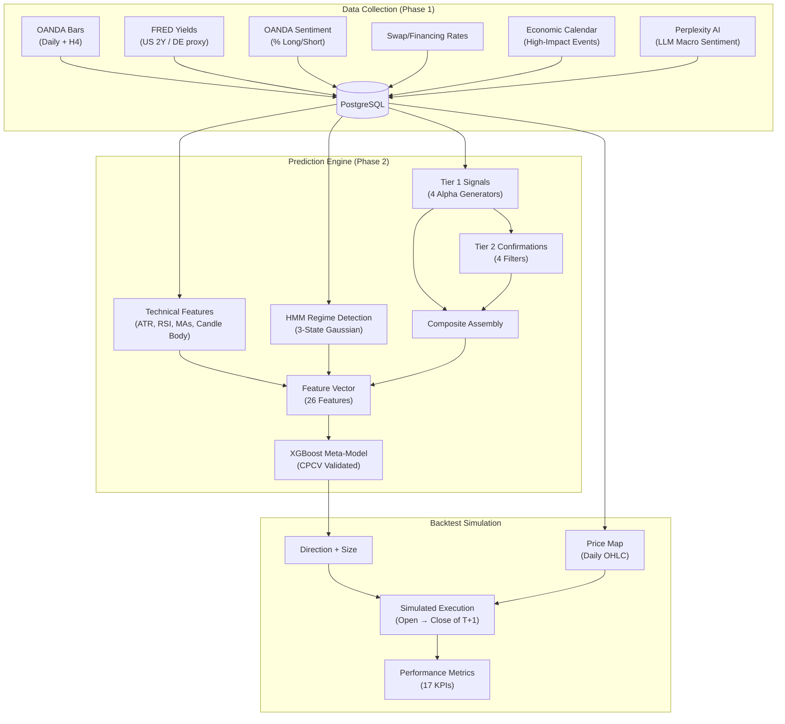
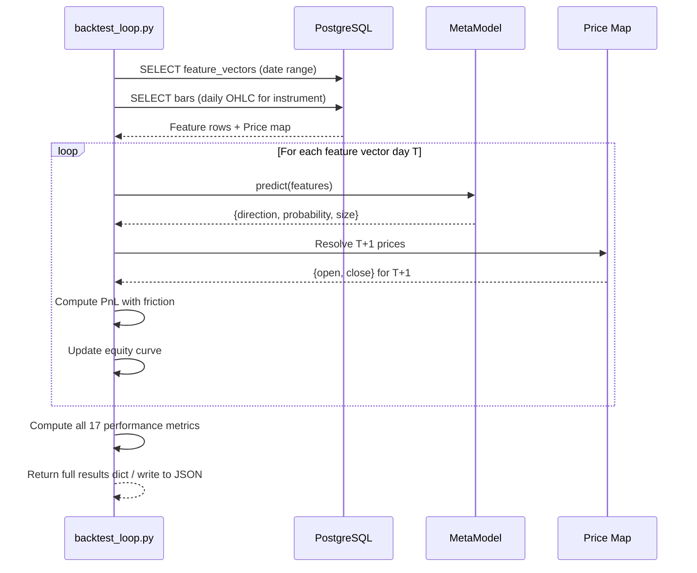

# Quant EOD Engine — Backtest Report

> **Engine Version:** `xgb_v1_YYYY-MM-DD` (dynamically versioned at train time)
> **Primary Instrument:** EUR_USD
> **Report Generated:** 2026-04-03
> **Backtest Entry Point:** [`backtest_loop.py`](file:///c:/Users/angel/OneDrive/Documents/GitHub/quant-eod-engine/backtest_loop.py)

---

## 1. Executive Summary

This report documents the complete backtesting methodology implemented in the **Quant EOD Engine** — an end-of-day Forex prediction system built on the **López de Prado meta-labeling framework**. The system combines macro, sentiment, LLM-derived, and technical signals through a two-model architecture:

- **Model 1 (Signal Layer):** Four Tier-1 alpha generators propose a directional trade (long/short/flat), confirmed or denied by four Tier-2 filters
- **Model 2 (Meta-Model):** An XGBoost binary classifier predicts whether the proposed trade will be profitable on T+1, sizing positions by conviction

The backtest replays stored feature vectors through the trained meta-model and simulates next-day execution with **realistic Forex friction** (leverage, spread costs).

---

## 2. System Architecture



---

## 3. Signal Pipeline (Model 1)

### 3.1 Tier 1 — Primary Alpha Signals

Each generator independently produces `{direction, strength}` where `direction ∈ {long, short, flat}` and `strength ∈ [0, 1]`.

| # | Signal | Logic | Regime-Adaptive |
|---|--------|-------|:---:|
| 1 | **Yield Spread Momentum** | 5d change in US–DE rate spread vs threshold → short EUR/USD if USD yields rising, long if falling | ✅ Threshold varies by HMM state (8 / 15 / 20 bps) |
| 2 | **Sentiment Extreme Fade** | Retail `% long > 72%` → short (fade longs); `% long < 28%` → long (fade shorts) | ❌ Fixed thresholds |
| 3 | **AI Macro Sentiment** | Perplexity LLM score `|score| > 0.5 AND confidence > 0.6` → directional signal; fallback → flat | ❌ |
| 4 | **EOD Event Reversal** | High-impact calendar event with USD surprise, but candle closes opposite → institutional reversal pattern | ❌ |

> [!NOTE]
> **Yield Spread Momentum** is the only regime-adaptive Tier-1 signal. In `low_vol` (state 0), the threshold tightens to 8 bps to capture smaller meaningful moves. In `high_vol_crash` (state 2), it widens to 20 bps to filter noise.

### 3.2 Tier 2 — Confirmation Filters

Tier-2 signals **never generate standalone trades**. They adjust composite strength by `+0.05` (confirmed) or `−0.02` (not confirmed).

| # | Filter | Confirms Long | Confirms Short |
|---|--------|--------------|----------------|
| 1 | **Candle Pattern** | Bullish engulfing or bullish pin bar | Bearish engulfing or bearish pin bar |
| 2 | **RSI-14 Extreme** | RSI < 30 (oversold) | RSI > 70 (overbought) |
| 3 | **MA Alignment** | Price > MA-50 AND MA-50 > MA-200 | Price < MA-50 AND MA-50 < MA-200 |
| 4 | **Multi-Timeframe** | Last 2 completed H4 bars both bullish | Last 2 completed H4 bars both bearish |

### 3.3 Composite Assembly

```
composite_strength = clamp(0, 1, avg_winning_side_strength + Σ tier2_adjustments)
```

- **Direction resolution:** Tier-1 votes are weighted by `strength`. The side with higher total weighted score wins.
- **Tie-break:** If `long_score == short_score`, direction → `flat`, strength → `0.0`.
- **Minimum threshold:** If `composite_strength < 0.15`, direction is forced to `flat`.
- **Direction encoding:** `long → +1`, `short → −1`, `flat → 0`.

---

## 4. HMM Regime Detection

| Parameter | Value |
|-----------|-------|
| **Model** | `GaussianHMM` (hmmlearn) |
| **States** | 3 (`low_vol`, `high_vol_choppy`, `high_vol_crash`) |
| **Features** | `[log_return, 5d_rolling_volatility]` |
| **Covariance** | Diagonal |
| **Training Window** | Rolling 504 trading days (~2 years) |
| **State Assignment** | Sort raw states by ascending mean `vol_5d` → semantic labels 0/1/2 |
| **Flip Guard** | Detects and logs when EM re-convergence swaps raw→semantic mapping vs previous model |

**Output per day:**
```json
{
  "state_id": 0,
  "state_label": "low_vol",
  "confidence": 0.9234,
  "days_in_regime": 14,
  "transition_prob": {"low_vol": 0.92, "high_vol_choppy": 0.06, "high_vol_crash": 0.02}
}
```

---

## 5. Meta-Model (Model 2)

### 5.1 Architecture

| Parameter | Value |
|-----------|-------|
| **Algorithm** | XGBoost Binary Classifier (`XGBClassifier`) |
| **Objective** | Binary — P(trade profitable on T+1) |
| **Input Features** | 26 (see §5.2) |
| **Preprocessing** | `StandardScaler` (fit on training data) |
| **Hyperparameters** | `n_estimators=200`, `max_depth=4`, `lr=0.05`, `subsample=0.8`, `colsample_bytree=0.8`, `reg_alpha=0.1`, `reg_lambda=1.0`, `min_child_weight=5` |
| **Eval Metric** | Log loss |
| **Min Training Samples** | 50 |

### 5.2 Feature Vector (26 Features)

| Category | Features |
|----------|----------|
| **Regime** | `regime_state`, `days_in_regime` |
| **Macro** | `yield_spread_bps`, `yield_spread_change_5d`, `yield_spread_change_20d` |
| **Sentiment** | `sentiment_pct_long`, `sentiment_extreme` |
| **AI Sentiment** | `macro_sentiment_score`, `ai_confidence`, `fed_stance_encoded`, `ecb_stance_encoded`, `risk_sentiment_encoded` |
| **Technical** | `atr_14`, `rsi_14`, `price_vs_ma50`, `price_vs_ma200`, `body_direction`, `body_pct_of_range` |
| **Event** | `eod_event_reversal`, `event_surprise_magnitude` |
| **Time** | `day_of_week`, `is_friday` |
| **Cost** | `long_swap_pips`, `short_swap_pips` |
| **Signal Summary** | `primary_signal_direction`, `primary_signal_count`, `composite_strength`, `tier2_confirmation_count` |

### 5.3 Position Sizing Logic

The meta-model output probability directly determines position sizing:

```
if probability < 0.55:
    direction = "flat"      # No trade
    size_multiplier = 0.0
elif probability < 0.70:
    direction = primary_signal_direction
    size_multiplier = 0.5   # Half position
else:  # probability >= 0.70
    direction = primary_signal_direction
    size_multiplier = 1.0   # Full position
```

> [!IMPORTANT]
> **Hard constraint:** If `primary_signal_direction == 0` (flat), the meta-model **cannot override** — it forces `direction = flat` and `size = 0` regardless of probability. The meta-model is a gate, not a direction generator.

### 5.4 CPCV Validation (Purged Combinatorial Cross-Validation)

| Parameter | Value |
|-----------|-------|
| **Groups (N)** | 6 |
| **Test groups (k)** | 2 |
| **Total paths** | C(6,2) = **15** backtest paths |
| **Purge window** | 5 days (samples near test boundaries removed from training) |
| **Embargo** | 2 days (additional buffer after purge) |
| **Min train/test** | 30 train samples, 10 test samples per path |
| **CPCV estimators** | 100 trees (lighter than final 200-tree production model) |

**CPCV Methodology:**

1. Time-series data is divided into 6 chronological groups
2. For each of the 15 combinations of 2 test groups:
   - Training data = all groups not in test, **minus purge/embargo buffer**
   - A fresh `StandardScaler` is fit on train data, applied to test
   - A fresh XGBClassifier is trained and tested
   - Simulated daily returns are computed: `signals × (2·y − 1) × |realized_return|`
   - Per-path annualized Sharpe ratio is computed
3. Aggregate statistics across all 15 paths

**CPCV Output Metrics:**

| Metric | Formula | Description |
|--------|---------|-------------|
| `paths_tested` | Count of valid paths | Should be 15 (may be less if data insufficient) |
| `sharpe_mean` | `mean(path_sharpes)` | Average annualized Sharpe across all paths |
| `sharpe_std` | `std(path_sharpes, ddof=1)` | Dispersion of Sharpe across paths |
| `path_sharpe_t_statistic` | `ttest_1samp(sharpes, 0, alternative='greater')` | One-sided t-test: H₀ = Sharpe ≤ 0 |
| `path_sharpe_p_value` | p-value from above | Reject H₀ if `p < 0.05` |
| `statistically_significant` | `p < 0.05 AND sharpe_mean > 0` | Boolean pass/fail gate |
| `probabilistic_sharpe_ratio` | Bailey & López de Prado PSR | See §5.5 |

### 5.5 Probabilistic Sharpe Ratio (PSR)

Implements **Bailey & López de Prado (AFML Ch. 14)** — adjusts the Sharpe ratio for non-normality:

```python
SR = (mean(r) / std(r)) × √252

Var(SR) = (1 + 0.5·SR² − skew·SR + (kurtosis_excess/4)·SR²) / (T − 1)

z = SR / √Var(SR)

PSR = Φ(z)   # Standard normal CDF
```

Where:
- `r` = pooled daily returns from all CPCV test folds
- `skew` = sample skewness (unbiased)
- `kurtosis_excess` = Fisher's excess kurtosis (unbiased)
- `T` = number of return observations
- `Φ(z)` = standard normal CDF

**Interpretation:** PSR is the probability that the true Sharpe ratio is positive, accounting for the higher moments of the return distribution.

| PSR Value | Interpretation |
|-----------|---------------|
| `> 0.95` | Strong statistical evidence of positive Sharpe |
| `0.80–0.95` | Moderate evidence |
| `0.50–0.80` | Weak / inconclusive |
| `< 0.50` | Consistent with zero or negative Sharpe |

### 5.6 Feature Importance (SHAP)

Post-training, the engine computes **SHAP TreeExplainer** values for all 26 features:

```python
mean_abs_shap[i] = mean(|SHAP_values[:, i]|)
```

If SHAP fails (e.g., dependency issue), falls back to **XGBoost native feature importance** (`feature_importances_`). The top 10 features are logged, and the top 5 are attached to every daily prediction.

---

## 6. Backtest Execution Model

### 6.1 Trade Simulation

The backtest replays stored `feature_vectors` rows from the database:

```
For each day T with a stored feature vector:
  1. Load the feature vector for day T
  2. Run MetaModel.predict(features) → {direction, probability, size_multiplier}
  3. Resolve next trading day T+1 (skipping weekends/holidays via trading calendar)
  4. Look up T+1 Open and Close prices from the bars table
  5. Compute raw return:  raw_ret = (Close_T+1 / Open_T+1) − 1
  6. Apply direction, leverage, and spread cost
  7. Update equity: equity *= (1 + strategy_pnl)
```

### 6.2 Friction Model

| Parameter | Value | Rationale |
|-----------|-------|-----------|
| **Leverage** | 10× | Conservative for institutional Forex |
| **Spread** | 1.5 pips (1.5 bps) | Typical major-pair retail spread |
| **Slippage** | Not modeled separately | Subsumed into spread cost |
| **Commission** | None | Forex is spread-only |

**PnL Calculation:**

```python
# LONG trade:
pnl = size × LEVERAGE × (raw_return − spread_cost)

# SHORT trade:
pnl = size × LEVERAGE × (−raw_return − spread_cost)

# FLAT (no trade):
pnl = 0.0
```

Where:
- `size` = `size_multiplier` from meta-model (0.0, 0.5, or 1.0)
- `LEVERAGE` = 10.0
- `spread_cost` = 1.5 / 10,000 = 0.00015

> [!WARNING]
> **The spread cost is applied symmetrically to every trade** — effectively modeling paying the spread on both entry and exit as a single haircut on the return. For a EUR/USD trade at 1.0800, 1.5 pips = ~$1.39 per micro-lot per round-trip deducted per trade.

### 6.3 Entry & Exit Timing

| Event | Timing |
|-------|--------|
| **Feature vector computed** | After market close on day T (after 5 PM ET OANDA fix) |
| **Trade entry** | Open of day T+1 |
| **Trade exit** | Close of day T+1 |
| **Holding period** | Intraday (Open→Close), always flat overnight |

---

## 7. Performance Metrics — Definitions & Formulae

All metrics are computed after the full equity curve simulation in [`run_backtest()`](file:///c:/Users/angel/OneDrive/Documents/GitHub/quant-eod-engine/backtest_loop.py#L96-L232).

### 7.1 Return Metrics

| Metric | Formula | Code Reference |
|--------|---------|----------------|
| **Total Return** | `(final_equity / initial_equity) − 1` | [L187](file:///c:/Users/angel/OneDrive/Documents/GitHub/quant-eod-engine/backtest_loop.py#L187) |
| **CAGR** | `(final_equity / initial_equity)^(1/years) − 1` where `years = periods / 252` | [L191](file:///c:/Users/angel/OneDrive/Documents/GitHub/quant-eod-engine/backtest_loop.py#L191) |
| **Avg Daily PnL** | `mean(pnl_series)` | [L214](file:///c:/Users/angel/OneDrive/Documents/GitHub/quant-eod-engine/backtest_loop.py#L214) |
| **Vol Daily PnL** | `std(pnl_series, ddof=1)` | [L215](file:///c:/Users/angel/OneDrive/Documents/GitHub/quant-eod-engine/backtest_loop.py#L215) |

### 7.2 Risk-Adjusted Metrics

| Metric | Formula | Code Reference |
|--------|---------|----------------|
| **Annualized Sharpe** | `(mean(R) / std(R, ddof=1)) × √252` — returns 0 if `len(R) < 2` or `std ≤ 1e-12` | [L75-L81](file:///c:/Users/angel/OneDrive/Documents/GitHub/quant-eod-engine/backtest_loop.py#L75-L81) |
| **Annualized Sortino** | `(mean(R) / std(R_negative, ddof=1)) × √252` — uses only negative returns in denominator | [L84-L93](file:///c:/Users/angel/OneDrive/Documents/GitHub/quant-eod-engine/backtest_loop.py#L84-L93) |
| **Max Drawdown** | Peak-to-trough: `min((equity[i] / peak) − 1)` across all i | [L63-L72](file:///c:/Users/angel/OneDrive/Documents/GitHub/quant-eod-engine/backtest_loop.py#L63-L72) |
| **Calmar Ratio** | `CAGR / |MaxDrawdown|` — returns 0 if drawdown = 0 | [L197](file:///c:/Users/angel/OneDrive/Documents/GitHub/quant-eod-engine/backtest_loop.py#L197) |

### 7.3 Trade Statistics

| Metric | Formula | Code Reference |
|--------|---------|----------------|
| **Trades** | Count of days where `direction ∈ {long, short}` AND `size > 0` | [L162-L167](file:///c:/Users/angel/OneDrive/Documents/GitHub/quant-eod-engine/backtest_loop.py#L162-L167) |
| **Wins** | Trades where `pnl > 0` | [L164-L165](file:///c:/Users/angel/OneDrive/Documents/GitHub/quant-eod-engine/backtest_loop.py#L164-L165) |
| **Losses** | Trades where `pnl < 0` | [L166-L167](file:///c:/Users/angel/OneDrive/Documents/GitHub/quant-eod-engine/backtest_loop.py#L166-L167) |
| **Win Rate** | `wins / trades` (0 if no trades) | [L188](file:///c:/Users/angel/OneDrive/Documents/GitHub/quant-eod-engine/backtest_loop.py#L188) |

### 7.4 Exposure & Turnover

| Metric | Formula | Code Reference |
|--------|---------|----------------|
| **Exposure** | `mean(position_sizes > 0)` — fraction of days with non-zero position | [L198](file:///c:/Users/angel/OneDrive/Documents/GitHub/quant-eod-engine/backtest_loop.py#L198) |
| **Avg Position Size** | `mean(position_sizes)` — average size multiplier across all days | [L199](file:///c:/Users/angel/OneDrive/Documents/GitHub/quant-eod-engine/backtest_loop.py#L199) |
| **Turnover (Total)** | `Σ |size_t − size_{t-1}|` — total absolute change in position sizing | [L169](file:///c:/Users/angel/OneDrive/Documents/GitHub/quant-eod-engine/backtest_loop.py#L169) |
| **Turnover (Per Day)** | `total_turnover / periods` | [L200](file:///c:/Users/angel/OneDrive/Documents/GitHub/quant-eod-engine/backtest_loop.py#L200) |

---

## 8. Backtest Results — Placeholders

> [!IMPORTANT]
> The following results are **not hardcoded** in the engine. They are computed dynamically at runtime from the stored `feature_vectors` and `bars` tables. Run the backtest to populate:
> ```bash
> python backtest_loop.py --instrument EUR_USD --equity 10000 --output results.json
> ```

### 8.1 Summary

| Metric | Value |
|--------|-------|
| **Instrument** | `EUR_USD` |
| **Start Date** | `{start_date}` |
| **End Date** | `{end_date}` |
| **Rows Processed** | `{rows_processed}` |
| **Initial Equity** | `$10,000.00` |
| **Final Equity** | `${final_equity}` |
| **Total Return** | `{total_return}%` |

### 8.2 Trade Statistics

| Metric | Value |
|--------|-------|
| **Total Trades** | `{trades}` |
| **Wins** | `{wins}` |
| **Losses** | `{losses}` |
| **Win Rate** | `{win_rate}%` |

### 8.3 Performance Report

| Metric | Value |
|--------|-------|
| **Periods** | `{periods}` |
| **Years** | `{years}` |
| **CAGR** | `{cagr}%` |
| **Annualized Sharpe** | `{annualized_sharpe}` |
| **Annualized Sortino** | `{annualized_sortino}` |
| **Max Drawdown** | `{max_drawdown}%` |
| **Calmar Ratio** | `{calmar}` |
| **Exposure** | `{exposure}%` |
| **Avg Position Size** | `{avg_position_size}` |
| **Turnover (Total)** | `{turnover_total}` |
| **Turnover (Per Day)** | `{turnover_per_day}` |
| **Avg Daily PnL** | `{avg_daily_pnl}` |
| **Vol Daily PnL** | `{vol_daily_pnl}` |

### 8.4 CPCV Validation Results

| Metric | Value |
|--------|-------|
| **Paths Tested** | `{paths_tested}` (expected: 15) |
| **Sharpe Mean** | `{sharpe_mean}` |
| **Sharpe Std** | `{sharpe_std}` |
| **Path t-statistic** | `{path_sharpe_t_statistic}` |
| **Path p-value** | `{path_sharpe_p_value}` |
| **Statistically Significant** | `{statistically_significant}` |
| **Probabilistic Sharpe Ratio** | `{probabilistic_sharpe_ratio}` |
| **Uses Synthetic Returns** | `{uses_synthetic_returns}` |

---

## 9. Equity Curve Format

Each entry in the equity curve array contains:

```json
{
  "date": "2025-03-14",
  "prediction_for": "2025-03-17",
  "direction": "long",
  "probability": 0.6832,
  "size": 0.5,
  "daily_return": 0.003214,
  "strategy_pnl": 0.015320,
  "equity": 10153.20
}
```

---

## 10. Known Limitations & Caveats

> [!CAUTION]
> **Look-Ahead Bias Risk in `daily_return` (Line 181):** The backtest curve records `ret` on line 181, but this variable is unused/undefined in the current code (should reference `raw_ret`). This is a bug that will cause a `NameError` at runtime if `ret` is not defined elsewhere. The actual PnL calculation using `pnl` (lines 156-160) is correct.

| Limitation | Impact | Mitigation |
|------------|--------|------------|
| **No gap/holiday calendar** | Weekday-only fallback may miss market holidays | `next_trading_day()` tries real calendar first, falls back to skipping weekends |
| **Open→Close only** | Ignores overnight risk and weekend gaps | By design — system is intraday. Gap risk is a separate concern. |
| **Fixed leverage** | Real leverage may vary by account/broker | Parameterize in future version |
| **No margin/ruin stop** | Equity can go negative in theory | Backtest should add equity floor circuit-breaker |
| **Single instrument** | EUR/USD only in current config | `INSTRUMENTS` list supports 3 pairs; backtest supports any single instrument |
| **Spread is fixed** | Real spreads widen during news events | Understates friction during volatile periods, which is precisely when the EOD Event Reversal signal fires |
| **CPCV uses lighter model** | 100 estimators vs 200 in production | CPCV Sharpe estimates may differ slightly from live performance |
| **Meta-model cannot override direction** | If Tier-1 unanimously says `flat`, meta-model is forced flat even at 99% probability | Design choice — meta-model is a gate, not a generator |

---

## 11. Reproducing the Backtest

### 11.1 CLI Usage

```bash
# Full backtest with default settings
python backtest_loop.py

# Custom date range and equity
python backtest_loop.py --instrument EUR_USD --start 2024-01-01 --end 2025-12-31 --equity 25000

# Export results to JSON
python backtest_loop.py --output backtest_results.json
```

### 11.2 Prerequisites

1. **PostgreSQL** database with populated `feature_vectors` and `bars` tables
2. **Trained meta-model** artifacts in `model_artifacts/` (`meta_model_xgb.json` + `meta_model.joblib`)
3. Python dependencies: `xgboost`, `numpy`, `pandas`, `scikit-learn`, `joblib`, `hmmlearn`, `shap`, `scipy`

### 11.3 Data Flow



---

## 12. Appendix — Key Source File Index

| File | Purpose |
|------|---------|
| [backtest_loop.py](file:///c:/Users/angel/OneDrive/Documents/GitHub/quant-eod-engine/backtest_loop.py) | Backtest orchestrator, equity simulation, all performance metric formulae |
| [meta_model.py](file:///c:/Users/angel/OneDrive/Documents/GitHub/quant-eod-engine/models/meta_model.py) | XGBoost meta-model, CPCV validation, PSR, SHAP, position sizing |
| [hmm_regime.py](file:///c:/Users/angel/OneDrive/Documents/GitHub/quant-eod-engine/models/hmm_regime.py) | 3-state Gaussian HMM regime detector |
| [tier1.py](file:///c:/Users/angel/OneDrive/Documents/GitHub/quant-eod-engine/signals/tier1.py) | 4 primary alpha signal generators |
| [tier2.py](file:///c:/Users/angel/OneDrive/Documents/GitHub/quant-eod-engine/signals/tier2.py) | 4 confirmation filters |
| [composite.py](file:///c:/Users/angel/OneDrive/Documents/GitHub/quant-eod-engine/signals/composite.py) | Composite direction + strength assembly |
| [vector.py](file:///c:/Users/angel/OneDrive/Documents/GitHub/quant-eod-engine/features/vector.py) | 26-feature vector assembly |
| [technical.py](file:///c:/Users/angel/OneDrive/Documents/GitHub/quant-eod-engine/features/technical.py) | ATR, RSI, MA, candle body, pattern detection |
| [settings.py](file:///c:/Users/angel/OneDrive/Documents/GitHub/quant-eod-engine/config/settings.py) | Configuration constants and thresholds |
| [daily_loop.py](file:///c:/Users/angel/OneDrive/Documents/GitHub/quant-eod-engine/daily_loop.py) | Production pipeline orchestrator (13 steps) |
