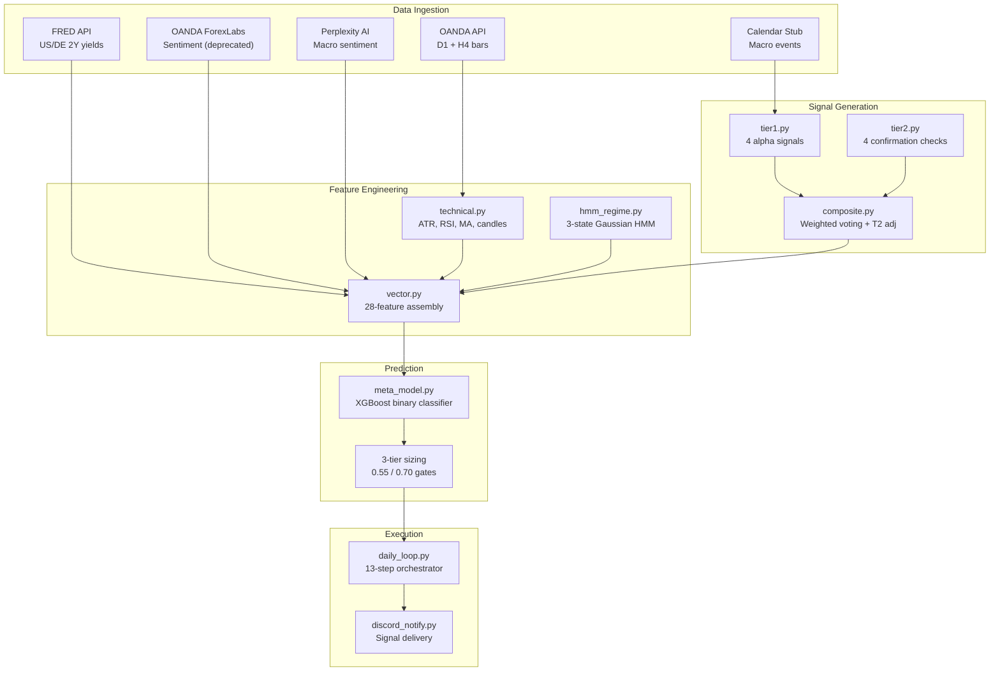

# Quant EOD Engine — Change Log & Audit Trail

> **Document Type:** Living document — update with every code change
> **Initialized:** 2026-04-03
> **Current Version:** v1.0.0
> **Repository:** `quant-eod-engine`

---

## Table of Contents

1. [Versioning Convention](#1-versioning-convention)
2. [Current State Snapshot (v1.0.0)](#2-current-state-snapshot-v100)
3. [Change Log](#3-change-log)
4. [Change Entry Template](#4-change-entry-template)
5. [Parameter Change Template](#5-parameter-change-template)
6. [Audit Checklist](#6-audit-checklist)
7. [Known Issues & Backlog](#7-known-issues--backlog)

---

## 1. Versioning Convention

### Semantic Versioning for Trading Systems

```
vMAJOR.MINOR.PATCH
```

| Component | When to Increment | Examples |
|-----------|-------------------|----------|
| **MAJOR** | Strategy logic change that alters signal direction, position sizing tiers, or model architecture. Any change that makes historical backtest results **non-comparable** to the previous version. | Changing probability gates, adding a new Tier 1 signal, switching from XGBoost to a neural net, modifying the composite scoring formula |
| **MINOR** | New feature, data source, or parameter tuning that extends capability without breaking existing logic. Backtest results may shift but the core strategy is the same. | Adding a new Tier 2 confirmation, integrating a new data feed, tuning HMM lookback window, adding a new column to feature vector |
| **PATCH** | Bug fix, documentation update, logging improvement, or refactor with **no intended change** to trading behavior. Backtest results should be identical (or only differ due to bug correction). | Fixing the `ret`→`raw_ret` bug, updating docstrings, improving error handling, serialization format changes |

### Version History Summary

| Version | Date | Type | Summary |
|:-------:|:----:|:----:|---------|
| **v1.0.0** | 2026-04-03 | Baseline | Initial audit baseline — all subsystems documented |

---

## 2. Current State Snapshot (v1.0.0)

### 2.1 System Architecture



### 2.2 Module-Level Logic Snapshot

#### `features/technical.py` — v1.0.0

| Component | Specification | Status |
|-----------|---------------|:------:|
| ATR | EMA span=14 (α=2/15) | ✅ Verified |
| RSI | Wilder smoothing com=13, NaN→50.0 | ✅ Verified |
| SMA | 50-period and 200-period, min_periods enforced | ✅ Verified |
| EMA | 20-period, adjust=False | ✅ Verified |
| Body analysis | 4 metrics: direction, body%, upper/lower wick% | ✅ Verified |
| Candle patterns | 6 detectors: engulfing (bull/bear), pin bar (bull/bear), inside bar, doji | ✅ Verified |
| Rolling vol | 5d and 20d pct_change std (sample) | ✅ Verified |
| H4 features | 4 optional features if H4 bars provided | ✅ Verified |

#### `models/hmm_regime.py` — v1.0.0

| Component | Specification | Status |
|-----------|---------------|:------:|
| Model | GaussianHMM, 3 states, diagonal covariance | ✅ Verified |
| Observation | 2D: [log_return, vol_5d] | ✅ Verified |
| Training | 504-day rolling window, n_iter=200, tol=1e-4 | ✅ Verified |
| State map | argsort by vol_5d mean (ascending) | ✅ Verified |
| State-flip guard | Detects label flips between re-trains, logs warning | ✅ Verified |
| Persistence | joblib: {model, state_map, version} | ✅ Verified |

#### `signals/tier1.py` — v1.0.0

| Signal | Thresholds | Status |
|--------|------------|:------:|
| Yield spread momentum | Regime-adaptive: 8/15/20 bps, strength = min(\|Δ5d\|/(2τ), 1.0) | ✅ Verified |
| Sentiment extreme fade | 72%/28% triggers, strength scaled over 0.18 span | ✅ Verified |
| AI macro sentiment | Score gate ±0.5, confidence gate 0.6, strength = min(\|s\|×c, 1.0) | ✅ Verified |
| EOD event reversal | Reversal when surprise opposes candle body, strength = min(0.85+0.02(N-1), 1.0) | ✅ Verified |

#### `signals/tier2.py` — v1.0.0

| Check | Thresholds | Status |
|-------|------------|:------:|
| RSI confirmation | Oversold <30 → long, overbought >70 → short | ✅ Verified |
| MA alignment | SMA-50 vs SMA-200 directional alignment | ✅ Verified |
| Candle pattern | Engulfing/pin bar matching signal direction | ✅ Verified |
| Multi-timeframe | H4 trend alignment with daily direction | ✅ Verified |

#### `signals/composite.py` — v1.0.0

| Component | Specification | Status |
|-----------|---------------|:------:|
| Directional voting | Strength-weighted sum per side, majority wins | ✅ Verified |
| Base strength | Average strength of winning side | ✅ Verified |
| T2 adjustment | +0.05 per confirmation, −0.02 per non-confirmation | ✅ Verified |
| Floor gate | composite_strength < 0.15 → flat | ✅ Verified |
| Clamping | [0.0, 1.0] | ✅ Verified |

#### `models/meta_model.py` — v1.0.0

| Component | Specification | Status |
|-----------|---------------|:------:|
| Architecture | XGBClassifier: 200 trees, depth=4, η=0.05 | ✅ Verified |
| Regularization | subsample=0.8, colsample=0.8, L1=0.1, L2=1.0, min_child_weight=5 | ✅ Verified |
| Normalization | StandardScaler (z-score) fit on all training data | ✅ Verified |
| Sizing | 3-tier: <0.55→flat, 0.55–0.70→0.5×, ≥0.70→1.0× | ✅ Verified |
| Signal veto | primary_signal_direction=0 → always flat | ✅ Verified |
| CPCV | N=6, k=2, purge=5, embargo=2 (15 paths) | ✅ Verified |
| PSR | Bailey & López de Prado (skew/kurtosis-adjusted) | ✅ Verified |
| SHAP | TreeExplainer with native-importance fallback | ✅ Verified |
| Persistence | XGB JSON + joblib (scaler, metadata) | ✅ Verified |

#### `backtest_loop.py` — v1.0.0

| Component | Specification | Status |
|-----------|---------------|:------:|
| Execution model | Signal on Day T close → Enter T+1 open → Exit T+1 close | ✅ Verified |
| Leverage | 10× fixed | ✅ Verified |
| Spread | 1.5 pips (applied once per trade) | ✅ Verified |
| Equity | Multiplicative compounding: E_t = E_{t-1} × (1 + PnL_t) | ✅ Verified |
| Sharpe | mean/std × √252, ddof=1, rf=0 | ✅ Verified |
| Sortino | mean/downside_std × √252, ddof=1 | ✅ Verified |
| MDD | Running peak-to-trough | ✅ Verified |

### 2.3 Feature Vector Schema (v1.0.0)

28 features in fixed order (`FEATURE_COLS`):

| # | Feature | Source | Type |
|:-:|---------|--------|:----:|
| 1 | `regime_state` | HMM | int {0,1,2} |
| 2 | `days_in_regime` | HMM | int |
| 3 | `yield_spread_bps` | FRED | float |
| 4 | `yield_spread_change_5d` | FRED | float |
| 5 | `yield_spread_change_20d` | FRED | float |
| 6 | `sentiment_pct_long` | OANDA | float [0,1] |
| 7 | `sentiment_extreme` | OANDA | int {0,1} |
| 8 | `macro_sentiment_score` | Perplexity | float [-1,1] |
| 9 | `ai_confidence` | Perplexity | float [0,1] |
| 10 | `fed_stance_encoded` | Perplexity | int {-1,0,1} |
| 11 | `ecb_stance_encoded` | Perplexity | int {-1,0,1} |
| 12 | `risk_sentiment_encoded` | Perplexity | int {-1,0,1} |
| 13 | `atr_14` | Bars | float |
| 14 | `rsi_14` | Bars | float [0,100] |
| 15 | `price_vs_ma50` | Bars | float (%) |
| 16 | `price_vs_ma200` | Bars | float (%) |
| 17 | `body_direction` | Bars | int {-1,0,1} |
| 18 | `body_pct_of_range` | Bars | float [0,1] |
| 19 | `eod_event_reversal` | Calendar | int {0,1} |
| 20 | `event_surprise_magnitude` | Calendar | float |
| 21 | `day_of_week` | System | int [0,4] |
| 22 | `is_friday` | System | int {0,1} |
| 23 | `long_swap_pips` | OANDA | float |
| 24 | `short_swap_pips` | OANDA | float |
| 25 | `primary_signal_direction` | Composite | int {-1,0,1} |
| 26 | `primary_signal_count` | Composite | int |
| 27 | `composite_strength` | Composite | float [0,1] |
| 28 | `tier2_confirmation_count` | Tier 2 | int |

---

## 3. Change Log

### v1.0.0 — 2026-04-03: Initial Audit Baseline

> **Classification:** PATCH (bug fix applied during audit)

---

#### PATCH-001: Fix NameError in backtest equity curve recording

| Field | Detail |
|-------|--------|
| **Date** | 2026-04-03 |
| **Version** | v1.0.0 |
| **Author** | Audit session |
| **File(s) Modified** | [backtest_loop.py:L181](file:///c:/Users/angel/OneDrive/Documents/GitHub/quant-eod-engine/backtest_loop.py#L181) |
| **Logic Modified** | Equity curve recording loop referenced undefined variable `ret`; changed to `raw_ret` which is the actual computed return variable. |
| **Reason for Change** | `NameError: name 'ret' is not defined` — the backtest would crash at the equity curve recording step, making it impossible to run any backtest. |
| **Impact on Backtest** | **Enabling fix only.** No change to PnL calculation (the `pnl` variable was already computed correctly using `raw_ret`). The fix only affects the diagnostic recording of `daily_return` in the equity curve output. Pre-fix: crash (no results). Post-fix: correct execution. |
| **Rollback Plan** | Revert L181 to `"daily_return": round(ret, 6),` — but this would re-introduce the crash. |
| **Review Status** | ✅ Verified during audit |

```diff
- "daily_return": round(ret, 6),
+ "daily_return": round(raw_ret, 6),
```

---

> *Future changes should be appended below in reverse chronological order (newest first).*

---

### v_._._  — YYYY-MM-DD: [Title]

*Copy and fill from [Section 4: Change Entry Template](#4-change-entry-template)*

---

## 4. Change Entry Template

Copy the block below for each new change. Fill in all fields before merging.

```markdown
---

#### [TYPE]-[NNN]: [Short descriptive title]

| Field | Detail |
|-------|--------|
| **Date** | YYYY-MM-DD |
| **Version** | v_._._ |
| **Author** | [Name or handle] |
| **File(s) Modified** | [file.py:LNNN](file:///path/to/file.py#LNNN), ... |
| **Logic Modified** | [Precise description of what was changed. Include before/after values for any constants or formulas.] |
| **Reason for Change** | [Why was this change needed? Link to issue, backtest finding, or audit item.] |
| **Impact on Backtest** | [REQUIRED] Run backtest before AND after the change. Record: Sharpe (before→after), MDD (before→after), Win Rate (before→after), Trade Count (before→after). State whether results are comparable to previous version. |
| **Rollback Plan** | [Exact steps to undo this change if it degrades live performance.] |
| **Review Status** | ⬜ Pending / 🔄 In Review / ✅ Approved / ❌ Rejected |

\```diff
- [old code]
+ [new code]
\```

**Backtest Comparison:**

| Metric | Before | After | Delta |
|--------|:------:|:-----:|:-----:|
| Sharpe | | | |
| Sortino | | | |
| MDD | | | |
| Win Rate | | | |
| Trades | | | |
| CAGR | | | |

---
```

### Type Codes

| Code | Meaning | Version Impact |
|:----:|---------|:--------------:|
| `MAJOR` | Strategy logic / signal direction change | MAJOR bump |
| `FEAT` | New feature or data source | MINOR bump |
| `TUNE` | Parameter tuning (use Parameter Template below) | MINOR bump |
| `PATCH` | Bug fix | PATCH bump |
| `DOCS` | Documentation only | PATCH bump |
| `REFAC` | Refactor with no behavior change | PATCH bump |
| `INFRA` | Infrastructure / DevOps / monitoring | PATCH bump |

---

## 5. Parameter Change Template

For changes that **only** modify a tunable parameter (threshold, hyperparameter, lookback period), use this specialized template. It enforces documenting the sensitivity analysis that justified the change.

```markdown
---

#### TUNE-[NNN]: [Parameter Name] [old_value] → [new_value]

| Field | Detail |
|-------|--------|
| **Date** | YYYY-MM-DD |
| **Version** | v_._._ |
| **Parameter ID** | [From sensitivity report, e.g., M-09] |
| **Parameter** | [Human name] |
| **File** | [file.py:LNNN](file:///path/to/file.py#LNNN) |
| **Old Value** | [exact old value] |
| **New Value** | [exact new value] |
| **Change Magnitude** | [+/- X%] |
| **Justification** | [What evidence supports this change? OAT sweep? Stress test? Regime shift?] |
| **Sensitivity Coefficient** | [From sensitivity test: how much does Sharpe move per 10% param change?] |

**OAT Sweep Results (if applicable):**

| Value Tested | Sharpe | MDD | Win Rate | Trades |
|:------------:|:------:|:---:|:--------:|:------:|
| [old - 20%] | | | | |
| [old - 10%] | | | | |
| **[old]** | | | | |
| **[new]** ← | | | | |
| [old + 10%] | | | | |
| [old + 20%] | | | | |

**Decision:** [Why was this specific new value chosen over other tested values?]

---
```

---

## 6. Audit Checklist

Before any change is merged to production, complete this checklist:

### Pre-Deployment Gate

```
[ ] 1. BACKTEST RUN — Full backtest executed with the change applied.
       Before: Sharpe=___ MDD=___ WinRate=___
       After:  Sharpe=___ MDD=___ WinRate=___

[ ] 2. CPCV VALIDATION — If model parameters changed, re-run CPCV.
       PSR before: ___
       PSR after:  ___

[ ] 3. STRESS TEST — If signal logic or sizing changed, run at least
       ST-01 (COVID) and ST-03 (SNB) from stress test framework.
       COVID MDD: ___  SNB MDD: ___

[ ] 4. FEATURE VECTOR COMPAT — If feature vector schema changed:
       [ ] Updated FEATURE_COLS in meta_model.py
       [ ] Updated feature vector schema table in this document (§2.3)
       [ ] Verified old stored feature_vectors are compatible or migrated

[ ] 5. CHANGE LOG ENTRY — Entry added to §3 with all fields filled.

[ ] 6. ROLLBACK VERIFIED — Rollback procedure tested or explicitly documented.

[ ] 7. SIGN-OFF — Change reviewed and approved.
       Reviewer: _______________
       Date:     _______________
```

### Post-Deployment Monitoring

```
[ ] 1. First live signal after change verified against manual calculation
[ ] 2. Discord notification confirmed working
[ ] 3. Database writes confirmed (predictions, feature_vectors tables)
[ ] 4. No new ERROR-level log entries in first 3 trading days
[ ] 5. Prediction probability distribution visually inspected (no sudden shift)
```

---

## 7. Known Issues & Backlog

Issues identified during the v1.0.0 audit, tracked for future resolution:

| ID | Severity | Issue | Affected Module | Status |
|:--:|:--------:|-------|-----------------|:------:|
| KI-001 | 🔴 Critical | No stop-loss or max drawdown circuit breaker. 10× leverage with no hard stop = existential risk. | `backtest_loop.py`, `daily_loop.py` | ⬜ Open |
| KI-002 | 🔴 Critical | Calendar data is a stub — `fetchers/calendar.py` relies on Perplexity AI for macro events instead of a structured feed. EOD event reversal signal is unreliable. | `fetchers/calendar.py` | ⬜ Open |
| KI-003 | 🟡 High | OANDA ForexLabs sentiment endpoint is deprecated. System falls back to neutral sentiment (0.5), disabling the sentiment extreme fade signal entirely. | `fetchers/oanda_sentiment.py` | ⬜ Open |
| KI-004 | 🟡 High | Single-instrument hardcoded (EUR/USD). No multi-instrument orchestration or portfolio-level risk management. | `config/settings.py` | ⬜ Open |
| KI-005 | 🟡 Medium | Pipeline status determination uses error-count heuristic instead of critical-step-check. A failure in a non-critical step (e.g., Discord) can mark the entire pipeline as failed. | `daily_loop.py` | ⬜ Open |
| KI-006 | 🟢 Low | No automated pipeline deadline monitoring. If `daily_loop.py` doesn't run by 5:30 PM ET, no alert is generated. | Infrastructure | ⬜ Open |

---

> **This document is the single source of truth for all changes to the Quant EOD Engine.**
> Every code change — no matter how small — gets an entry.
> Every parameter change requires backtest evidence.
> No exceptions.
