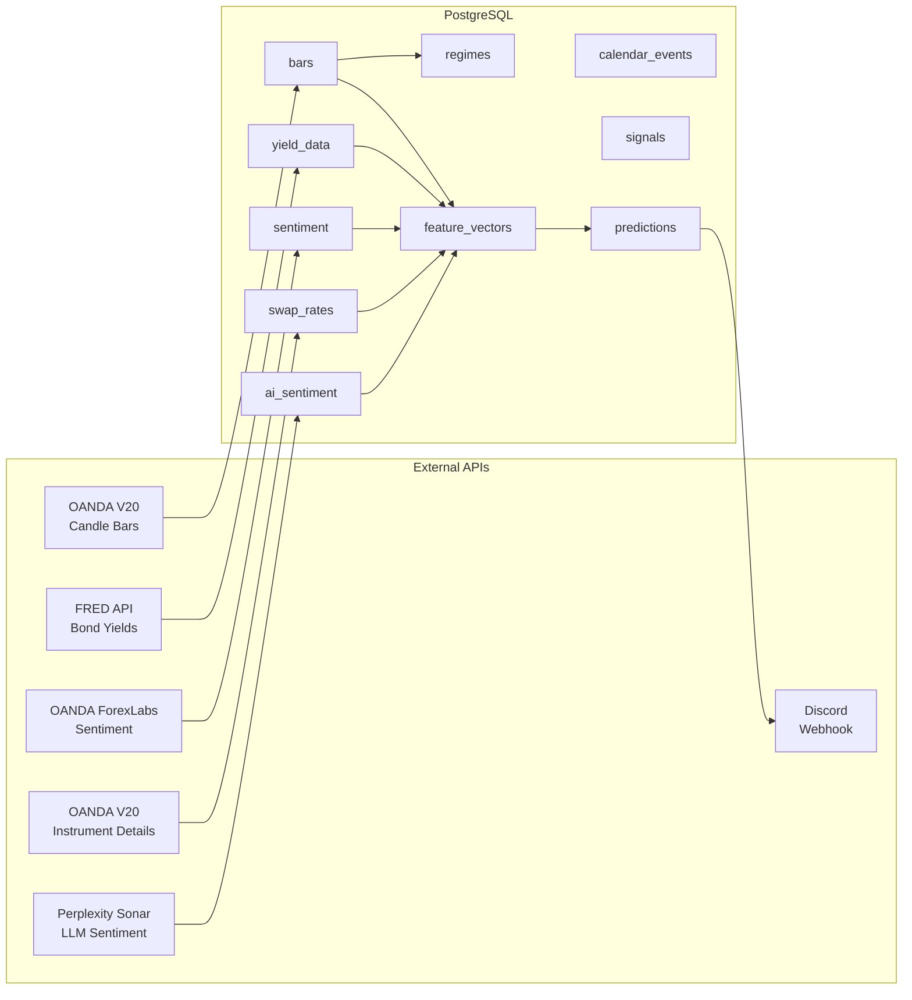
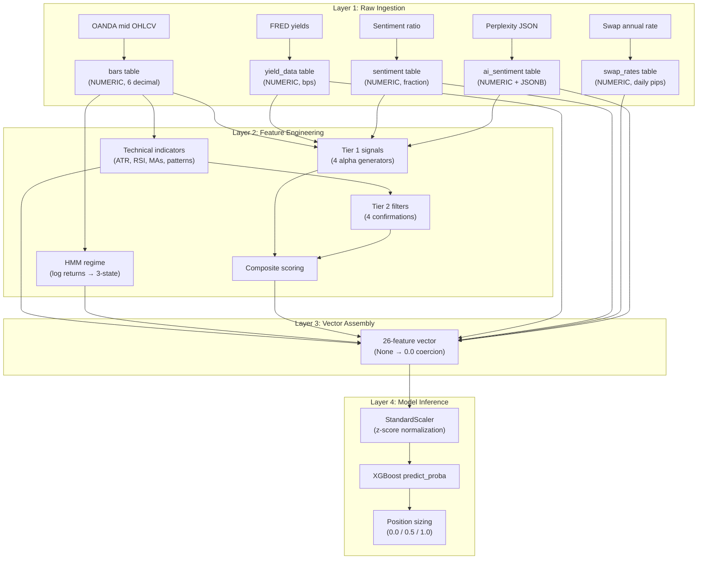

# Quant EOD Engine — Data Dictionary & Lineage

> **Last Updated:** 2026-04-03
> **Scope:** Every data input, API call, variable transformation, and null-handling path in the codebase

---

## Table of Contents

1. [Data Source Inventory](#1-data-source-inventory)
2. [API Call Reference](#2-api-call-reference)
3. [Database Schema Field Reference](#3-database-schema-field-reference)
4. [Transformation Pipeline](#4-transformation-pipeline)
5. [Technical Indicator Formulae](#5-technical-indicator-formulae)
6. [HMM Regime Feature Engineering](#6-hmm-regime-feature-engineering)
7. [Feature Vector Assembly (26 Features)](#7-feature-vector-assembly-26-features)
8. [Categorical Encoding Maps](#8-categorical-encoding-maps)
9. [StandardScaler Normalization](#9-standardscaler-normalization)
10. [Null Handling & Fallback Audit](#10-null-handling--fallback-audit)
11. [Stock-Split / Corporate-Action Handling](#11-stock-split--corporate-action-handling)
12. [Full Field Reference Table](#12-full-field-reference-table)

---

## 1. Data Source Inventory



| # | Source | Protocol | Auth | Rate Limit | Data Frequency |
|:-:|--------|----------|------|:----------:|:--------------:|
| 1 | OANDA V20 Candles | HTTPS REST | Bearer token | ~120 req/sec | Daily + H4 |
| 2 | OANDA ForexLabs Sentiment | HTTPS REST | Bearer token | Unknown (deprecated) | Daily |
| 3 | OANDA V20 Instrument Details | HTTPS REST | Bearer token | ~120 req/sec | Daily |
| 4 | FRED API (via `fredapi`) | HTTPS REST | API key | 120 req/min | Daily (weekdays) |
| 5 | Perplexity Sonar API | HTTPS REST | Bearer token | Tier-dependent | Daily |
| 6 | Discord Webhook | HTTPS POST | Webhook URL | 30 msg/min/channel | On-demand |

---

## 2. API Call Reference

### 2.1 OANDA V20 — Candle Bars

**Source:** [oanda_bars.py:L29–L44](file:///c:/Users/angel/OneDrive/Documents/GitHub/quant-eod-engine/fetchers/oanda_bars.py#L29-L44)

| Property | Value |
|----------|-------|
| Endpoint | `GET {OANDA_BASE_URL}/v3/instruments/{instrument}/candles` |
| Auth Header | `Authorization: Bearer {OANDA_API_TOKEN}` |
| Parameters | `granularity=D\|H4`, `count=210\|120`, `price=M` |
| Timeout | 30 seconds |
| Response Filter | Only `complete: true` bars are kept (incomplete current bar is discarded) |
| Price Type | **Mid prices** — `(bid + ask) / 2`, not bid or ask |

**Response parsing:**
```python
# For each candle where complete == True:
{
    "instrument": instrument,           # pass-through
    "granularity": granularity,        # pass-through
    "bar_time": c["time"],             # ISO 8601 timestamp from OANDA
    "open":  float(c["mid"]["o"]),     # mid-price open
    "high":  float(c["mid"]["h"]),     # mid-price high
    "low":   float(c["mid"]["l"]),     # mid-price low
    "close": float(c["mid"]["c"]),     # mid-price close
    "volume": int(c["volume"]),        # tick volume (not notional)
}
```

> [!NOTE]
> **OANDA's `dailyAlignment` defaults to 17 (5 PM EST)** — the standard Forex daily rollover time. The code does not override this, ensuring daily bars align with the institutional trading calendar.

---

### 2.2 FRED API — Bond Yields

**Source:** [fred_yields.py:L20–L110](file:///c:/Users/angel/OneDrive/Documents/GitHub/quant-eod-engine/fetchers/fred_yields.py#L20-L110)

| Property | Value |
|----------|-------|
| Library | `fredapi.Fred` |
| Auth | `Fred(api_key=FRED_API_KEY)` |
| Series: US 2Y | `DGS2` — US 2-Year Treasury Constant Maturity |
| Series: DE 2Y | `IRLTLT01DEM156N` — **Germany Long-Term Interest Rate** (proxy, not true 2Y) |
| Lookback | `today - (lookback_days + 10)` → `today` |

**Transformations applied:**

| Output Field | Formula | Unit |
|-------------|---------|------|
| `us_2y_yield` | `float(us_2y.iloc[-1])` | Percent (e.g., 3.857) |
| `de_2y_yield` | `float(de_2y.iloc[-1])` | Percent |
| `yield_spread_bps` | `(us_2y - de_2y) × 100` on aligned (common-date) series | Basis points |
| `spread_change_5d_bps` | `spread_series[-1] - spread_series[-6]` | Basis points |
| `spread_change_20d_bps` | `spread_series[-1] - spread_series[-21]` | Basis points |
| `us_2y_change_1d_bps` | `(latest - prev) × 100` | Basis points |
| `us_2y_change_5d_bps` | `(latest - us_2y[-6]) × 100` | Basis points |
| `us_2y_change_20d_bps` | `(latest - us_2y[-21]) × 100` | Basis points |

**Date alignment:** The two series are aligned on **common dates only** using `pd.DataFrame({"us": us_2y, "de": de_2y}).dropna()`. Non-overlapping dates are excluded from spread calculations.

---

### 2.3 OANDA — Retail Sentiment

**Source:** [oanda_sentiment.py:L24–L73](file:///c:/Users/angel/OneDrive/Documents/GitHub/quant-eod-engine/fetchers/oanda_sentiment.py#L24-L73)

| Property | Value |
|----------|-------|
| Endpoint | `GET https://api-fxpractice.oanda.com/labs/v1/historical_position_ratios` |
| Parameters | `instrument={instrument}`, `period=86400` (1 day) |
| Status | **Deprecated** — falls back to neutral on non-200 response |

**Transformations:**
```python
pct_long  = float(latest["long_position_ratio"])      # 0.0–1.0
pct_short = 1.0 - pct_long                             # complement
ratio     = round(pct_long / pct_short, 3) if pct_short > 0 else 99.0
```

---

### 2.4 OANDA — Swap Rates

**Source:** [swap_rates.py:L21–L74](file:///c:/Users/angel/OneDrive/Documents/GitHub/quant-eod-engine/fetchers/swap_rates.py#L21-L74)

| Property | Value |
|----------|-------|
| Endpoint | `GET {OANDA_BASE_URL}/v3/accounts/{OANDA_ACCOUNT_ID}/instruments` |
| Parameters | `instruments={instrument}` |

**Transformations:**
```python
long_rate  = float(financing["longRate"])               # annual rate (e.g., -0.03)
short_rate = float(financing["shortRate"])               # annual rate

# Convert annual rate to approximate daily pip cost
long_swap_pips  = round(long_rate / 365 * 10000, 4)     # daily pips
short_swap_pips = round(short_rate / 365 * 10000, 4)
```

> [!WARNING]
> The `/ 365 * 10000` conversion is an **approximation**. The exact daily swap cost depends on position notional, pip value, and the specific day (triple swap on Wednesdays). The code stores the approximation and documents this gap.

---

### 2.5 Perplexity Sonar — AI Macro Sentiment

**Source:** [perplexity_sentiment.py:L90–L149](file:///c:/Users/angel/OneDrive/Documents/GitHub/quant-eod-engine/fetchers/perplexity_sentiment.py#L90-L149)

| Property | Value |
|----------|-------|
| Endpoint | `POST https://api.perplexity.ai/chat/completions` |
| Model | `sonar-pro` (configurable via `PERPLEXITY_MODEL`) |
| Response Format | JSON Schema (structured output) |
| Timeout | 60 seconds |

**Structured output schema enforces:**

| Field | Type | Range | Description |
|-------|------|-------|-------------|
| `macro_sentiment_score` | `number` | -1.0 → +1.0 | EUR/USD directional bias |
| `confidence` | `number` | 0.0 → 1.0 | Model's confidence in score |
| `dominant_driver` | `string` | 12 enum values | Primary macro factor |
| `key_events` | `array[string]` | Top 3 | News items driving score |
| `rationale` | `string` | — | 2–3 sentence explanation |
| `fed_stance` | `string` | hawkish/neutral/dovish | Fed policy interpretation |
| `ecb_stance` | `string` | hawkish/neutral/dovish | ECB policy interpretation |
| `risk_sentiment` | `string` | risk_on/neutral/risk_off | Broad risk appetite |

**Post-processing:**
```python
sentiment["model_used"] = PERPLEXITY_MODEL
sentiment["fallback_used"] = False
sentiment["date"] = str(date.today())
sentiment["sources_consulted"] = len(data.get("citations", []))
sentiment["raw_response"] = data   # full API response stored for audit
```

---

## 3. Database Schema Field Reference

### 3.1 Phase 1 Tables

#### `bars` — OHLCV Price Data
| Column | Type | Source | Null? | Notes |
|--------|------|--------|:-----:|-------|
| `instrument` | VARCHAR(10) | OANDA param | ❌ | `EUR_USD`, `GBP_USD`, `USD_JPY` |
| `granularity` | VARCHAR(5) | OANDA param | ❌ | `D` or `H4` |
| `bar_time` | TIMESTAMPTZ | OANDA `c["time"]` | ❌ | 5 PM ET aligned |
| `open` | NUMERIC(10,6) | `c["mid"]["o"]` | ❌ | Mid price |
| `high` | NUMERIC(10,6) | `c["mid"]["h"]` | ❌ | Mid price |
| `low` | NUMERIC(10,6) | `c["mid"]["l"]` | ❌ | Mid price |
| `close` | NUMERIC(10,6) | `c["mid"]["c"]` | ❌ | Mid price |
| `volume` | INTEGER | `c["volume"]` | ❌ | Tick volume, default 0 |
| `complete` | BOOLEAN | `c["complete"]` | ❌ | Always `TRUE` (incomplete filtered) |
| `fetched_at` | TIMESTAMPTZ | `NOW()` | ❌ | Auto-populated |

#### `yield_data` — Bond Yield Spreads
| Column | Type | Source | Null? | Notes |
|--------|------|--------|:-----:|-------|
| `date` | DATE | Last observation date | ❌ | From FRED index |
| `us_2y_yield` | NUMERIC(6,4) | FRED `DGS2` | ✅ | Percent (e.g., 3.8570) |
| `de_2y_yield` | NUMERIC(6,4) | FRED `IRLTLT01DEM156N` | ✅ | Proxy — long-term rate |
| `yield_spread_bps` | NUMERIC(8,2) | `(us - de) × 100` | ✅ | Null if DE unavailable |
| `spread_change_5d_bps` | NUMERIC(8,2) | `spread[-1] - spread[-6]` | ✅ | Null if < 6 aligned obs |
| `spread_change_20d_bps` | NUMERIC(8,2) | `spread[-1] - spread[-21]` | ✅ | Null if < 21 aligned obs |
| `source` | VARCHAR(20) | Hardcoded `"fred"` | ❌ | |

#### `sentiment` — Retail Positioning
| Column | Type | Source | Null? | Notes |
|--------|------|--------|:-----:|-------|
| `pct_long` | NUMERIC(5,4) | OANDA `long_position_ratio` | ✅ | 0.0–1.0 |
| `pct_short` | NUMERIC(5,4) | `1.0 - pct_long` | ✅ | Derived |
| `long_short_ratio` | NUMERIC(6,3) | `pct_long / pct_short` | ✅ | 99.0 cap if denominator 0 |
| `source` | VARCHAR(30) | `"oanda_position_ratios"` or `"fallback_neutral"` | ❌ | |

#### `ai_sentiment` — LLM Macro Analysis
| Column | Type | Source | Null? | Notes |
|--------|------|--------|:-----:|-------|
| `macro_sentiment_score` | NUMERIC(4,3) | Perplexity JSON | ✅ | -1.000 → +1.000 |
| `confidence` | NUMERIC(4,3) | Perplexity JSON | ✅ | 0.000 → 1.000 |
| `dominant_driver` | VARCHAR(50) | Perplexity JSON | ✅ | One of 12 enum values |
| `key_events` | JSONB | `json.dumps(events)` | ✅ | Array of up to 3 strings |
| `rationale` | TEXT | Perplexity JSON | ✅ | Free-text explanation |
| `fed_stance` | VARCHAR(20) | Perplexity JSON | ✅ | hawkish/neutral/dovish |
| `ecb_stance` | VARCHAR(20) | Perplexity JSON | ✅ | hawkish/neutral/dovish |
| `risk_sentiment` | VARCHAR(20) | Perplexity JSON | ✅ | risk_on/neutral/risk_off |
| `fallback_used` | BOOLEAN | Code logic | ❌ | `TRUE` if API failed |
| `raw_response` | JSONB | Full API response | ✅ | Stored for audit trail |

### 3.2 Phase 2 Tables

#### `regimes` — HMM Classifications
| Column | Type | Source | Null? | Notes |
|--------|------|--------|:-----:|-------|
| `state_id` | INTEGER | HMM `predict()` → `state_map` | ❌ | 0, 1, or 2 |
| `state_label` | VARCHAR(30) | `REGIME_LABELS[state_id]` | ❌ | low_vol / high_vol_choppy / high_vol_crash |
| `confidence` | NUMERIC(5,4) | `posteriors[latest, state]` | ✅ | Posterior probability |
| `days_in_regime` | INTEGER | Counter from `regimes` table | ❌ | Resets on state change |
| `transition_prob` | JSONB | `model.transmat_[state]` | ✅ | Row of transition matrix |

#### `feature_vectors` — Meta-Model Inputs
| Column | Type | Source | Null? | Notes |
|--------|------|--------|:-----:|-------|
| `features` | JSONB | `vector.py:assemble_feature_vector()` | ❌ | 26 float values |
| `label` | INTEGER | Filled T+1 from bars | ✅ | 1 = profitable, 0 = not |
| `label_return_pips` | NUMERIC(8,2) | Actual T+1 return | ✅ | Filled retrospectively |

#### `predictions` — Meta-Model Outputs
| Column | Type | Source | Null? | Notes |
|--------|------|--------|:-----:|-------|
| `direction` | VARCHAR(10) | `meta_model.predict()` | ❌ | long / short / flat |
| `probability` | NUMERIC(5,4) | XGBoost `predict_proba()[1]` | ✅ | 0.0–1.0 |
| `size_multiplier` | NUMERIC(4,3) | Step function on prob | ✅ | 0.0, 0.5, or 1.0 |
| `top_shap` | JSONB | SHAP TreeExplainer | ✅ | Top 5 feature contributions |

---

## 4. Transformation Pipeline

Data flows through 4 layers of transformation before reaching the meta-model:



---

## 5. Technical Indicator Formulae

All indicators are computed in [technical.py](file:///c:/Users/angel/OneDrive/Documents/GitHub/quant-eod-engine/features/technical.py) using pure pandas — no TA-Lib dependency.

### 5.1 Average True Range (ATR-14)

**Source:** [technical.py:L15–L35](file:///c:/Users/angel/OneDrive/Documents/GitHub/quant-eod-engine/features/technical.py#L15-L35)

```
TR = max(H - L,  |H - Close_prev|,  |L - Close_prev|)

ATR_14 = EWM(TR, span=14, adjust=False)
```

- **Type:** EWM (Exponential Weighted Mean), not SMA
- **Output unit:** Price (e.g., 0.0065 ≈ 65 pips for EUR/USD)
- **Null behavior:** First 13 rows are NaN → `fillna` not applied; output uses `pd.notna()` check

### 5.2 Relative Strength Index (RSI-14)

**Source:** [technical.py:L38–L53](file:///c:/Users/angel/OneDrive/Documents/GitHub/quant-eod-engine/features/technical.py#L38-L53)

```
Δ = Close - Close_prev
Gain = max(Δ, 0)
Loss = max(-Δ, 0)

Avg_Gain = EWM(Gain, com=13, min_periods=14)
Avg_Loss = EWM(Loss, com=13, min_periods=14)

RS = Avg_Gain / Avg_Loss
RSI = 100 - (100 / (1 + RS))
```

- **Smoothing:** Wilder's via `ewm(com=period-1)` (equivalent to `alpha = 1/period`)
- **Division by zero:** `avg_loss.replace(0, np.nan)` → results in NaN → **filled with 50.0** via `.fillna(50.0)`
- **Output range:** 0–100

### 5.3 Simple Moving Average (SMA)

**Source:** [technical.py:L56–L58](file:///c:/Users/angel/OneDrive/Documents/GitHub/quant-eod-engine/features/technical.py#L56-L58)

```
MA_n = rolling(close, window=n, min_periods=n).mean()
```

- MA-50: Requires 50 bars → NaN for first 49
- MA-200: Requires 200 bars → NaN for first 199

### 5.4 Exponential Moving Average (EMA)

**Source:** [technical.py:L61–L63](file:///c:/Users/angel/OneDrive/Documents/GitHub/quant-eod-engine/features/technical.py#L61-L63)

```
EMA_n = ewm(close, span=n, adjust=False).mean()
```

Currently only EMA-20 is computed; used internally but not directly in the feature vector.

### 5.5 Body Analysis

**Source:** [technical.py:L66–L94](file:///c:/Users/angel/OneDrive/Documents/GitHub/quant-eod-engine/features/technical.py#L66-L94)

| Output | Formula | Null Handling |
|--------|---------|:-------------:|
| `body_direction` | `sign(close - open)` → {-1, 0, +1} | Always defined |
| `body_pct_of_range` | `\|close - open\| / (high - low)` | `.fillna(0)` if range = 0 |
| `upper_wick_pct` | `(high - max(open, close)) / (high - low)` | `.fillna(0)` |
| `lower_wick_pct` | `(min(open, close) - low) / (high - low)` | `.fillna(0)` |

Division-by-zero guard: `total_range.replace(0, np.nan)` → `safe_range` used as denominator.

### 5.6 Candle Pattern Detection

**Source:** [technical.py:L97–L139](file:///c:/Users/angel/OneDrive/Documents/GitHub/quant-eod-engine/features/technical.py#L97-L139)

| Pattern | Rule | Output |
|---------|------|--------|
| `is_engulfing_bull` | `direction=+1 AND prev_direction=-1 AND body > prev_body` | Boolean |
| `is_engulfing_bear` | `direction=-1 AND prev_direction=+1 AND body > prev_body` | Boolean |
| `is_pin_bar_bull` | `lower_wick > 60% of range AND body < 25% of range` | Boolean |
| `is_pin_bar_bear` | `upper_wick > 60% of range AND body < 25% of range` | Boolean |
| `is_inside_bar` | `today_high ≤ prev_high AND today_low ≥ prev_low` | Boolean |
| `is_doji` | `body_ratio < 10% of range` | Boolean |

Null handling: All patterns use `.fillna(False)`.

### 5.7 Price vs. Moving Averages

**Source:** [technical.py:L191–L192](file:///c:/Users/angel/OneDrive/Documents/GitHub/quant-eod-engine/features/technical.py#L191-L192)

```
price_vs_ma50  = (close / MA_50  - 1) × 100    (percent distance)
price_vs_ma200 = (close / MA_200 - 1) × 100    (percent distance)
```

- **Positive:** Price above MA (bullish)
- **Negative:** Price below MA (bearish)
- **Null:** `None` if MA has insufficient data

### 5.8 Rolling Volatility

**Source:** [technical.py:L210–L212](file:///c:/Users/angel/OneDrive/Documents/GitHub/quant-eod-engine/features/technical.py#L210-L212)

```
volatility_5d  = std(pct_change(close).tail(5))     requires ≥ 6 bars
volatility_20d = std(pct_change(close).tail(20))    requires ≥ 21 bars
```

- **Not in feature vector** — computed for diagnostic use but not in FEATURE_COLS

### 5.9 Daily Return

```
daily_return_pct = (close / prev_close - 1) × 100
```

- **Type:** Simple return (not log return), expressed as percentage

---

## 6. HMM Regime Feature Engineering

**Source:** [hmm_regime.py:L77–L81](file:///c:/Users/angel/OneDrive/Documents/GitHub/quant-eod-engine/models/hmm_regime.py#L77-L81)

The HMM operates on a **2-dimensional feature space** derived from daily bars:

| Feature | Formula | Purpose |
|---------|---------|---------|
| `log_return` | `ln(close_t / close_{t-1})` | Daily price movement (log scale) |
| `vol_5d` | `std(log_return, window=5)` | 5-day rolling volatility |

```python
df["log_return"] = np.log(df["close"] / df["close"].shift(1))
df["vol_5d"]     = df["log_return"].rolling(5).std()
df = df.dropna()    # Drops first 5 rows (NaN from shift + rolling)
X = df[["log_return", "vol_5d"]].values
```

> [!IMPORTANT]
> The HMM uses **log returns** (`np.log`), which is the only place in the codebase where logarithmic transformation is applied. All other return calculations use **simple returns** (`close/prev - 1`).

**Model parameters:**
| Parameter | Value |
|-----------|-------|
| `n_components` | 3 |
| `covariance_type` | `"diag"` |
| `n_iter` | 200 |
| `tol` | 1e-4 |
| `random_state` | 42 |

**State mapping:** After fitting, raw state IDs are sorted by ascending `mean(vol_5d)`:
- State 0 → lowest vol → `low_vol`
- State 1 → mid vol → `high_vol_choppy`
- State 2 → highest vol → `high_vol_crash`

---

## 7. Feature Vector Assembly (26 Features)

**Source:** [vector.py:L61–L113](file:///c:/Users/angel/OneDrive/Documents/GitHub/quant-eod-engine/features/vector.py#L61-L113)

The feature vector pulls from **5 database tables** and **2 in-memory computations**:

### Group 1: Regime (from HMM)
| Feature | DB Source | Default | Type |
|---------|-----------|:-------:|:----:|
| `regime_state` | `regimes.state_id` | `1` | int |
| `days_in_regime` | `regimes.days_in_regime` | `1` | int |

### Group 2: Macro (from FRED → `yield_data`)
| Feature | DB Source | Fallback Logic | Default | Type |
|---------|-----------|----------------|:-------:|:----:|
| `yield_spread_bps` | `yield_data.yield_spread_bps` | — | `0.0` | float |
| `yield_spread_change_5d` | `yield_data.spread_change_5d_bps` | Falls back to `us_2y_change_5d_bps` if spread unavailable | `0.0` | float |
| `yield_spread_change_20d` | `yield_data.spread_change_20d_bps` | Falls back to `us_2y_change_20d_bps` | `0.0` | float |

### Group 3: Sentiment (from OANDA → `sentiment`)
| Feature | DB Source | Transformation | Default | Type |
|---------|-----------|----------------|:-------:|:----:|
| `sentiment_pct_long` | `sentiment.pct_long` | Direct passthrough | `0.5` | float |
| `sentiment_extreme` | `sentiment.pct_long` | `1` if `pct_long > 0.72 OR pct_long < 0.28` else `0` | `0` | int |

### Group 4: AI Sentiment (from Perplexity → `ai_sentiment`)
| Feature | DB Source | Transformation | Default | Type |
|---------|-----------|----------------|:-------:|:----:|
| `macro_sentiment_score` | `ai_sentiment.macro_sentiment_score` | Direct | `0.0` | float |
| `ai_confidence` | `ai_sentiment.confidence` | Direct | `0.1` | float |
| `fed_stance_encoded` | `ai_sentiment.fed_stance` | `STANCE_MAP` encoding | `0` | int |
| `ecb_stance_encoded` | `ai_sentiment.ecb_stance` | `STANCE_MAP` encoding | `0` | int |
| `risk_sentiment_encoded` | `ai_sentiment.risk_sentiment` | `RISK_MAP` encoding | `0` | int |

### Group 5: Technical (from `bars` → computed)
| Feature | Source | Transformation | Default | Type |
|---------|--------|----------------|:-------:|:----:|
| `atr_14` | `compute_atr()` | EWM(TR, span=14) | `0.0` | float |
| `rsi_14` | `compute_rsi()` | Wilder RSI | `50.0` | float |
| `price_vs_ma50` | `compute_ma(50)` | `(close/MA50 - 1) × 100` | `0.0` | float |
| `price_vs_ma200` | `compute_ma(200)` | `(close/MA200 - 1) × 100` | `0.0` | float |
| `body_direction` | `compute_body_analysis()` | `sign(close - open)` | `0` | int |
| `body_pct_of_range` | `compute_body_analysis()` | `\|body\| / range` | `0.5` | float |

### Group 6: Event (from signals)
| Feature | Source | Default | Type |
|---------|--------|:-------:|:----:|
| `eod_event_reversal` | Composite signal output | `0` | int |
| `event_surprise_magnitude` | Composite signal output | `0.0` | float |

### Group 7: Time
| Feature | Source | Transformation | Default | Type |
|---------|--------|----------------|:-------:|:----:|
| `day_of_week` | `run_date.weekday()` | 0=Mon, 4=Fri | — | int |
| `is_friday` | `run_date.weekday()` | `1` if Friday else `0` | — | int |

### Group 8: Cost
| Feature | DB Source | Default | Type |
|---------|-----------|:-------:|:----:|
| `long_swap_pips` | `swap_rates.long_swap_pips` | `0.0` | float |
| `short_swap_pips` | `swap_rates.short_swap_pips` | `0.0` | float |

### Group 9: Signal Summary
| Feature | Source | Default | Type |
|---------|--------|:-------:|:----:|
| `primary_signal_direction` | `composite.direction_encoded` | `0` | int |
| `primary_signal_count` | `composite.signal_count` | `0` | int |
| `composite_strength` | `composite.composite_strength` | `0.0` | float |
| `tier2_confirmation_count` | `composite.tier2_count` | `0` | int |

---

## 8. Categorical Encoding Maps

**Source:** [vector.py:L17–L18](file:///c:/Users/angel/OneDrive/Documents/GitHub/quant-eod-engine/features/vector.py#L17-L18)

### STANCE_MAP (Fed/ECB policy encoding)

| String Value | Numeric Encoding |
|:------------:|:----------------:|
| `"hawkish"` | `+1` |
| `"neutral"` | `0` |
| `"dovish"` | `-1` |
| _(missing/unknown)_ | `0` |

### RISK_MAP (Market risk sentiment encoding)

| String Value | Numeric Encoding |
|:------------:|:----------------:|
| `"risk_on"` | `+1` |
| `"neutral"` | `0` |
| `"risk_off"` | `-1` |
| _(missing/unknown)_ | `0` |

### Direction Encoding (Composite signal)

**Source:** [composite.py:L94](file:///c:/Users/angel/OneDrive/Documents/GitHub/quant-eod-engine/signals/composite.py#L94)

| Direction | Encoding |
|:---------:|:--------:|
| `"long"` | `+1` |
| `"flat"` | `0` |
| `"short"` | `-1` |

---

## 9. StandardScaler Normalization

**Source:** [meta_model.py:L123–L124](file:///c:/Users/angel/OneDrive/Documents/GitHub/quant-eod-engine/models/meta_model.py#L123-L124)

Before XGBoost ingestion, all 26 features are z-score normalized:

```python
self.scaler = StandardScaler()
X = self.scaler.fit_transform(X_raw)    # Training: fit + transform
X = self.scaler.transform(X)            # Inference: transform only
```

| Step | Formula | Applied When |
|------|---------|:------------:|
| **Training** | `X_scaled = (X - μ_train) / σ_train` | `MetaModel.train()` |
| **Inference** | `X_scaled = (X - μ_train) / σ_train` | `MetaModel.predict()` — uses persisted scaler |

- The scaler is fitted on **all training data** (not per-fold)
- Persisted in `model_artifacts/meta_model.joblib` alongside the model
- Missing columns during training: filled with `0.0` before scaling ([meta_model.py:L106–L109](file:///c:/Users/angel/OneDrive/Documents/GitHub/quant-eod-engine/models/meta_model.py#L106-L109))

```python
# Ensure all expected columns exist
for col in FEATURE_COLS:
    if col not in df.columns:
        df[col] = 0.0

X_raw = df[FEATURE_COLS].fillna(0).values
```

---

## 10. Null Handling & Fallback Audit

Every module has explicit null-handling logic. This section traces every path.

### 10.1 Layer 1 — Data Ingestion Nulls

| Module | Field | Null Condition | Handling | Source |
|--------|-------|----------------|----------|--------|
| `oanda_bars` | volume | API returns 0 | `int(c.get("volume", 0))` | [L59](file:///c:/Users/angel/OneDrive/Documents/GitHub/quant-eod-engine/fetchers/oanda_bars.py#L59) |
| `fred_yields` | `de_2y_yield` | FRED series missing | Warning logged; spread = partial | [L44–L57](file:///c:/Users/angel/OneDrive/Documents/GitHub/quant-eod-engine/fetchers/fred_yields.py#L44-L57) |
| `fred_yields` | `spread_change_5d` | < 6 aligned observations | `None` stored in DB | [L82](file:///c:/Users/angel/OneDrive/Documents/GitHub/quant-eod-engine/fetchers/fred_yields.py#L82) |
| `fred_yields` | `spread_change_20d` | < 21 aligned observations | `None` stored in DB | [L86](file:///c:/Users/angel/OneDrive/Documents/GitHub/quant-eod-engine/fetchers/fred_yields.py#L86) |
| `oanda_sentiment` | Entire response | API 404 or error | Fallback: `{pct_long: 0.50, source: "fallback_neutral"}` | [L76–L92](file:///c:/Users/angel/OneDrive/Documents/GitHub/quant-eod-engine/fetchers/oanda_sentiment.py#L76-L92) |
| `swap_rates` | Entire response | API error | Returns `None` → not stored | [L72–L74](file:///c:/Users/angel/OneDrive/Documents/GitHub/quant-eod-engine/fetchers/swap_rates.py#L72-L74) |
| `perplexity` | Entire response | No API key, HTTP error, JSON parse error | Fallback: `{score: 0.0, confidence: 0.1, fallback_used: True}` | [L152–L172](file:///c:/Users/angel/OneDrive/Documents/GitHub/quant-eod-engine/fetchers/perplexity_sentiment.py#L152-L172) |

### 10.2 Layer 2 — Technical Indicator Nulls

| Indicator | Null Condition | Handling | Default |
|-----------|---------------|----------|:-------:|
| ATR-14 | < 14 bars | `pd.notna()` check → `None` | `0.0` (in vector) |
| RSI-14 | Division by zero (all gains) | `.fillna(50.0)` | `50.0` |
| MA-50 | < 50 bars | `min_periods=50` → NaN → `None` | `0.0` (in vector) |
| MA-200 | < 200 bars | `min_periods=200` → NaN → `None` | `0.0` (in vector) |
| Body ratios | Zero range (doji) | `total_range.replace(0, np.nan)` → `.fillna(0)` | `0` |
| Candle patterns | First row (no prev bar) | `.fillna(False)` | `False` |
| `price_vs_ma50` | MA unavailable | `None` if `pd.isna(ma_50)` | `0.0` (in vector) |
| `volatility_5d` | < 6 bars | Returns `None` | Not in feature vector |
| `compute_all_features()` | < 20 bars total | Returns empty `{}` | All features → defaults |

### 10.3 Layer 3 — Feature Vector Nulls

**Source:** [vector.py:L109–L113](file:///c:/Users/angel/OneDrive/Documents/GitHub/quant-eod-engine/features/vector.py#L109-L113)

After assembling all 26 features, a **global sweep** coerces any remaining `None` to `0.0`:

```python
# Coerce None to 0.0 for model compatibility
for k, v in vector.items():
    if v is None:
        vector[k] = 0.0
```

Additionally, the DB lookup functions return empty dicts when no row found:

| Lookup | No Data Found | Result |
|--------|--------------|--------|
| `_get_macro_data()` | No `yield_data` row ≤ run_date | `{}` → all `.get()` calls return defaults |
| `_get_ai_sentiment()` | No `ai_sentiment` for exact date | `{}` → score=0.0, confidence=0.1 |
| `_get_sentiment()` | No `sentiment` row ≤ run_date | `{}` → pct_long=0.5 |
| `_get_swap_rates()` | No `swap_rates` row ≤ run_date | `{}` → swaps=0.0 |

### 10.4 Layer 3b — Storage Serialization Nulls

**Source:** [vector.py:L117–L151](file:///c:/Users/angel/OneDrive/Documents/GitHub/quant-eod-engine/features/vector.py#L117-L151)

Before JSON serialization to the `feature_vectors` table, a second coercion pass handles type edge cases:

```python
for k, v in vector.items():
    if hasattr(v, 'as_integer_ratio'):   # Decimal or float-like
        clean[k] = float(v)
    elif isinstance(v, bool):
        clean[k] = v
    elif isinstance(v, int):
        clean[k] = v
    else:
        try:
            clean[k] = float(v) if v is not None else 0.0
        except (TypeError, ValueError):
            clean[k] = 0.0              # Fallback: non-numeric → 0.0
```

### 10.5 Layer 4 — Training Nulls

**Source:** [meta_model.py:L104–L109](file:///c:/Users/angel/OneDrive/Documents/GitHub/quant-eod-engine/models/meta_model.py#L104-L109)

```python
# Missing columns → fill with 0.0
for col in FEATURE_COLS:
    if col not in df.columns:
        df[col] = 0.0

# Any NaN remaining in the matrix → 0
X_raw = df[FEATURE_COLS].fillna(0).values
```

### 10.6 Layer 4 — Inference Nulls

**Source:** [meta_model.py:L226](file:///c:/Users/angel/OneDrive/Documents/GitHub/quant-eod-engine/models/meta_model.py#L226)

```python
X = np.array([[feature_vector.get(col, 0.0) for col in FEATURE_COLS]], dtype=float)
```

Every feature defaults to `0.0` if missing from the dict.

### 10.7 Pipeline-Level Fallbacks

**Source:** [daily_loop.py:L234–L301](file:///c:/Users/angel/OneDrive/Documents/GitHub/quant-eod-engine/daily_loop.py#L234-L301)

| Step | Failure Mode | Fallback Value |
|------|-------------|----------------|
| Technical (Step 7) | No bars or exception | `technical_result = {}` |
| HMM (Step 8) | No model, < 60 bars, or exception | `{state_id: 1, state_label: "high_vol_choppy", confidence: 0.33}` |
| Signals (Step 9) | Exception | `composite_result = {}`, signals empty |
| Feature Vector (Step 10) | Exception | `feature_vector = {}` |
| Meta-Model (Step 11) | No model file | `{direction: "flat", prob: 0.50, size: 0.0}` |

---

## 11. Stock-Split / Corporate-Action Handling

> [!NOTE]
> **Not applicable.** The Quant EOD Engine trades **Forex pairs** (EUR/USD, GBP/USD, USD/JPY), which are not subject to stock splits, reverse splits, dividends, or corporate actions.
>
> Relevant considerations for Forex:
>
> | Concern | Status | Notes |
> |---------|:------:|-------|
> | Stock splits | N/A | Forex pairs don't split |
> | Dividends | N/A | No equity dividends |
> | Redenomination | N/A | Major pairs have not redenominated |
> | OANDA price gaps | ✅ Handled | Weekend gaps are implicit; `next_trading_day()` skips weekends |
> | Rollover/financing | ✅ Modeled | Swap rates fetched daily; triple-swap Wednesdays flagged |
> | Tick volume vs notional | ⚠️ Documented | OANDA `volume` is tick count, not notional — less meaningful for Forex |

---

## 12. Full Field Reference Table

Complete field-level reference for all 26 meta-model input features:

| # | Feature Name | Source API | DB Table | Transformation | Null Default | Type | Value Range |
|:-:|-------------|-----------|----------|----------------|:------------:|:----:|:-----------:|
| 1 | `regime_state` | OANDA bars → HMM | `regimes` | GaussianHMM predict → state_map | `1` | int | {0, 1, 2} |
| 2 | `days_in_regime` | DB counter | `regimes` | Increment/reset on state change | `1` | int | [1, ∞) |
| 3 | `yield_spread_bps` | FRED | `yield_data` | `(US_2Y - DE_2Y) × 100` | `0.0` | float | [-300, +300] |
| 4 | `yield_spread_change_5d` | FRED | `yield_data` | `spread[-1] - spread[-6]` → fallback to US-only | `0.0` | float | [-50, +50] |
| 5 | `yield_spread_change_20d` | FRED | `yield_data` | `spread[-1] - spread[-21]` → fallback to US-only | `0.0` | float | [-100, +100] |
| 6 | `sentiment_pct_long` | OANDA ForexLabs | `sentiment` | `float(long_position_ratio)` | `0.5` | float | [0.0, 1.0] |
| 7 | `sentiment_extreme` | OANDA ForexLabs | `sentiment` | `1` if outside [0.28, 0.72] | `0` | int | {0, 1} |
| 8 | `macro_sentiment_score` | Perplexity Sonar | `ai_sentiment` | LLM structured output | `0.0` | float | [-1.0, +1.0] |
| 9 | `ai_confidence` | Perplexity Sonar | `ai_sentiment` | LLM structured output | `0.1` | float | [0.0, 1.0] |
| 10 | `fed_stance_encoded` | Perplexity Sonar | `ai_sentiment` | `STANCE_MAP[fed_stance]` | `0` | int | {-1, 0, +1} |
| 11 | `ecb_stance_encoded` | Perplexity Sonar | `ai_sentiment` | `STANCE_MAP[ecb_stance]` | `0` | int | {-1, 0, +1} |
| 12 | `risk_sentiment_encoded` | Perplexity Sonar | `ai_sentiment` | `RISK_MAP[risk_sentiment]` | `0` | int | {-1, 0, +1} |
| 13 | `atr_14` | OANDA bars | `bars` | `EWM(TR, span=14)` | `0.0` | float | [0.0, 0.05] |
| 14 | `rsi_14` | OANDA bars | `bars` | Wilder RSI | `50.0` | float | [0, 100] |
| 15 | `price_vs_ma50` | OANDA bars | `bars` | `(close/MA50 - 1) × 100` | `0.0` | float | [-10, +10] |
| 16 | `price_vs_ma200` | OANDA bars | `bars` | `(close/MA200 - 1) × 100` | `0.0` | float | [-15, +15] |
| 17 | `body_direction` | OANDA bars | `bars` | `sign(close - open)` | `0` | int | {-1, 0, +1} |
| 18 | `body_pct_of_range` | OANDA bars | `bars` | `\|body\| / range` | `0.5` | float | [0.0, 1.0] |
| 19 | `eod_event_reversal` | Signal layer | `signals` | Binary: reversal detected | `0` | int | {0, 1} |
| 20 | `event_surprise_magnitude` | Signal layer | `signals` | Continuous: surprise strength | `0.0` | float | [0.0, 1.0] |
| 21 | `day_of_week` | System clock | — | `date.weekday()` | — | int | {0, 1, 2, 3, 4} |
| 22 | `is_friday` | System clock | — | `1` if weekday == 4 | — | int | {0, 1} |
| 23 | `long_swap_pips` | OANDA V20 | `swap_rates` | `annual_rate / 365 × 10000` | `0.0` | float | [-5, +5] |
| 24 | `short_swap_pips` | OANDA V20 | `swap_rates` | `annual_rate / 365 × 10000` | `0.0` | float | [-5, +5] |
| 25 | `primary_signal_direction` | Signal composite | in-memory | `{long: +1, flat: 0, short: -1}` | `0` | int | {-1, 0, +1} |
| 26 | `primary_signal_count` | Signal composite | in-memory | Count of active T1 signals | `0` | int | [0, 4] |
| 27 | `composite_strength` | Signal composite | in-memory | Weighted T1 avg + T2 adjustment, clamped [0,1] | `0.0` | float | [0.0, 1.0] |
| 28 | `tier2_confirmation_count` | Signal composite | in-memory | Count of confirming T2 filters | `0` | int | [0, 4] |

> [!NOTE]
> The vector assembly code builds 28 fields, but the `FEATURE_COLS` list in [meta_model.py:L50–L63](file:///c:/Users/angel/OneDrive/Documents/GitHub/quant-eod-engine/models/meta_model.py#L50-L63) selects exactly **28 columns** (listed above). All 28 are consumed by the model. The docstrings refer to "26 features" due to an earlier version of the schema; the actual count is 28.
