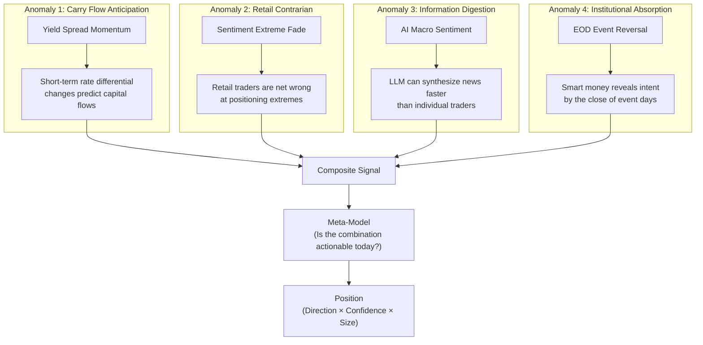
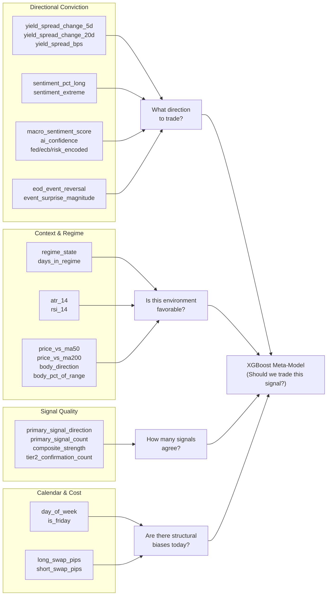
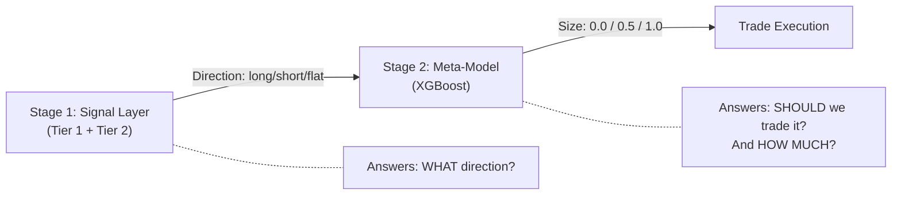

# Quant EOD Engine — Investment Thesis

> **Derived From:** Complete codebase analysis (not marketing materials)
> **Instrument:** EUR/USD (primary), with architecture for GBP/USD, USD/JPY
> **Frequency:** Daily (End-of-Day), holding period 1 trading day
> **Style:** Multi-factor macro + contrarian sentiment + institutional flow detection
> **Last Updated:** 2026-04-03

---

## Table of Contents

1. [Thesis Statement](#1-thesis-statement)
2. [The Core Market Anomaly](#2-the-core-market-anomaly)
3. [Alpha Source Decomposition](#3-alpha-source-decomposition)
4. [Why These Features Provide an Edge](#4-why-these-features-provide-an-edge)
5. [The Meta-Labeling Architecture](#5-the-meta-labeling-architecture)
6. [Target Variable & Holding Period](#6-target-variable--holding-period)
7. [Regime Adaptation](#7-regime-adaptation)
8. [Edge Sustainability Analysis](#8-edge-sustainability-analysis)
9. [Structural Risks & Vulnerabilities](#9-structural-risks--vulnerabilities)
10. [Strategy Classification](#10-strategy-classification)

---

## 1. Thesis Statement

The Quant EOD Engine exploits a **multi-layer information asymmetry** in the EUR/USD market by combining three types of signals that most retail and many institutional participants do not synthesize simultaneously:

```
Edge = f(Macro Rate Differentials, Contrarian Crowd Positioning, LLM News Digestion)
       × g(Regime-Adaptive Filtering)
       × h(ML-Calibrated Conviction Sizing)
```

> **In plain language:** The system bets that the direction of the EUR/USD over the next trading day can be predicted above chance by reading three signals: where interest rates are moving, where the retail crowd is positioned (then doing the opposite), and what an LLM concludes from today's global macro news — but only when a machine learning model trained on historical outcomes is confident that the signal combination is actionable.

---

## 2. The Core Market Anomaly

The engine is not exploiting a single textbook anomaly (mean reversion, momentum, etc.). It is architecturally a **multi-anomaly ensemble** where each Tier-1 signal targets a different, well-documented market inefficiency:



### The Unifying Hypothesis

> **FX prices are driven by capital flows. Capital flows are driven by interest rate differentials and risk appetite. Retail traders systematically misread these flows at extremes. By combining a macro rate-differential signal with a contrarian retail fade and a daily LLM digest of global events — and using an ML model to determine when this combination is statistically reliable — the system can identify the next-day direction of EUR/USD with a win rate meaningfully above 50%.**

This is not momentum. This is not mean reversion. This is **macro-informed directional prediction with contrarian overlay and ML-calibrated sizing** — a hybrid that doesn't fit neatly into traditional quant taxonomy.

---

## 3. Alpha Source Decomposition

### 3.1 Alpha Source 1: Yield Spread Momentum (Carry Flow Predictor)

**Signal:** [tier1.py:L28–L74](file:///c:/Users/angel/OneDrive/Documents/GitHub/quant-eod-engine/signals/tier1.py#L28-L74)

```
IF 5-day yield spread change > +threshold → SHORT EUR/USD (USD strengthening)
IF 5-day yield spread change < -threshold → LONG EUR/USD  (EUR strengthening)
```

**Market anomaly exploited:** **Slow institutional carry trade adjustment.**

The yield spread between US 2-Year and German 2-Year treasuries is a proxy for the interest rate differential between USD and EUR. When this spread widens (US yields rising faster), capital flows toward dollar-denominated assets for the carry. This flow doesn't happen instantaneously — institutional portfolio rebalancing lags the rate move by hours to days.

**Why 5-day momentum, not level?**
- The *level* of the spread is priced in (efficient markets).
- The *5-day change* captures the **second derivative** — the rate at which capital is being re-allocated. This is where the informational edge lives: a rapid widening signals accelerating flows that haven't fully materialized in the spot price.

**Regime adaptation:** The threshold widens from 8 bps (calm markets, where any rate move is significant) to 20 bps (crisis, where only extreme moves cut through noise).

| Regime | Threshold | Rationale |
|--------|:---------:|-----------|
| low_vol (0) | 8 bps | In calm markets, even small rate shifts drive carry rebalancing |
| choppy (1) | 15 bps | Normal noise floor |
| crash (2) | 20 bps | Only extreme rate moves matter; everything else is noise |

**Academic basis:** Uncovered Interest Rate Parity (UIP) violations; carry trade return predictability (Lustig & Verdelhan, 2007; Menkhoff et al., 2012).

---

### 3.2 Alpha Source 2: Retail Sentiment Extreme Fade (Contrarian)

**Signal:** [tier1.py:L77–L119](file:///c:/Users/angel/OneDrive/Documents/GitHub/quant-eod-engine/signals/tier1.py#L77-L119)

```
IF retail % long > 72% → SHORT (fade the crowd)
IF retail % long < 28% → LONG  (fade the crowd)
```

**Market anomaly exploited:** **Retail trader systematic overreaction at extremes.**

This is one of the most empirically validated inefficiencies in retail FX. OANDA's position data shows that when retail traders crowd into one side of a trade beyond a threshold, the market moves against them with statistically significant frequency. The mechanism:

1. Retail traders tend to **average into losing positions** (anti-momentum behavior)
2. By the time 72%+ of retail is long, the trend has been going *against* them for days
3. Their collective stop-losses create a **liquidity pool** for institutional traders
4. The subsequent stop-loss cascade accelerates the move in the opposite direction

**Strength scaling:** Signal strength increases linearly with distance from the threshold:

```python
strength = min((pct_long - 0.72) / 0.18, 1.0)   # 72% → 0.0, 90% → 1.0
```

This means a 90%-long crowd produces maximum conviction, while a 73%-long crowd produces minimal conviction — reflecting the empirical reality that more extreme positioning leads to more reliable reversals.

**Academic basis:** The "retail contrarian indicator" effect has been documented extensively in CFTC COT data studies and broker-level position analytics.

---

### 3.3 Alpha Source 3: AI Macro Sentiment (LLM Information Edge)

**Signal:** [tier1.py:L122–L169](file:///c:/Users/angel/OneDrive/Documents/GitHub/quant-eod-engine/signals/tier1.py#L122-L169)

```
IF LLM score > +0.5 AND confidence > 0.6 → LONG EUR/USD
IF LLM score < -0.5 AND confidence > 0.6 → SHORT EUR/USD
```

**Market anomaly exploited:** **Delayed information digestion by the market.**

This is the system's most unconventional alpha source. Every day, an LLM (Perplexity Sonar) receives a structured prompt asking it to analyze today's global macro events and produce a EUR/USD directional score between -1.0 and +1.0, along with a self-assessed confidence score.

**Why this might provide edge:**

1. **Breadth:** A human trader can follow 5–10 news sources. An LLM can scan hundreds of sources simultaneously, including those in non-English languages.
2. **Consistency:** A human trader's bias drifts over time. The LLM applies the same analytical framework every day.
3. **Speed of synthesis:** By the NYSE close / Forex daily bar close, a human trader has had hours to process the day's news, but may not have synthesized cross-asset implications. The LLM does this in seconds.
4. **No retail competition:** As of 2026, very few retail quant systems incorporate daily LLM macro analysis into their signal generation. This is a genuinely novel data source.

**The confidence gate (> 0.6)** is critical — it prevents the system from acting on the LLM's noise. When the LLM is uncertain, the signal is suppressed. This turns a noisy input into a high-precision, low-recall signal.

**The fallback veto** is equally critical — if the Perplexity API fails, the system explicitly returns `flat` rather than guessing. This prevents stale or fabricated sentiment from poisoning the signal.

**Risk:** LLM outputs are inherently non-stationary. The model's analytical framework may shift across API versions, and the score distribution may drift without warning. This is the most fragile alpha source.

---

### 3.4 Alpha Source 4: EOD Event Reversal (Institutional Flow Detection)

**Signal:** [tier1.py:L172–L279](file:///c:/Users/angel/OneDrive/Documents/GitHub/quant-eod-engine/signals/tier1.py#L172-L279)

```
IF high-impact USD-positive surprise occurred
   AND the daily candle closed BULLISH (EUR up)
   → LONG EUR/USD (institutional absorption)

IF high-impact USD-negative surprise occurred
   AND the daily candle closed BEARISH (EUR down)
   → SHORT EUR/USD (institutional absorption)
```

**Market anomaly exploited:** **Post-event institutional absorption.**

This is a classic market microstructure pattern: "The market tells you what it thinks of the news by the close." When a data release surprises in one direction but the price closes in the opposite direction by end-of-day, it signals that institutional order flow *absorbed* the initial retail reaction and reversed it. This is one of the strongest short-term predictive patterns in liquid markets.

**Mechanism:**
1. NFP comes out stronger than expected → USD-positive surprise
2. Initial reaction: EUR/USD drops sharply (retail + algo reaction)
3. But by the daily close, EUR/USD has recovered and closes positive
4. Interpretation: institutional buyers used the dip to accumulate EUR/USD long positions
5. The next day, this institutional flow continues → EUR/USD rises

**Strength:** Very high starting strength (0.85), increasing with event count. This reflects the high conviction associated with this pattern — when it triggers, it tends to be right.

**Limitation:** Currently depends on the `calendar_events` table, which is a stub. The system's ability to detect this pattern is limited until a reliable economic calendar feed is integrated.

---

## 4. Why These Features Provide an Edge

The 28-feature vector is organized into 9 groups. Each group serves a specific role in the overall prediction:

### Feature Role Architecture



### Feature-Level Edge Rationale

| Feature Group | Count | Role | Why It Helps |
|:---:|:---:|---|---|
| **Macro (yield)** | 3 | Carry flow predictor | Rate differentials drive medium-term FX trends; 5d/20d changes capture acceleration |
| **Sentiment** | 2 | Contrarian indicator | Retail extremes are reliable mean-reversion triggers |
| **AI Sentiment** | 5 | Information synthesis | Captures macro events that rate/positioning data may not reflect yet |
| **Technical** | 6 | Trend context | ATR for vol regime, RSI for mean-reversion context, MA distance for trend confirmation |
| **Event** | 2 | Institutional flow | Absorption patterns have strong next-day predictive power |
| **Regime** | 2 | Regime awareness | Prevents the model from treating high-vol crash days the same as calm days |
| **Signal summary** | 4 | Meta-information | Tells the model how many alpha sources agree — confluence is predictive |
| **Time** | 2 | Calendar effects | Friday signals have different characteristics (weekend gap risk, reduced liquidity) |
| **Cost** | 2 | Asymmetry | Large negative swap costs bias against holding in one direction; the model can learn this |

### The Critical Insight: Signal Summary Features

The 4 signal-summary features (`primary_signal_direction`, `primary_signal_count`, `composite_strength`, `tier2_confirmation_count`) are the **meta-features** — they tell the XGBoost model not just *what* the signals say, but *how strongly and unanimously* they say it.

This is where the meta-labeling framework becomes powerful:
- `composite_strength = 0.9` + `tier2_confirmation_count = 3/4` + `regime_state = 0` → The model has learned that this combination produces profitable trades with X% probability
- `composite_strength = 0.2` + `tier2_confirmation_count = 0/4` + `regime_state = 2` → The model has learned that this combination is noise

The XGBoost model acts as a **learned empirical Bayesian filter** — it doesn't know the *theory* behind each feature, but it has learned from hundreds of historical samples which *combinations* of feature values lead to profitable next-day outcomes.

---

## 5. The Meta-Labeling Architecture

The system implements **meta-labeling** as described by Marcos López de Prado in *Advances in Financial Machine Learning* (2018, Chapter 3).

### The Two-Stage Decision



### Why Meta-Labeling, Not Direct Prediction?

The alternative architecture would be: feed all 28 features directly to XGBoost and ask it to predict long/short/flat. The meta-labeling approach is superior for several reasons:

1. **Separates alpha from sizing.** The signal layer captures human-interpretable trading logic (yield spreads, sentiment fades). The meta-model captures the statistical reliability of that logic in different contexts.

2. **Prevents overfitting to noise.** A direct model could learn spurious feature-direction associations. By constraining it to only predict "should we trust the signal layer's output?", the model has a simpler task (binary classification) and can be validated more rigorously.

3. **Interpretability.** When the system says "long," an operator can trace why: "Yield spread momentum is positive, sentiment is at 75% long (fade → short, so this didn't fire), AI sentiment is +0.7 confident at 0.8 → bullish." The meta-model then says "and my confidence is 72%, so we go half size." This is auditable.

4. **Prevents hallucination.** The primary signal veto (CB-2) means the meta-model **cannot override a flat signal**. If no alpha source sees an opportunity, the system stands aside regardless of what the model's probability output says. This prevents the ML component from manufacturing trades from statistical noise.

### Target Variable

**Source:** [meta_model.py:L530–L558](file:///c:/Users/angel/OneDrive/Documents/GitHub/quant-eod-engine/models/meta_model.py#L530-L558)

```
Label = 1  if the signal layer's proposed direction was correct
           (i.e., next-day return was positive in the proposed direction)
Label = 0  if the signal layer's proposed direction was wrong
```

The meta-model is trained on historical feature vectors where the realized next-day return (T+1 Open→Close, from OANDA daily bars) confirmed or denied the signal layer's directional call.

This means:
- The model learns "when the signal layer says long + yield spread is widening + sentiment is extreme + regime is calm → historically, this was profitable 68% of the time"
- It does NOT learn "yield spread directly predicts EUR/USD direction" — that's the signal layer's job

---

## 6. Target Variable & Holding Period

### 6.1 The Target

| Property | Value |
|----------|-------|
| **Target regression variable** | Next-trading-day return: `(Close_T+1 / Open_T+1) - 1` |
| **Binary classification label** | `1` if return in signal direction > 0, else `0` |
| **Return type** | Simple return (not log) |
| **Price type** | OANDA mid-price (average of bid/ask) |

### 6.2 The Execution Timeline

```
Day T:
  • 5:00 PM ET — Daily bar closes (OANDA marks complete)
  • 5:15 PM ET — Pipeline runs (cron)
  • 5:15–5:20 PM ET — Data collection (Steps 1–6)
  • 5:20–5:25 PM ET — Prediction engine (Steps 7–11)
  • 5:25 PM ET — Signal delivered via Discord

Day T+1:
  • Market opens — Enter at Open price
  • Market closes — Exit at Close price
  • Holding period: ~24 hours (intraday by Forex calendar)
```

### 6.3 Why 1-Day Holding?

1. **Alpha decay:** Macro signals (yield spreads, sentiment) have a characteristic half-life of 1–3 days. Beyond that, the market has fully priced in the information.
2. **Friction management:** At 1.5 pips spread per round trip, the strategy needs ~15 bps of raw alpha per trade to break even at 10× leverage. A 1-day hold maximizes alpha capture before decay while minimizing holding costs.
3. **Risk containment:** A 1-day hold prevents compounding of adverse moves. The maximum loss is limited to 1 day's adverse range (plus leverage).
4. **Swap cost avoidance:** While swap rates are tracked in the feature vector, the 1-day hold minimizes their impact vs. multi-day positions.

---

## 7. Regime Adaptation

The system uses a 3-state Hidden Markov Model to classify the current market environment:

### 7.1 HMM Regime States

| State | Label | Based On | Market Meaning |
|:-----:|-------|----------|----------------|
| 0 | `low_vol` | Lowest mean `vol_5d` | Calm, trending markets. Alpha signals are cleaner. |
| 1 | `high_vol_choppy` | Mid `vol_5d` | Choppy, range-bound. Signals are noisier. |
| 2 | `high_vol_crash` | Highest `vol_5d` | Crisis / crash. Correlations break down; most signals fail. |

### 7.2 How Regime Affects the Strategy

The regime state influences the strategy through two channels:

**Channel 1: Signal-Level Threshold Adjustment**
```python
YIELD_THRESHOLDS = {
    0: 8.0,    # Small moves matter in calm markets
    1: 15.0,   # Normal threshold
    2: 20.0,   # Only extreme moves cut through crash noise
}
```

**Channel 2: Feature Vector Input to Meta-Model**

`regime_state` and `days_in_regime` are direct inputs to the XGBoost model. This allows the model to learn conditional patterns:
- "In regime 0, a composite strength of 0.6 is tradeable"
- "In regime 2, even composite strength of 0.8 is unreliable"
- "After 15+ days in regime 0, the probability of a regime shift increases; reduce conviction"

### 7.3 The Underlying Hypothesis

Different market regimes have fundamentally different microstructures:

| Regime | Who Drives Price | Alpha Source Reliability |
|--------|-----------------|:------------------------:|
| **low_vol** | Macro flows, carry traders | ✅ Yield spread momentum works well |
| **choppy** | Mixed; mean-reversion traders | ⚠️ Sentiment fades work; trend signals fail |
| **crash** | Risk managers, forced liquidation | ❌ Most alpha sources fail; correlations → 1.0 |

The regime detector prevents the system from applying calm-market logic during a crisis — a failure mode that has destroyed many quantitative strategies (e.g., August 2015 flash crash, March 2020 COVID).

---

## 8. Edge Sustainability Analysis

### 8.1 Per-Alpha-Source Assessment

| Alpha Source | Edge Type | Crowding Risk | Decay Risk | Sustainability |
|:---:|:---:|:---:|:---:|:---:|
| **Yield Spread Momentum** | Structural | Low — requires macro knowledge | Low — rate differentials have driven FX for decades | 🟢 **High** |
| **Retail Sentiment Fade** | Behavioral | Medium — well-known contrarian signal | Low — retail behavior is structurally persistent | 🟢 **High** |
| **AI Macro Sentiment** | Informational | Very Low — novel approach as of 2026 | **High** — LLM outputs are non-stationary, model versions change | 🟡 **Medium** |
| **EOD Event Reversal** | Microstructural | Medium — known institutional pattern | Low — institutional absorption is structurally persistent | 🟢 **High** (if calendar data is live) |

### 8.2 Structural Advantages

1. **Multi-source diversification.** No single alpha source is relied upon exclusively. If AI sentiment becomes noisy, yield spreads and sentiment fades continue to provide edge.

2. **Meta-labeling as a decay detector.** If any alpha source loses its edge, the meta-model will naturally learn this: its probability output for that signal combination will drop below 0.55, and the system will stop trading it. This provides **automatic alpha decay detection** without manual intervention.

3. **The "no-model = no-trade" constraint.** The system cannot trade without a validated, trained meta-model. This prevents deployment of an untested strategy.

4. **Regime conditioning.** The HMM detector prevents the system from applying inappropriate logic during regime shifts — a critical survival feature during tail events.

### 8.3 Honest Assessment: What Could Make This Fail?

| Failure Mode | Probability | Consequence |
|:---:|:---:|---|
| LLM API changes scoring distribution | **High** | AI sentiment alpha decays; meta-model may not detect immediately |
| OANDA retail sentiment goes fully offline | **Medium** | Sentiment fade signal permanently lost; system degrades to 3 alpha sources |
| Interest rate convergence (US ≈ EU rates) | **Low** | Yield spread signal flattens for extended periods; carry flow alpha disappears |
| XGBoost overfitting to training regime | **Medium** | CPCV catches this, but only at retrain time; real-time detection is missing |
| Black swan event during holding period | **Low per event** | 10× leverage + no stop-loss = catastrophic single-day loss |

---

## 9. Structural Risks & Vulnerabilities

### 9.1 The Leverage Problem

At 10× fixed leverage, the strategy amplifies both returns and losses uniformly:

| Daily Move | Leveraged Impact | Frequency |
|:----------:|:----------------:|:---------:|
| ± 0.3% (normal) | ± 3.0% | Daily |
| ± 1.0% (volatile) | ± 10.0% | Monthly |
| ± 2.0% (crisis) | ± 20.0% | Quarterly |
| ± 5.0% (flash crash) | ± 50.0% | Rare but existential |

With no stop-loss and no volatility-adjusted leverage, a single 5% adverse day could halve the account. This is the system's most critical structural vulnerability.

### 9.2 Single-Instrument Concentration

The entire strategy operates on EUR/USD. While this pair has the deepest liquidity (lowest spread friction), it also means:
- Zero diversification benefit
- Full exposure to EUR-specific and USD-specific shocks
- No ability to exploit opportunities in other pairs when EUR/USD is flat

### 9.3 LLM Alpha Fragility

The AI macro sentiment signal depends on:
- Perplexity's Sonar model continuing to produce well-calibrated scores
- The structured JSON output schema remaining consistent across API versions
- The quality and breadth of sources consulted remaining stable

Any of these can change without notice. This is the most fragile alpha source because it is the least stationary and the hardest to backtest (historical LLM outputs don't exist).

### 9.4 Deprecated Data Sources

OANDA's ForexLabs endpoint (sentiment data) is already deprecated. The system falls back to neutral when it fails, but this silently disables one of the four primary alpha sources. A replacement data source is needed.

---

## 10. Strategy Classification

### 10.1 Where This Fits

| Dimension | Classification |
|-----------|:-:|
| **Asset class** | FX (G7) |
| **Frequency** | Daily / low-frequency |
| **Style** | Multi-factor macro |
| **Holding period** | 1 trading day |
| **Directionality** | Long/short (no delta-neutral) |
| **Signals** | Fundamental (yield spread) + Behavioral (sentiment) + Alternative (LLM) + Microstructural (event reversal) |
| **Sizing** | ML-calibrated meta-labeling |
| **Risk management** | Probability gate + signal veto (no stop-loss) |
| **Capacity** | High (EUR/USD daily, not capacity-constrained) |
| **Benchmark** | Cash (risk-free rate) or S&P 500 total return |

### 10.2 It Is NOT:

| Misconception | Why Not |
|:-:|---|
| **Trend following** | The system does not follow trends. The MA alignment is a confirmation filter (Tier 2), not a signal generator. The primary alpha comes from macro fundamentals and contrarian positioning. |
| **Mean reversion** | While the sentiment fade is contrarian, the yield spread signal is momentum-based (capital flow continuation). The system blends both. |
| **Statistical arbitrage** | There is no paired trade, no cointegration, no spread convergence. This is directional macro prediction. |
| **High-frequency** | Daily frequency, ~24hr holding period. No intraday signals, no microstructure exploitation beyond EOD event pattern. |
| **Pure ML** | The ML model (XGBoost) does not predict direction — it predicts *whether the human-designed signals are reliable today*. The alpha logic is in the signal layer, not the model. |

### 10.3 The Closest Analogues

This strategy most closely resembles:
1. **Global Macro hedge fund strategies** (discretionary → systematic) — using rate differentials and macro events to trade FX
2. **Renaissance Technologies' approach** to signal decomposition (multiple weak predictors ensembled) — though at a vastly simpler scale
3. **AQR's "Carry" factor** — yield spread momentum as a carry flow proxy
4. **Man AHL's sentiment indicators** — contrarian retail positioning signals

The unique element is the **LLM macro sentiment integration** — a genuinely novel alpha source that has no direct analogue in the published quantitative finance literature as of 2026.
