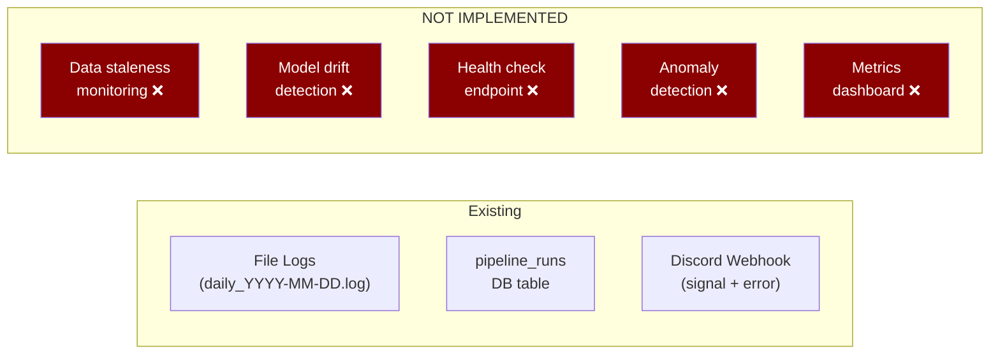
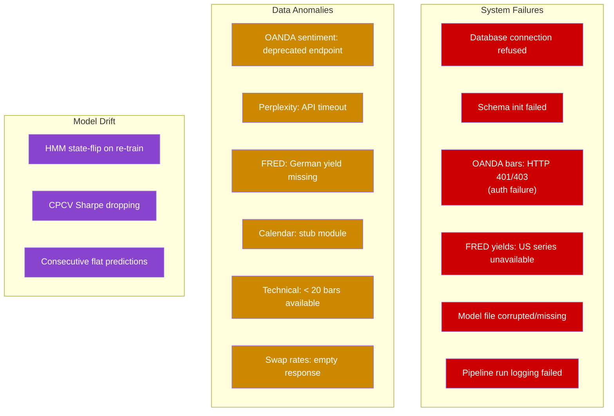
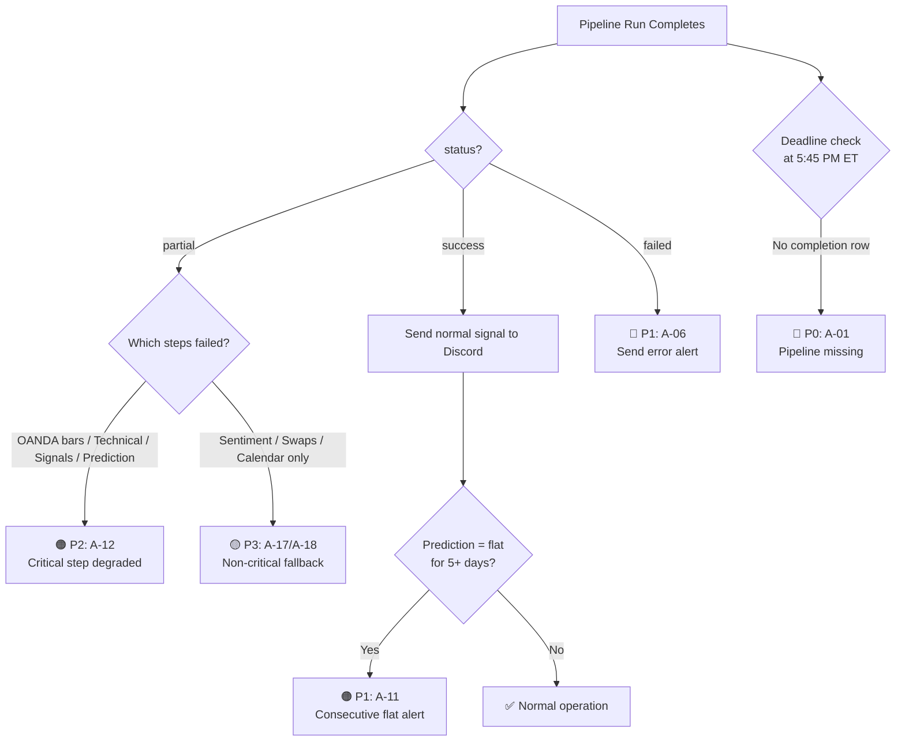

# Quant EOD Engine — Monitoring & Alerting Specification

> **Last Updated:** 2026-04-03
> **Scope:** Full audit of logging, error handling, and validation across all modules
> **Status:** Specification — proposes 18 alerting rules across 4 severity tiers

---

## Table of Contents

1. [Executive Summary](#1-executive-summary)
2. [Existing Monitoring Infrastructure](#2-existing-monitoring-infrastructure)
3. [Logging Architecture](#3-logging-architecture)
4. [Error Taxonomy: System Failure vs Data Anomaly](#4-error-taxonomy-system-failure-vs-data-anomaly)
5. [Pipeline Error Handling Map](#5-pipeline-error-handling-map)
6. [Module-Level Error Catalog](#6-module-level-error-catalog)
7. [Proposed Alert Rules](#7-proposed-alert-rules)
8. [Proposed Monitoring Dashboard](#8-proposed-monitoring-dashboard)
9. [Implementation Roadmap](#9-implementation-roadmap)

---

## 1. Executive Summary

The Quant EOD Engine has a **functional but minimal** monitoring system. Key findings:

| Dimension | Current State | Assessment |
|-----------|--------------|:----------:|
| **Logging** | Dual-output (file + stdout), per-day log files | ✅ Adequate |
| **Pipeline tracking** | `pipeline_runs` DB table with step/error JSONB | ✅ Adequate |
| **Alerting** | Discord webhook (signal + error) | ⚠️ Partial |
| **Anomaly detection** | None | ❌ Missing |
| **Health checks** | None | ❌ Missing |
| **Data staleness detection** | None | ❌ Missing |
| **Model drift monitoring** | None | ❌ Missing |
| **Metrics/dashboards** | None | ❌ Missing |



---

## 2. Existing Monitoring Infrastructure

### 2.1 File-Based Logging

**Source:** [daily_loop.py:L55–L67](file:///c:/Users/angel/OneDrive/Documents/GitHub/quant-eod-engine/daily_loop.py#L55-L67)

```python
logging.basicConfig(
    level=getattr(logging, LOG_LEVEL, logging.INFO),
    format="%(asctime)s [%(levelname)s] %(name)s: %(message)s",
    handlers=[
        logging.FileHandler(log_file),       # logs/daily_2026-04-03.log
        logging.StreamHandler(sys.stdout),    # console output
    ],
)
```

| Property | Value |
|----------|-------|
| Log directory | `{project_root}/logs/` |
| File naming | `daily_{YYYY-MM-DD}.log` |
| Default level | `INFO` (configurable via `LOG_LEVEL` env var) |
| Format | `2026-04-03 17:15:00 [INFO] daily_loop: message` |
| Rotation | ❌ None — files accumulate indefinitely |
| Retention | ❌ None — no auto-cleanup |

### 2.2 Pipeline Run Tracking (Database)

**Source:** [daily_loop.py:L70–L93](file:///c:/Users/angel/OneDrive/Documents/GitHub/quant-eod-engine/daily_loop.py#L70-L93)

Every pipeline execution is recorded in the `pipeline_runs` table:

```sql
CREATE TABLE pipeline_runs (
    id              SERIAL PRIMARY KEY,
    run_date        DATE NOT NULL UNIQUE,
    started_at      TIMESTAMPTZ NOT NULL,
    completed_at    TIMESTAMPTZ,
    status          VARCHAR(20) NOT NULL DEFAULT 'running',
    steps_completed JSONB,    -- {"oanda_bars": true, "fred_yields": true, ...}
    errors          JSONB     -- {"oanda_bars": "Connection refused", ...}
);
```

**Status determination logic:**

```python
if not errors:
    status = "success"       # All 13 steps passed
elif len(errors) < 4:
    status = "partial"       # 1-3 steps failed, pipeline degraded
else:
    status = "failed"        # 4+ steps failed, pipeline unusable
```

| Status | Condition | Trading Impact |
|:------:|-----------|----------------|
| `success` | 0 errors | Full signal generated |
| `partial` | 1–3 errors | Signal generated with missing data; fallbacks active |
| `failed` | 4+ errors | Signal likely flat; multiple fallbacks; unreliable |

> [!WARNING]
> The `partial` threshold is **hardcoded at `< 4` errors**. This means 3 failed data sources (e.g., OANDA bars + FRED yields + AI sentiment) still counts as "partial" — yet this would produce a severely degraded signal. The threshold should be tuned based on which specific steps failed, not just count.

### 2.3 Discord Alert Delivery

**Source:** [discord_notify.py:L19–L55](file:///c:/Users/angel/OneDrive/Documents/GitHub/quant-eod-engine/fetchers/discord_notify.py#L19-L55) and [L196–L218](file:///c:/Users/angel/OneDrive/Documents/GitHub/quant-eod-engine/fetchers/discord_notify.py#L196-L218)

Two alert types exist:

| Function | Trigger | Content | Color |
|----------|---------|---------|:-----:|
| `send_signal()` | Every pipeline run | Rich embed with prediction, regime, macro data | 🟢 Green (success) / 🟡 Amber (partial) / 🔴 Red (failed) |
| `send_error_alert()` | Pipeline `status == "failed"` or explicit call | Error message (truncated to 1800 chars) | 🔴 Red |

**Limitations:**
- No separate channel for alerts vs signals
- No @mention or escalation for critical failures
- No retry logic if Discord webhook fails
- No heartbeat/keepalive notification ("I'm alive")
- No alert suppression (same error can fire repeatedly)
- Timeout: 15 seconds (adequate but no retry)

---

## 3. Logging Architecture

### 3.1 Logging Level Usage Across Codebase

Complete audit of all `logger.warning()`, `logger.error()`, and `logger.critical()` calls:

| Level | Count | Usage Pattern |
|:-----:|:-----:|---------------|
| `logger.info()` | ~50 | Normal operation, step completion, data summaries |
| `logger.warning()` | 19 | Degraded data, fallbacks activated, non-critical gaps |
| `logger.error()` | 31 | API failures, DB errors, unhandled exceptions |
| `logger.critical()` | 0 | **Never used** — no CRITICAL-level logging exists |

### 3.2 Warning vs Error Classification (Current)

The codebase uses logging levels **inconsistently**. The table below classifies each occurrence:

#### Warnings (19 total) — Degraded but Operational

| Module | Message | Meaning | Should Be |
|--------|---------|---------|:---------:|
| `fred_yields` | `German 2Y series unavailable` | DE yield missing, spread partial | ⚠️ OK |
| `fred_yields` | `German 2Y yield unavailable — spread partial` | Same, later path | ⚠️ OK |
| `fred_yields` | `Skipping yield storage: {error}` | No data to store | ⚠️ OK |
| `oanda_sentiment` | `OANDA position ratios deprecated` | Expected — endpoint sunsetted | ⚠️ OK |
| `oanda_sentiment` | `Sentiment fetch failed... Using fallback` | API down, using neutral | ⚠️ OK |
| `swap_rates` | `No instrument data for {instrument}` | API returned empty | ⚠️ OK |
| `perplexity_sentiment` | `No Perplexity API key configured` | Missing env var | 🔴 → Error |
| `calendar` | `Calendar events stub...` | Feature not implemented | ⚠️ OK |
| `vector` | `Using US-only 5d change fallback` | Spread data partial | ⚠️ OK |
| `vector` | `Using US-only 20d change fallback` | Spread data partial | ⚠️ OK |
| `technical` | `Only {n} bars — need at least 20` | Insufficient data | 🔴 → Error |
| `meta_model` | `No meta-model available` | No trained model on disk | 🔴 → Error |
| `meta_model` | `No meta-model at {path}` | Model file missing | 🔴 → Error |
| `meta_model` | `CPCV using fixed synthetic return proxy` | Synthetic returns in validation | ⚠️ OK |
| `meta_model` | `SHAP computation failed` | Non-critical diagnostic | ⚠️ OK |
| `meta_model` | `trading_calendar import failed` | Using weekday-only fallback | ⚠️ OK |
| `hmm_regime` | `HMM state-label flip detected` | Regime semantics changed | 🔴 → Error |
| `hmm_regime` | `No HMM model available` | No trained model | 🔴 → Error |
| `hmm_regime` | `No HMM model file at {path}` | Model file missing | 🔴 → Error |
| `discord_notify` | `No Discord webhook URL configured` | Missing env var | ⚠️ OK |
| `daily_loop` | `No daily bars in DB` | No price data | 🔴 → Error |
| `daily_loop` | `Discord notification skipped` | No webhook configured | ⚠️ OK |

#### Errors (31 total) — System/Component Failure

All `logger.error()` calls in the codebase represent a genuine failure that should trigger investigation. See [Section 6](#6-module-level-error-catalog) for the full catalog.

---

## 4. Error Taxonomy: System Failure vs Data Anomaly

### 4.1 Definitions

| Category | Definition | Trading Impact | Required Response |
|----------|-----------|----------------|-------------------|
| **System Failure** | A component has crashed or is unreachable. The pipeline cannot complete its intended function. | **Signal generation blocked or severely compromised.** The system may produce a flat signal by default, but it cannot be trusted. | Immediate investigation. Halt trading if prediction was produced. |
| **Data Anomaly** | Data was received but is stale, partial, or statistically unusual. The pipeline completes but with degraded inputs. | **Signal generated with reduced confidence.** Fallback values may mask a genuine market condition. | Review within 24 hours. Monitor for recurrence. |
| **Model Drift** | The trained model's predictions are systematically deviating from historical accuracy patterns. | **Signals technically valid but may be wrong.** The model's edge may have decayed. | Retrain within 1 week. Monitor CPCV metrics. |
| **Operational Warning** | Infrastructure concern that doesn't affect current signals. | **None currently.** May cause future failures. | Fix during next maintenance window. |

### 4.2 Classification of Current try/except Blocks



---

## 5. Pipeline Error Handling Map

Every `try/except` block in [daily_loop.py](file:///c:/Users/angel/OneDrive/Documents/GitHub/quant-eod-engine/daily_loop.py) is mapped below with its classification:

| Step | Module | Exception Handler | Fallback Value | Classification | Can Trade? |
|:----:|--------|-------------------|----------------|:--------------:|:----------:|
| **0** | Schema init | `except Exception` | Logs error, continues | System Failure | Yes (if schema exists) |
| **1** | OANDA bars | `except Exception` | `bars_result = {"error": str(e)}` | **System Failure** | ❌ No — no price data for technical indicators |
| **2** | FRED yields | `except Exception` | `yields_result = {"error": str(e)}` | Data Anomaly | ⚠️ Degraded — yield signals inactive |
| **3** | Sentiment | `except Exception` | `sentiment_result = {"error": str(e)}` | Data Anomaly | ⚠️ Degraded — sentiment signals at neutral |
| **4** | Swap rates | `except Exception` | `swaps_result = {"error": str(e)}` | Data Anomaly | ✅ Yes — swaps are Tier 2 |
| **5** | Calendar | `except Exception` | `calendar_result = {"error": str(e)}` | Operational Warning | ✅ Yes — calendar is a stub |
| **6** | AI sentiment | `except Exception` | `ai_result = {"error": str(e)}` | Data Anomaly | ⚠️ Degraded — AI signal at neutral |
| **7** | Technical | `except Exception` | `technical_result = {}` | **System Failure** | ❌ No — no ATR, RSI, MAs |
| **8** | HMM regime | `except Exception` | Default: `{state_id: 1, confidence: 0.33}` | Data Anomaly | ⚠️ Degraded — assumes choppy regime |
| **9** | Signals | `except Exception` | `composite_result = {}`, signals empty | **System Failure** | ❌ No — no directional signals |
| **10** | Feature vector | `except Exception` | `feature_vector = {}` | **System Failure** | ❌ No — empty vector → flat prediction |
| **11** | Meta-model | `except Exception` | `prediction_result = {}` | **System Failure** | ❌ No — no prediction generated |
| **12** | Snapshot | `except Exception` | Skipped | Operational Warning | ✅ Yes — snapshot is for audit |
| **13** | Discord | `except Exception` | Skipped | Operational Warning | ✅ Yes — notification is passive |

> [!CAUTION]
> **Steps 1, 7, 9, 10, and 11 are "trading-critical"** — if any of these fail, the resulting prediction is unreliable or absent. However, the pipeline treats them identically to non-critical failures (swap rates, calendar). The system will still produce a `partial` status and potentially trade on a degraded signal.

---

## 6. Module-Level Error Catalog

### 6.1 Database Module (`models/database.py`)

| Error | Level | Location | Classification |
|-------|:-----:|----------|:--------------:|
| `DB execute error` | ERROR | [L26](file:///c:/Users/angel/OneDrive/Documents/GitHub/quant-eod-engine/models/database.py#L26) | System Failure |
| `DB execute_returning error` | ERROR | [L43](file:///c:/Users/angel/OneDrive/Documents/GitHub/quant-eod-engine/models/database.py#L43) | System Failure |
| `DB fetch_all error` | ERROR | [L57](file:///c:/Users/angel/OneDrive/Documents/GitHub/quant-eod-engine/models/database.py#L57) | System Failure |
| `DB fetch_one error` | ERROR | [L72](file:///c:/Users/angel/OneDrive/Documents/GitHub/quant-eod-engine/models/database.py#L72) | System Failure |
| `Schema init error` | ERROR | [L98](file:///c:/Users/angel/OneDrive/Documents/GitHub/quant-eod-engine/models/database.py#L98) | System Failure |

### 6.2 OANDA Fetchers

| Error | Level | Module | Classification |
|-------|:-----:|--------|:--------------:|
| `Error storing candles` | ERROR | `oanda_bars` | System Failure |
| `Failed to fetch bars for {instrument}` | ERROR | `oanda_bars` | System Failure |
| `OANDA position ratios deprecated` | WARNING | `oanda_sentiment` | Data Anomaly (expected) |
| `Sentiment fetch failed... Using fallback` | WARNING | `oanda_sentiment` | Data Anomaly |
| `Error storing sentiment` | ERROR | `oanda_sentiment` | System Failure |
| `No instrument data for {instrument}` | WARNING | `swap_rates` | Data Anomaly |
| `Failed to fetch swap rates` | ERROR | `swap_rates` | Data Anomaly |
| `Error storing swap rates` | ERROR | `swap_rates` | System Failure |

### 6.3 FRED Fetcher

| Error | Level | Classification |
|-------|:-----:|:--------------:|
| `Failed to fetch US 2Y yield` | ERROR | System Failure |
| `German 2Y series unavailable` | WARNING | Data Anomaly (expected) |
| `German 2Y yield unavailable — spread partial` | WARNING | Data Anomaly |
| `Skipping yield storage: {error}` | WARNING | Data Anomaly |
| `Error storing yields` | ERROR | System Failure |

### 6.4 Perplexity Fetcher

| Error | Level | Classification |
|-------|:-----:|:--------------:|
| `No Perplexity API key configured` | WARNING | System Failure (misconfiguration) |
| `Perplexity API HTTP error` | ERROR | Data Anomaly |
| `Perplexity API error` | ERROR | Data Anomaly |
| `Error storing AI sentiment` | ERROR | System Failure |

### 6.5 Models

| Error | Level | Module | Classification |
|-------|:-----:|--------|:--------------:|
| `No meta-model available` | WARNING | `meta_model` | System Failure |
| `No meta-model at {path}` | WARNING | `meta_model` | System Failure |
| `Failed to record model_run to DB` | ERROR | `meta_model` | Operational Warning |
| `Error storing prediction` | ERROR | `meta_model` | System Failure |
| `SHAP computation failed` | WARNING | `meta_model` | Operational Warning |
| `HMM state-label flip detected` | WARNING | `hmm_regime` | **Model Drift** |
| `No HMM model available` | WARNING | `hmm_regime` | System Failure |
| `Error storing regime` | ERROR | `hmm_regime` | System Failure |

### 6.6 Feature Engineering

| Error | Level | Module | Classification |
|-------|:-----:|--------|:--------------:|
| `Only {n} bars — need at least 20` | WARNING | `technical` | System Failure |
| `Using US-only 5d change fallback` | WARNING | `vector` | Data Anomaly |
| `Using US-only 20d change fallback` | WARNING | `vector` | Data Anomaly |
| `Error storing feature vector` | ERROR | `vector` | System Failure |

---

## 7. Proposed Alert Rules

### 7.1 Alert Severity Tiers

| Tier | Label | Response Time | Delivery Channel |
|:----:|-------|:-------------:|------------------|
| **P0** | Critical | < 5 minutes | Discord @everyone + DM + log |
| **P1** | High | < 30 minutes | Discord embed (red) + log |
| **P2** | Medium | < 24 hours | Discord embed (amber) + log file |
| **P3** | Informational | Next maintenance | Log file only |

### 7.2 Alert Rules

#### P0 — Critical (Halt Trading)

| ID | Rule | Threshold | Check Method | Rationale |
|:--:|------|-----------|:------------:|-----------|
| **A-01** | **Pipeline not completed by deadline** | No `pipeline_runs` row with `completed_at` by **5:45 PM ET** | Cron job checks `pipeline_runs` at 5:45 PM | Signal is needed before T+1 open. A 30-minute grace period from the 5:15 PM scheduled start. |
| **A-02** | **Database unreachable** | `get_connection()` raises exception | Step 0 (schema init) | No persistence = no state = no trading. |
| **A-03** | **OANDA bars fetch failed** | `oanda_bars` in `errors` JSONB | Step 1 | No price data → no technical indicators → no valid signal. |
| **A-04** | **Meta-model prediction missing** | `prediction` step not in `steps_completed` JSONB | Step 11 | No prediction = no trade, but system should confirm this explicitly. |
| **A-05** | **Model file missing on disk** | `meta_model_xgb.json` or `meta_model.joblib` not found | Pre-prediction check | Without a model, default flat — but this should be a manual decision, not silent. |

#### P1 — High (Investigate Promptly)

| ID | Rule | Threshold | Check Method | Rationale |
|:--:|------|-----------|:------------:|-----------|
| **A-06** | **Pipeline status = "failed"** | `status = 'failed'` in `pipeline_runs` | End of `main()` | 4+ steps failed. Signal is degraded beyond acceptable limits. |
| **A-07** | **Data staleness: OANDA bars** | Latest `bars.bar_time` is **> 48 hours old** | Query `bars` table before technical computation | Weekend gaps are 48h; anything beyond suggests an API issue. |
| **A-08** | **Data staleness: FRED yields** | Latest `yield_data.date` is **> 5 business days old** | Query `yield_data` before vector assembly | FRED publishes daily; 5-day gap means the feed is broken. |
| **A-09** | **Data staleness: AI sentiment** | No `ai_sentiment` row for **today's date** AND `fallback_used = TRUE` for **3+ consecutive days** | Query `ai_sentiment` history | Occasional fallback is OK; consecutive failures indicate a systemic issue. |
| **A-10** | **HMM state-flip on re-train** | `HMM state-label flip detected` in logs | HMM fit function | Regime labels may have changed meaning — all downstream regime-adaptive logic is affected. |
| **A-11** | **Consecutive flat predictions** | **5+ consecutive days** where `predictions.direction = 'flat'` | Query `predictions` table | Could indicate model degradation, data feed death, or a regime where the model correctly stands aside — but requires human review. |

#### P2 — Medium (Review Within 24 Hours)

| ID | Rule | Threshold | Check Method | Rationale |
|:--:|------|-----------|:------------:|-----------|
| **A-12** | **Pipeline status = "partial"** with critical steps failed | `status = 'partial'` AND (`oanda_bars` OR `technical` OR `signals` OR `prediction` in `errors` keys) | `pipeline_runs.errors` JSONB | The generic "partial" threshold (< 4 errors) masks critical-step failures. |
| **A-13** | **Price anomaly: daily return > 3 ATRs** | `\|daily_return\| > 3 × atr_14` | Post-technical computation | Extreme moves warrant review — the model may be operating outside training distribution. |
| **A-14** | **Yield spread anomaly** | `\|spread_change_5d_bps\| > 50` | Feature vector assembly | A 50+ bps 5-day spread move is extreme; verify data integrity. |
| **A-15** | **Sentiment data using fallback** | `sentiment.source = 'fallback_neutral'` OR `ai_sentiment.fallback_used = TRUE` | DB queries | Single-day fallback is tolerable; flag for awareness. |

#### P3 — Informational (Log Only)

| ID | Rule | Threshold | Check Method | Rationale |
|:--:|------|-----------|:------------:|-----------|
| **A-16** | **Log file grew > 10 MB** | `daily_YYYY-MM-DD.log > 10 MB` | File size check | May indicate error loops or excessive debug logging. |
| **A-17** | **Swap rates unavailable** | `swap_rates` in `errors` JSONB | Pipeline errors | Low impact — swaps are a minor feature. |
| **A-18** | **Discord notification skipped** | `discord_notify` not in `steps_completed` | Pipeline steps | Non-critical but should be fixed to maintain operator awareness. |

### 7.3 Alert Rule Decision Tree



---

## 8. Proposed Monitoring Dashboard

### 8.1 Key Metrics to Track

| Metric | Query | Update Frequency | Dashboard Widget |
|--------|-------|:----------------:|:----------------:|
| Pipeline success rate (7d rolling) | `SELECT count(*) FILTER (WHERE status='success') / count(*) FROM pipeline_runs WHERE run_date > now() - 7` | Daily | Gauge (target: > 90%) |
| Mean pipeline duration | `SELECT avg(completed_at - started_at) FROM pipeline_runs WHERE run_date > now() - 30` | Daily | Time series |
| Data freshness (per source) | `SELECT max(date) FROM {table}` for each table | Daily | Table with color coding |
| Prediction distribution (7d) | `SELECT direction, count(*) FROM predictions WHERE date > now() - 7 GROUP BY direction` | Daily | Pie chart |
| Average model probability | `SELECT avg(probability) FROM predictions WHERE date > now() - 30` | Daily | Time series |
| Fallback usage rate | `SELECT count(*) FILTER (WHERE fallback_used) / count(*) FROM ai_sentiment WHERE date > now() - 30` | Daily | Gauge (target: < 20%) |
| Regime distribution (30d) | `SELECT state_label, count(*) FROM regimes WHERE date > now() - 30 GROUP BY state_label` | Daily | Bar chart |

### 8.2 Pipeline Health Summary Query

```sql
-- Daily health check: run after pipeline completes
WITH latest AS (
    SELECT * FROM pipeline_runs 
    WHERE run_date = CURRENT_DATE 
    ORDER BY completed_at DESC LIMIT 1
),
freshness AS (
    SELECT
        (SELECT max(bar_time)::date FROM bars WHERE granularity = 'D') AS latest_bars,
        (SELECT max(date) FROM yield_data) AS latest_yields,
        (SELECT max(date) FROM sentiment) AS latest_sentiment,
        (SELECT max(date) FROM ai_sentiment) AS latest_ai,
        (SELECT max(date) FROM swap_rates) AS latest_swaps,
        (SELECT max(date) FROM regimes) AS latest_regime,
        (SELECT max(date) FROM predictions) AS latest_prediction
),
streaks AS (
    SELECT count(*) AS consecutive_flat
    FROM (
        SELECT direction, date,
               ROW_NUMBER() OVER (ORDER BY date DESC) AS rn
        FROM predictions
        WHERE instrument = 'EUR_USD'
        ORDER BY date DESC LIMIT 10
    ) sub
    WHERE direction = 'flat'
      AND rn = (SELECT count(*) FROM predictions 
                WHERE instrument = 'EUR_USD' AND direction = 'flat'
                AND date >= (SELECT max(date) FROM predictions 
                             WHERE instrument = 'EUR_USD' AND direction != 'flat'))
)
SELECT 
    l.run_date,
    l.status,
    l.completed_at - l.started_at AS duration,
    l.steps_completed,
    l.errors,
    f.*,
    s.consecutive_flat
FROM latest l, freshness f, streaks s;
```

### 8.3 Proposed Health Check Endpoint

If the engine is ever deployed as a service (e.g., on Heroku), add a lightweight health endpoint:

```python
# health.py — minimal health check
def check_health() -> dict:
    """Returns system health status for monitoring."""
    from models.database import fetch_one
    from datetime import date, timedelta
    
    today = date.today()
    checks = {}
    
    # 1. Database connectivity
    try:
        fetch_one("SELECT 1 AS ok")
        checks["database"] = "ok"
    except Exception:
        checks["database"] = "FAIL"
    
    # 2. Latest pipeline run
    run = fetch_one(
        "SELECT status, completed_at FROM pipeline_runs WHERE run_date = %s",
        (str(today),)
    )
    checks["pipeline_today"] = run["status"] if run else "MISSING"
    
    # 3. Data freshness
    bars = fetch_one("SELECT max(bar_time)::date AS d FROM bars WHERE granularity='D'")
    bars_age = (today - bars["d"]).days if bars and bars["d"] else 999
    checks["bars_staleness_days"] = bars_age
    checks["bars_fresh"] = bars_age <= 2
    
    # 4. Model exists
    import os
    model_path = "model_artifacts/meta_model_xgb.json"
    checks["model_exists"] = os.path.exists(model_path)
    
    # 5. Overall
    is_healthy = all([
        checks["database"] == "ok",
        checks["pipeline_today"] in ("success", "partial"),
        checks["bars_fresh"],
        checks["model_exists"],
    ])
    checks["healthy"] = is_healthy
    
    return checks
```

---

## 9. Implementation Roadmap

### Phase 1: Quick Wins (1–2 hours)

| Task | Effort | Impact |
|------|:------:|:------:|
| Add `logger.critical()` calls for P0 events (DB unreachable, model missing) | 15 min | High |
| Differentiate critical vs non-critical steps in `status` determination | 30 min | High |
| Add deadline-check cron script (`check_pipeline_deadline.py`) | 30 min | High |
| Add log rotation (Python `RotatingFileHandler` or `TimedRotatingFileHandler`) | 15 min | Medium |

**Proposed status logic improvement:**

```python
# Replace the simple error-count threshold:
CRITICAL_STEPS = {"oanda_bars", "technical", "signals", "feature_vector", "prediction"}

if not errors:
    status = "success"
elif errors.keys() & CRITICAL_STEPS:
    status = "failed"       # Any critical step failure = failed
elif len(errors) < 4:
    status = "partial"
else:
    status = "failed"
```

### Phase 2: Data Monitoring (2–4 hours)

| Task | Effort | Impact |
|------|:------:|:------:|
| Add staleness checks before each pipeline phase | 1 hr | High |
| Add price anomaly detector (> 3 ATR) | 30 min | Medium |
| Add consecutive-flat counter to meta-model | 30 min | Medium |
| Add yield spread anomaly detector | 30 min | Medium |

### Phase 3: Model Monitoring (4–8 hours)

| Task | Effort | Impact |
|------|:------:|:------:|
| Track rolling prediction accuracy vs actual returns | 2 hr | High |
| Implement CPCV metric tracking over time | 2 hr | High |
| Add model staleness check (days since last retrain) | 30 min | Medium |
| Store prediction confidence distribution for drift detection | 1 hr | Medium |

### Phase 4: Infrastructure (Optional)

| Task | Effort | Impact |
|------|:------:|:------:|
| Health check endpoint (if deployed as service) | 1 hr | Medium |
| Grafana/Prometheus metrics export | 4 hr | Medium |
| PagerDuty/Opsgenie integration for P0 alerts | 2 hr | High |
| Separate Discord channels for signals vs alerts | 15 min | Medium |

---

## Appendix: Alert Rule Quick Reference

| ID | Severity | Rule | Threshold |
|:--:|:--------:|------|-----------|
| A-01 | P0 | Pipeline missed deadline | No completion by 5:45 PM ET |
| A-02 | P0 | Database unreachable | Connection exception |
| A-03 | P0 | OANDA bars failed | Step 1 in errors |
| A-04 | P0 | Prediction missing | Step 11 not in steps_completed |
| A-05 | P0 | Model file missing | File does not exist on disk |
| A-06 | P1 | Pipeline "failed" | status = 'failed' |
| A-07 | P1 | Bars staleness | Latest bar > 48 hours old |
| A-08 | P1 | Yields staleness | Latest yield > 5 business days old |
| A-09 | P1 | AI sentiment fallback streak | 3+ consecutive days fallback |
| A-10 | P1 | HMM state-flip | State-flip warning in logs |
| A-11 | P1 | Consecutive flat predictions | 5+ days flat |
| A-12 | P2 | Partial with critical step failure | partial + critical step in errors |
| A-13 | P2 | Price anomaly | \|return\| > 3 × ATR |
| A-14 | P2 | Yield spread anomaly | \|5d change\| > 50 bps |
| A-15 | P2 | Sentiment fallback active | Single-day fallback |
| A-16 | P3 | Log file size | > 10 MB |
| A-17 | P3 | Swap rates unavailable | In errors JSONB |
| A-18 | P3 | Discord skipped | Not in steps_completed |
