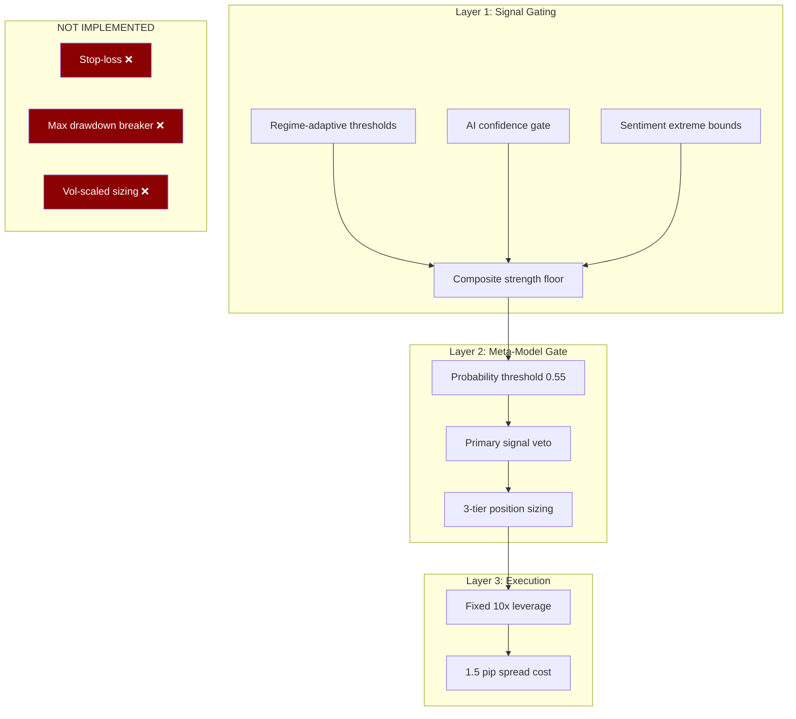

# Quant EOD Engine — Risk Management Framework

> **Last Updated:** 2026-04-03
> **Scope:** Full audit of risk controls currently implemented in the codebase
> **Status:** Active — 9 implemented controls, 3 critical gaps identified

---

## Table of Contents

1. [Executive Summary](#1-executive-summary)
2. [Position Sizing Model](#2-position-sizing-model)
3. [Leverage & Friction Model](#3-leverage--friction-model)
4. [Existing Circuit Breakers](#4-existing-circuit-breakers)
5. [Signal-Layer Gating Mechanisms](#5-signal-layer-gating-mechanisms)
6. [Gap Analysis — What's Missing](#6-gap-analysis--whats-missing)
7. [Proposed Risk Parameters](#7-proposed-risk-parameters)
8. [Risk Parameter Summary Table](#8-risk-parameter-summary-table)

---

## 1. Executive Summary

The Quant EOD Engine operates as a **leveraged, daily-frequency, single-instrument Forex strategy** on EUR/USD. Risk control is currently architected across three layers:



> [!CAUTION]
> **No stop-losses, no drawdown circuit breakers, and no volatility-based position scaling exist anywhere in the codebase.** The only capital protection mechanisms are the meta-model's probability gate (which prevents trading when confidence is low) and the natural 1-day holding period (Open→Close of T+1). A single catastrophic intraday move could blow through the full leveraged position with no protection.

---

## 2. Position Sizing Model

### 2.1 Three-Tier Probability Gate

The meta-model outputs a predicted probability of trade profitability. Position size is determined by a **hard-coded step function** with no continuous scaling:

**Source:** [meta_model.py:L231–L245](file:///c:/Users/angel/OneDrive/Documents/GitHub/quant-eod-engine/models/meta_model.py#L231-L245)

```python
# Position sizing from probability
if prob < 0.55:
    size_mult = 0.0      # NO TRADE
    direction = "flat"
elif prob < 0.70:
    size_mult = 0.5      # HALF SIZE
    direction = <from primary signal>
else:
    size_mult = 1.0      # FULL SIZE
    direction = <from primary signal>
```

| Probability Band | `size_multiplier` | Effective Leverage | Behavior |
|:-:|:-:|:-:|---|
| `< 0.55` | 0.0× | 0× | **No trade** — position is flat |
| `0.55 – 0.70` | 0.5× | 5× | **Half position** — lower confidence |
| `≥ 0.70` | 1.0× | 10× | **Full position** — high confidence |

### 2.2 Primary Signal Override Veto

Even when the meta-model is confident (`prob ≥ 0.55`), if the Tier-1 composite signal is flat, the position is forced to zero:

**Source:** [meta_model.py:L242–L245](file:///c:/Users/angel/OneDrive/Documents/GitHub/quant-eod-engine/models/meta_model.py#L242-L245)

```python
# If primary signal is flat, meta-model can't override
if feature_vector.get("primary_signal_direction", 0) == 0:
    direction = "flat"
    size_mult = 0.0
```

> [!IMPORTANT]
> This is a **critical architectural constraint**: the meta-model acts as a gate/sizer, never as a directional override. It cannot force a trade that the signal layer didn't propose. This prevents the XGBoost model from hallucinating trades in the absence of fundamental/technical justification.

### 2.3 Default (No Model) Behavior

When no trained model exists on disk:

**Source:** [meta_model.py:L509–L517](file:///c:/Users/angel/OneDrive/Documents/GitHub/quant-eod-engine/models/meta_model.py#L509-L517)

```python
def _default_prediction(self, feature_vector: dict) -> dict:
    return {
        "direction": "flat",
        "probability": 0.50,
        "size_multiplier": 0.0,   # NEVER TRADES
        "model_version": "no_model",
    }
```

**Effect:** The system **cannot trade at all** without a trained, validated meta-model. This is safe-by-default behavior.

---

## 3. Leverage & Friction Model

### 3.1 Fixed Leverage

**Source:** [backtest_loop.py:L130](file:///c:/Users/angel/OneDrive/Documents/GitHub/quant-eod-engine/backtest_loop.py#L130)

```python
LEVERAGE = 10.0
```

Leverage is a **hardcoded constant** — it does not adapt to:
- Current regime (low_vol vs high_vol_crash)
- Position confidence (prob = 0.56 vs prob = 0.95)
- Recent drawdown
- ATR / realized volatility

### 3.2 Transaction Cost Model

**Source:** [backtest_loop.py:L131–L132](file:///c:/Users/angel/OneDrive/Documents/GitHub/quant-eod-engine/backtest_loop.py#L131-L132)

```python
SPREAD_BPS = 1.5          # 1.5 pips assumed spread
spread_cost_mult = SPREAD_BPS / 10000.0   # = 0.00015
```

**Application (symmetrical):**

```python
# Long trade
pnl = size * LEVERAGE * (raw_ret - spread_cost_mult)

# Short trade  
pnl = size * LEVERAGE * (-raw_ret - spread_cost_mult)
```

| Parameter | Value | Notes |
|-----------|:-----:|-------|
| Spread | 1.5 pips | Applied once per round trip (entry + exit combined) |
| Slippage | 0 | **Not modeled** |
| Commission | 0 | OANDA uses spread-only pricing |
| Swap/financing | 0 | **Not modeled** in backtest (data collected in production) |

### 3.3 Trade Execution Timing

**Source:** [backtest_loop.py:L143–L149](file:///c:/Users/angel/OneDrive/Documents/GitHub/quant-eod-engine/backtest_loop.py#L143-L149)

```
Signal day T:    Feature vector computed after market close (5 PM ET)
Entry:           T+1 Open
Exit:            T+1 Close
Holding period:  1 trading day (intraday)
```

> [!NOTE]
> The 1-day forced exit is an **implicit risk control** — it prevents open positions from being held over weekends or through multi-day adverse moves. However, no intraday stop-loss exists during the holding period.

---

## 4. Existing Circuit Breakers

### CB-1: Meta-Model Probability Floor (`prob < 0.55 → flat`)

| Property | Value |
|----------|-------|
| **Location** | [meta_model.py:L232–L234](file:///c:/Users/angel/OneDrive/Documents/GitHub/quant-eod-engine/models/meta_model.py#L232-L234) |
| **Trigger** | `predict_proba()[1] < 0.55` |
| **Action** | `size_multiplier = 0.0`, `direction = "flat"` |
| **Effect** | No trade entered. Capital is fully protected for the day. |
| **Bypassed by** | Nothing — this is an absolute gate. |

This is the system's **primary risk control**. When the XGBoost model estimates < 55% probability of the trade being profitable, the system stands aside entirely.

---

### CB-2: Primary Signal Veto (`signal = flat → flat regardless of prob`)

| Property | Value |
|----------|-------|
| **Location** | [meta_model.py:L242–L245](file:///c:/Users/angel/OneDrive/Documents/GitHub/quant-eod-engine/models/meta_model.py#L242-L245) |
| **Trigger** | `primary_signal_direction == 0` |
| **Action** | Force `direction = "flat"`, `size = 0.0` |
| **Effect** | Meta-model cannot manufacture directional conviction from nothing. |

---

### CB-3: Composite Strength Floor (`strength < 0.15 → flat`)

| Property | Value |
|----------|-------|
| **Location** | [composite.py:L89–L92](file:///c:/Users/angel/OneDrive/Documents/GitHub/quant-eod-engine/signals/composite.py#L89-L92) |
| **Trigger** | `composite_strength < 0.15` |
| **Action** | `direction = "flat"`, `composite_strength = 0.0` |
| **Effect** | Weak signals (barely above noise) are suppressed before reaching the meta-model. |

```python
# If composite strength is too weak, go flat
if composite_strength < 0.15:
    direction = "flat"
    composite_strength = 0.0
```

---

### CB-4: Tier-1 Tie-Break → Flat

| Property | Value |
|----------|-------|
| **Location** | [composite.py:L72–L75](file:///c:/Users/angel/OneDrive/Documents/GitHub/quant-eod-engine/signals/composite.py#L72-L75) |
| **Trigger** | `long_score == short_score` |
| **Action** | `direction = "flat"`, `base_strength = 0.0` |
| **Effect** | When signals are equally split between long and short, the system refuses to trade rather than coin-flip. |

---

### CB-5: AI Sentiment Fallback Veto

| Property | Value |
|----------|-------|
| **Location** | [tier1.py:L143–L148](file:///c:/Users/angel/OneDrive/Documents/GitHub/quant-eod-engine/signals/tier1.py#L143-L148) |
| **Trigger** | `fallback_used == True` (Perplexity API failed) |
| **Action** | AI macro sentiment signal returns `flat` with `strength = 0.0` |
| **Effect** | Prevents the system from acting on placeholder sentiment data. Does not block other signals. |

---

### CB-6: AI Confidence Gate (`confidence < 0.6 → no signal`)

| Property | Value |
|----------|-------|
| **Location** | [tier1.py:L150–L169](file:///c:/Users/angel/OneDrive/Documents/GitHub/quant-eod-engine/signals/tier1.py#L150-L169) |
| **Trigger** | `|score| < 0.5` OR `confidence < 0.6` |
| **Action** | Returns flat signal — no directional contribution from AI |
| **Effect** | LLM must be both extreme (|score| ≥ 0.5) AND confident (≥ 0.6) to influence trading decisions. |

---

### CB-7: Regime-Adaptive Yield Thresholds

| Property | Value |
|----------|-------|
| **Location** | [tier1.py:L19–L23](file:///c:/Users/angel/OneDrive/Documents/GitHub/quant-eod-engine/signals/tier1.py#L19-L23) |
| **Parameters** | See table below |
| **Effect** | In low volatility regimes, smaller yield spread moves are significant. In high volatility, the threshold is raised to filter noise. |

```python
YIELD_THRESHOLDS = {
    0: 8.0,    # low_vol:         tighter threshold (smaller moves matter)
    1: 15.0,   # high_vol_choppy: standard threshold
    2: 20.0,   # high_vol_crash:  wider threshold (ignore noise)
}
```

| HMM State | Threshold (bps) | Rationale |
|:---------:|:---------------:|-----------|
| 0 (low_vol) | 8.0 | Quiet markets: a 8 bps 5-day yield spread move is meaningful |
| 1 (high_vol_choppy) | 15.0 | Normal: standard threshold |
| 2 (high_vol_crash) | 20.0 | Crisis: only large moves cut through noise |

---

### CB-8: HMM State-Flip Guard

| Property | Value |
|----------|-------|
| **Location** | [hmm_regime.py:L105–L128](file:///c:/Users/angel/OneDrive/Documents/GitHub/quant-eod-engine/models/hmm_regime.py#L105-L128) |
| **Trigger** | EM re-convergence swaps the semantic meaning of state indices |
| **Action** | Logs `WARNING` with old vs new state map. Always uses the new vol-sorted map (correct by construction). |
| **Effect** | Prevents silent regime misclassification after re-training. Alerts operator to verify regime history. |

---

### CB-9: 30-Day Price-Gap Guard

| Property | Value |
|----------|-------|
| **Location** | [backtest_loop.py:L54–L59](file:///c:/Users/angel/OneDrive/Documents/GitHub/quant-eod-engine/backtest_loop.py#L54-L59) |
| **Trigger** | Cannot find next trading day's price data within 30 calendar days |
| **Action** | Skips the trade (returns `None`) |
| **Effect** | Prevents stale or missing price data from creating phantom trades in the backtest. |

```python
guard = 0
while nd not in price_map and guard < 30:
    nd = next_trading_day(nd)
    guard += 1
if nd not in price_map:
    return None, None
```

---

## 5. Signal-Layer Gating Mechanisms

The following table summarizes all thresholds and bounds in the signal generation layer. These are **pre-trade filters** — they control whether a signal is generated at all, before the meta-model even sees the feature vector.

| Signal | Parameter | Value | Source |
|--------|-----------|:-----:|--------|
| Yield Spread Momentum | 5d spread change threshold (low_vol) | ±8.0 bps | [tier1.py:L21](file:///c:/Users/angel/OneDrive/Documents/GitHub/quant-eod-engine/signals/tier1.py#L21) |
| Yield Spread Momentum | 5d spread change threshold (choppy) | ±15.0 bps | [tier1.py:L22](file:///c:/Users/angel/OneDrive/Documents/GitHub/quant-eod-engine/signals/tier1.py#L22) |
| Yield Spread Momentum | 5d spread change threshold (crash) | ±20.0 bps | [tier1.py:L23](file:///c:/Users/angel/OneDrive/Documents/GitHub/quant-eod-engine/signals/tier1.py#L23) |
| Yield Spread Momentum | Strength cap | `min(|Δ| / (2 × threshold), 1.0)` | [tier1.py:L55](file:///c:/Users/angel/OneDrive/Documents/GitHub/quant-eod-engine/signals/tier1.py#L55) |
| Sentiment Extreme Fade | Upper threshold (% long) | 72% | [settings.py:L64](file:///c:/Users/angel/OneDrive/Documents/GitHub/quant-eod-engine/config/settings.py#L64) |
| Sentiment Extreme Fade | Lower threshold (% long) | 28% | [settings.py:L65](file:///c:/Users/angel/OneDrive/Documents/GitHub/quant-eod-engine/config/settings.py#L65) |
| AI Macro Sentiment | Minimum |score| for signal | 0.50 | [tier1.py:L150](file:///c:/Users/angel/OneDrive/Documents/GitHub/quant-eod-engine/signals/tier1.py#L150) |
| AI Macro Sentiment | Minimum confidence | 0.60 | [tier1.py:L150](file:///c:/Users/angel/OneDrive/Documents/GitHub/quant-eod-engine/signals/tier1.py#L150) |
| AI Macro Sentiment | Fallback veto | `True` → flat | [tier1.py:L143](file:///c:/Users/angel/OneDrive/Documents/GitHub/quant-eod-engine/signals/tier1.py#L143) |
| Composite | Minimum composite strength | 0.15 | [composite.py:L90](file:///c:/Users/angel/OneDrive/Documents/GitHub/quant-eod-engine/signals/composite.py#L90) |
| Composite | T2 confirmation bonus | +0.05 per confirm | [composite.py:L82](file:///c:/Users/angel/OneDrive/Documents/GitHub/quant-eod-engine/signals/composite.py#L82) |
| Composite | T2 non-confirmation penalty | −0.02 per reject | [composite.py:L85](file:///c:/Users/angel/OneDrive/Documents/GitHub/quant-eod-engine/signals/composite.py#L85) |
| Meta-Model | Probability floor (no trade) | 0.55 | [meta_model.py:L232](file:///c:/Users/angel/OneDrive/Documents/GitHub/quant-eod-engine/models/meta_model.py#L232) |
| Meta-Model | Probability threshold (full size) | 0.70 | [meta_model.py:L235](file:///c:/Users/angel/OneDrive/Documents/GitHub/quant-eod-engine/models/meta_model.py#L235) |
| Meta-Model | Primary signal veto | `direction == 0 → flat` | [meta_model.py:L243](file:///c:/Users/angel/OneDrive/Documents/GitHub/quant-eod-engine/models/meta_model.py#L243) |

---

## 6. Gap Analysis — What's Missing

### 6.1 Critical Gaps

| # | Missing Control | Severity | Impact |
|:-:|----------------|:--------:|--------|
| **G-1** | **Stop-loss / intraday loss limit** | 🔴 Critical | A flash crash during the T+1 holding period can cause unlimited leveraged loss. At 10× leverage, a 2% adverse intraday move = 20% equity loss. No mechanism stops this. |
| **G-2** | **Max drawdown circuit breaker** | 🔴 Critical | If the strategy enters a losing streak, nothing prevents it from continuing to trade. There is no equity curve check — the system will trade through a −30% drawdown identically to a +30% run. |
| **G-3** | **Volatility-scaled position sizing** | 🟡 High | ATR is computed and stored in the feature vector (`atr_14`), but **never used for position sizing**. In a high-ATR regime, 10× leverage on a full position is significantly more dangerous than in a low-ATR environment. |
| **G-4** | **Consecutive loss counter** | 🟡 High | No logic tracks or reacts to consecutive losing trades. A streak of 5+ losers at full size could compound into catastrophic drawdown. |
| **G-5** | **Correlation / concentration limit** | 🟡 Medium | The engine trades a single instrument (EUR/USD). If expanded to GBP/USD and USD/JPY simultaneously, no correlation check prevents taking 3 correlated USD-short positions. |
| **G-6** | **Daily P&L cap** | 🟡 Medium | No maximum daily gain or loss limit. Combined with 10× leverage, a single-day loss could exceed risk tolerance. |
| **G-7** | **Weekend gap risk check** | 🟢 Low | The T+1 exit at Close inherently avoids multi-day holds, but `next_trading_day()` doesn't check for Friday-to-Monday gaps where the Open may gap significantly from Friday's Close. |

### 6.2 Volatility Data Availability (Unused)

The following volatility measures are **computed and stored** but **never consumed** for risk scaling:

| Feature | Source | Available In |
|---------|--------|:------------:|
| `atr_14` | [technical.py:L161](file:///c:/Users/angel/OneDrive/Documents/GitHub/quant-eod-engine/features/technical.py#L161) | feature_vectors |
| `volatility_5d` | [technical.py:L211](file:///c:/Users/angel/OneDrive/Documents/GitHub/quant-eod-engine/features/technical.py#L211) | technical dict |
| `volatility_20d` | [technical.py:L212](file:///c:/Users/angel/OneDrive/Documents/GitHub/quant-eod-engine/features/technical.py#L212) | technical dict |
| `h4_volatility_6bars` | [technical.py:L227](file:///c:/Users/angel/OneDrive/Documents/GitHub/quant-eod-engine/features/technical.py#L227) | technical dict |
| `regime_state` | [hmm_regime.py](file:///c:/Users/angel/OneDrive/Documents/GitHub/quant-eod-engine/models/hmm_regime.py) | feature_vectors |

> [!WARNING]
> The system **knows** the current volatility regime and ATR, but takes **identical position sizes** regardless. A 10× leveraged full-size trade during a regime-2 (high_vol_crash) day is quantifiably more dangerous than during a regime-0 (low_vol) day — yet both receive the same `size_multiplier = 1.0` when prob ≥ 0.70.

---

## 7. Proposed Risk Parameters

Based on the strategy characteristics (leveraged, daily-frequency, single-instrument, model-gated Forex), the following three risk controls should be implemented:

---

### PROP-1: ATR-Based Dynamic Position Scaler

**Problem solved:** Fixed position sizing ignores current market volatility. A full-size trade during a 100-pip ATR day risks 10× more capital than during a 50-pip ATR day.

**Implementation:**

```python
# In meta_model.py predict(), after determining size_mult:

# ATR-based risk budget: target a fixed % of equity at risk per trade
TARGET_RISK_PCT = 0.02       # 2% of equity at risk per trade
REFERENCE_ATR = 0.0060       # ~60 pips (long-run EUR/USD daily ATR)

current_atr = feature_vector.get("atr_14", REFERENCE_ATR)
if current_atr > 0:
    vol_scalar = REFERENCE_ATR / current_atr   # > 1 in quiet markets, < 1 in volatile
    vol_scalar = max(0.25, min(1.5, vol_scalar))  # Clamp to [0.25×, 1.5×]
    size_mult *= vol_scalar
```

| Current ATR (pips) | `vol_scalar` | Effective Size (if prob ≥ 0.70) |
|:---:|:---:|:---:|
| 40 | 1.50× (capped) | 1.0 × 1.50 = **1.50×** |
| 60 | 1.00× | 1.0 × 1.00 = **1.00×** |
| 90 | 0.67× | 1.0 × 0.67 = **0.67×** |
| 150 | 0.40× | 1.0 × 0.40 = **0.40×** |
| 240+ | 0.25× (floored) | 1.0 × 0.25 = **0.25×** |

**Integration point:** [meta_model.py:L231](file:///c:/Users/angel/OneDrive/Documents/GitHub/quant-eod-engine/models/meta_model.py#L231) — insert between the probability tier logic and the primary signal veto check.

**Config additions to `settings.py`:**
```python
RISK_TARGET_PCT = float(os.environ.get("RISK_TARGET_PCT", "0.02"))
RISK_REFERENCE_ATR = float(os.environ.get("RISK_REFERENCE_ATR", "0.0060"))
RISK_VOL_SCALAR_MIN = float(os.environ.get("RISK_VOL_SCALAR_MIN", "0.25"))
RISK_VOL_SCALAR_MAX = float(os.environ.get("RISK_VOL_SCALAR_MAX", "1.50"))
```

---

### PROP-2: Equity Curve Circuit Breaker

**Problem solved:** The system has no memory of recent performance. It trades identically after 10 consecutive losses as after 10 consecutive wins. This violates basic survival principles for leveraged strategies.

**Implementation:**

```python
# New module: risk/circuit_breaker.py

from models.database import fetch_all
from datetime import date, timedelta

def check_circuit_breaker(instrument: str, run_date: date) -> dict:
    """
    Check if circuit breaker conditions are met.
    Returns: {"allow_trade": bool, "reason": str, "scale_factor": float}
    """
    # ── Rule 1: Consecutive Losses ──
    MAX_CONSECUTIVE_LOSSES = 5
    
    recent = fetch_all("""
        SELECT date, direction, probability, size_multiplier
        FROM predictions
        WHERE instrument = %s AND date <= %s
        ORDER BY date DESC LIMIT 10
    """, (instrument, str(run_date)))
    
    # Count consecutive losses (would need a join with bars for actual P&L)
    # Simplified: check if last N predictions all went to 'flat' territory
    
    # ── Rule 2: Trailing Drawdown ──
    MAX_TRAILING_DD = -0.15   # -15% from peak equity
    
    # Query the backtest or live equity curve from daily_snapshots
    # If current equity / peak equity - 1 < -0.15 → halt
    
    # ── Rule 3: Rolling Sharpe Check ──
    ROLLING_WINDOW = 20       # Last 20 trading days
    MIN_ROLLING_SHARPE = -1.0 # If rolling Sharpe < -1.0 → reduce size
    
    return {
        "allow_trade": True,        # or False if breaker tripped
        "reason": "all_clear",      # or "consecutive_losses" / "trailing_dd" / "rolling_sharpe"
        "scale_factor": 1.0,        # Reduce to 0.5 or 0.0 if partially tripped
    }
```

**Breaker tiers:**

| Trigger | Condition | Action |
|---------|-----------|--------|
| **Soft halt** | 3 consecutive losing trades | Reduce `size_multiplier` by 50% (force 0.5× max) |
| **Hard halt** | 5 consecutive losing trades | Force `size_multiplier = 0.0` for 2 trading days |
| **Emergency halt** | Trailing drawdown ≥ −15% from peak | All trading ceases until operator manually resets |
| **Degraded mode** | 20-day rolling Sharpe < −1.0 | Cap position to 0.5× until Sharpe recovers to ≥ −0.5 |

**Integration point:** [daily_loop.py](file:///c:/Users/angel/OneDrive/Documents/GitHub/quant-eod-engine/daily_loop.py) — call `check_circuit_breaker()` **before** Step 11 (meta-model prediction). If breaker is tripped, skip prediction and log status. Send Discord warning via `send_error_alert()`.

---

### PROP-3: Regime-Conditional Leverage Reduction

**Problem solved:** Fixed 10× leverage in all market conditions. During a high_vol_crash regime (HMM state 2), the same leverage amplifies tail risk catastrophically.

**Implementation:**

```python
# In backtest_loop.py and daily_loop.py, replace:
#   LEVERAGE = 10.0
# With:

REGIME_LEVERAGE = {
    0: 10.0,    # low_vol:         full leverage — market is calm
    1: 7.0,     # high_vol_choppy: reduced — whipsaws eat capital
    2: 4.0,     # high_vol_crash:  defensive — survival mode
}

# In the trade execution logic:
regime_state = feature_vector.get("regime_state", 1)   # default to choppy
effective_leverage = REGIME_LEVERAGE.get(regime_state, 7.0)
pnl = size * effective_leverage * (raw_ret - spread_cost_mult)
```

**Impact on max single-day loss (assuming 2% adverse move):**

| Regime | Leverage | Max Loss (full size) |
|--------|:--------:|:--------------------:|
| low_vol (0) | 10× | −20% |
| high_vol_choppy (1) | 7× | −14% |
| high_vol_crash (2) | 4× | −8% |

**Integration points:**
- **Backtest:** [backtest_loop.py:L130](file:///c:/Users/angel/OneDrive/Documents/GitHub/quant-eod-engine/backtest_loop.py#L130) — replace constant `LEVERAGE` with regime lookup from the feature vector
- **Production:** [daily_loop.py](file:///c:/Users/angel/OneDrive/Documents/GitHub/quant-eod-engine/daily_loop.py) — pass regime state to the trade sizing logic
- **Config:** Add `REGIME_LEVERAGE_MAP` to `settings.py` for env-var override

---

## 8. Risk Parameter Summary Table

### Currently Implemented

| # | Control | Type | Location | Status |
|:-:|---------|------|----------|:------:|
| CB-1 | Probability floor (0.55) | Position gate | `meta_model.py:L232` | ✅ Active |
| CB-2 | Primary signal veto | Directional gate | `meta_model.py:L242` | ✅ Active |
| CB-3 | Composite strength floor (0.15) | Signal filter | `composite.py:L90` | ✅ Active |
| CB-4 | Tie-break → flat | Signal filter | `composite.py:L72` | ✅ Active |
| CB-5 | AI fallback veto | Signal filter | `tier1.py:L143` | ✅ Active |
| CB-6 | AI confidence gate (score ≥ 0.5, conf ≥ 0.6) | Signal filter | `tier1.py:L150` | ✅ Active |
| CB-7 | Regime-adaptive yield thresholds | Signal calibration | `tier1.py:L19` | ✅ Active |
| CB-8 | HMM state-flip guard | Model integrity | `hmm_regime.py:L105` | ✅ Active |
| CB-9 | 30-day price-gap guard | Data integrity | `backtest_loop.py:L54` | ✅ Active |

### Not Implemented (Gaps)

| # | Control | Type | Severity | Proposed |
|:-:|---------|------|:--------:|:--------:|
| G-1 | Stop-loss / intraday limit | Capital protection | 🔴 Critical | — |
| G-2 | Max drawdown breaker | Capital protection | 🔴 Critical | PROP-2 |
| G-3 | Volatility-scaled sizing | Risk normalization | 🟡 High | PROP-1 |
| G-4 | Consecutive loss counter | Streak protection | 🟡 High | PROP-2 |
| G-5 | Correlation limit | Concentration risk | 🟡 Medium | — |
| G-6 | Daily P&L cap | Capital protection | 🟡 Medium | — |
| G-7 | Weekend gap check | Gap risk | 🟢 Low | — |

### Proposed Additions

| # | Control | Addresses Gaps | Implementation Effort |
|:-:|---------|:-:|:-:|
| PROP-1 | ATR-based position scaler | G-3 | Small — 10 lines in `meta_model.py` |
| PROP-2 | Equity curve circuit breaker | G-2, G-4 | Medium — new module + DB queries |
| PROP-3 | Regime-conditional leverage | G-1 (partial), G-3 | Small — lookup table replacement |
