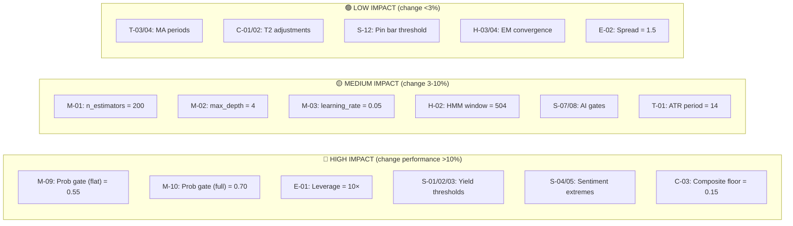
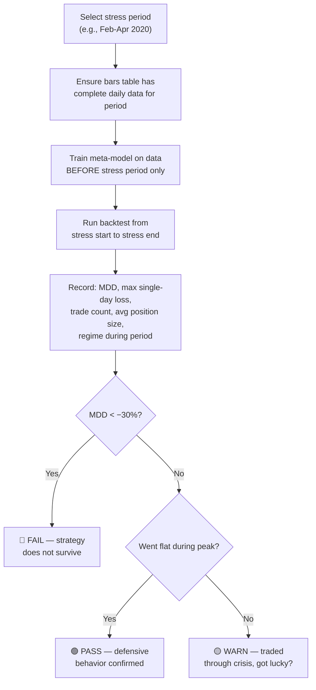

# Quant EOD Engine — Sensitivity & Stress Test Report

> **Status:** Template — results to be populated after execution
> **Last Updated:** 2026-04-03
> **Prerequisite:** Trained meta-model + populated `feature_vectors` and `bars` tables

---

## Table of Contents

1. [Tunable Parameter Inventory](#1-tunable-parameter-inventory)
2. [Sensitivity Analysis Framework](#2-sensitivity-analysis-framework)
3. [Parameter Sensitivity Test Plan](#3-parameter-sensitivity-test-plan)
4. [Stress Test Framework](#4-stress-test-framework)
5. [Historical Stress Scenarios](#5-historical-stress-scenarios)
6. [Execution Script Template](#6-execution-script-template)
7. [Results Recording Template](#7-results-recording-template)
8. [Pass/Fail Criteria](#8-passfail-criteria)

---

## 1. Tunable Parameter Inventory

### 1.1 Complete Parameter Catalog

38 tunable parameters identified across 6 subsystems:

#### Technical Indicators (6 parameters)

| ID | Parameter | Current | Code Reference | Subsystem Impact |
|:--:|-----------|:-------:|:--------------:|:----------------:|
| T-01 | ATR period | 14 | [technical.py:L15](file:///c:/Users/angel/OneDrive/Documents/GitHub/quant-eod-engine/features/technical.py#L15) | Volatility sensitivity, HMM input |
| T-02 | RSI period | 14 | [technical.py:L38](file:///c:/Users/angel/OneDrive/Documents/GitHub/quant-eod-engine/features/technical.py#L38) | Tier 2 confirmation, feature vector |
| T-03 | SMA short period | 50 | [technical.py:L163](file:///c:/Users/angel/OneDrive/Documents/GitHub/quant-eod-engine/features/technical.py#L163) | Trend context, Tier 2 MA alignment |
| T-04 | SMA long period | 200 | [technical.py:L164](file:///c:/Users/angel/OneDrive/Documents/GitHub/quant-eod-engine/features/technical.py#L164) | Trend context, Tier 2 MA alignment |
| T-05 | Rolling vol short window | 5 | [technical.py:L211](file:///c:/Users/angel/OneDrive/Documents/GitHub/quant-eod-engine/features/technical.py#L211) | HMM observation space |
| T-06 | Rolling vol long window | 20 | [technical.py:L212](file:///c:/Users/angel/OneDrive/Documents/GitHub/quant-eod-engine/features/technical.py#L212) | Diagnostics only |

#### Signal Thresholds (12 parameters)

| ID | Parameter | Current | Code Reference | Subsystem Impact |
|:--:|-----------|:-------:|:--------------:|:----------------:|
| S-01 | Yield threshold (low_vol) | 8.0 bps | [tier1.py:L21](file:///c:/Users/angel/OneDrive/Documents/GitHub/quant-eod-engine/signals/tier1.py#L21) | Yield signal sensitivity |
| S-02 | Yield threshold (choppy) | 15.0 bps | [tier1.py:L22](file:///c:/Users/angel/OneDrive/Documents/GitHub/quant-eod-engine/signals/tier1.py#L22) | Yield signal sensitivity |
| S-03 | Yield threshold (crash) | 20.0 bps | [tier1.py:L23](file:///c:/Users/angel/OneDrive/Documents/GitHub/quant-eod-engine/signals/tier1.py#L23) | Yield signal sensitivity |
| S-04 | Sentiment extreme high | 0.72 | [settings.py](file:///c:/Users/angel/OneDrive/Documents/GitHub/quant-eod-engine/config/settings.py) | Sentiment fade trigger frequency |
| S-05 | Sentiment extreme low | 0.28 | [settings.py](file:///c:/Users/angel/OneDrive/Documents/GitHub/quant-eod-engine/config/settings.py) | Sentiment fade trigger frequency |
| S-06 | Sentiment strength span | 0.18 | [tier1.py:L25](file:///c:/Users/angel/OneDrive/Documents/GitHub/quant-eod-engine/signals/tier1.py#L25) | Signal strength scaling |
| S-07 | AI sentiment score gate | ±0.50 | [tier1.py](file:///c:/Users/angel/OneDrive/Documents/GitHub/quant-eod-engine/signals/tier1.py) | AI signal trigger frequency |
| S-08 | AI confidence gate | 0.60 | [tier1.py](file:///c:/Users/angel/OneDrive/Documents/GitHub/quant-eod-engine/signals/tier1.py) | AI signal quality filter |
| S-09 | EOD reversal base strength | 0.85 | [tier1.py:L255](file:///c:/Users/angel/OneDrive/Documents/GitHub/quant-eod-engine/signals/tier1.py#L255) | Event reversal conviction |
| S-10 | RSI oversold threshold | 30 | [tier2.py:L74](file:///c:/Users/angel/OneDrive/Documents/GitHub/quant-eod-engine/signals/tier2.py#L74) | Tier 2 confirmation rate |
| S-11 | RSI overbought threshold | 70 | [tier2.py:L76](file:///c:/Users/angel/OneDrive/Documents/GitHub/quant-eod-engine/signals/tier2.py#L76) | Tier 2 confirmation rate |
| S-12 | Pin bar wick threshold | 0.60 | [technical.py:L123](file:///c:/Users/angel/OneDrive/Documents/GitHub/quant-eod-engine/features/technical.py#L123) | Pattern detection sensitivity |

#### Composite Scoring (4 parameters)

| ID | Parameter | Current | Code Reference | Subsystem Impact |
|:--:|-----------|:-------:|:--------------:|:----------------:|
| C-01 | T2 confirmation bonus | +0.05 | [composite.py:L82](file:///c:/Users/angel/OneDrive/Documents/GitHub/quant-eod-engine/signals/composite.py#L82) | Composite strength inflation |
| C-02 | T2 non-confirmation penalty | −0.02 | [composite.py:L85](file:///c:/Users/angel/OneDrive/Documents/GitHub/quant-eod-engine/signals/composite.py#L85) | Composite strength deflation |
| C-03 | Composite strength floor | 0.15 | [composite.py:L90](file:///c:/Users/angel/OneDrive/Documents/GitHub/quant-eod-engine/signals/composite.py#L90) | Signal gating sensitivity |
| C-04 | Doji body max ratio | 0.10 | [technical.py:L130](file:///c:/Users/angel/OneDrive/Documents/GitHub/quant-eod-engine/features/technical.py#L130) | Pattern sensitivity |

#### HMM Regime Model (4 parameters)

| ID | Parameter | Current | Code Reference | Subsystem Impact |
|:--:|-----------|:-------:|:--------------:|:----------------:|
| H-01 | HMM states | 3 | [hmm_regime.py:L84](file:///c:/Users/angel/OneDrive/Documents/GitHub/quant-eod-engine/models/hmm_regime.py#L84) | Regime granularity |
| H-02 | HMM training window | 504 days | [hmm_regime.py:L49](file:///c:/Users/angel/OneDrive/Documents/GitHub/quant-eod-engine/models/hmm_regime.py#L49) | Regime stability vs responsiveness |
| H-03 | HMM EM iterations | 200 | [hmm_regime.py:L86](file:///c:/Users/angel/OneDrive/Documents/GitHub/quant-eod-engine/models/hmm_regime.py#L86) | Convergence quality |
| H-04 | HMM convergence tolerance | 1e-4 | [hmm_regime.py:L88](file:///c:/Users/angel/OneDrive/Documents/GitHub/quant-eod-engine/models/hmm_regime.py#L88) | Convergence precision |

#### XGBoost Meta-Model (11 parameters)

| ID | Parameter | Current | Code Reference | Subsystem Impact |
|:--:|-----------|:-------:|:--------------:|:----------------:|
| M-01 | n_estimators (prod) | 200 | [meta_model.py:L141](file:///c:/Users/angel/OneDrive/Documents/GitHub/quant-eod-engine/models/meta_model.py#L141) | Model capacity |
| M-02 | max_depth | 4 | [meta_model.py:L142](file:///c:/Users/angel/OneDrive/Documents/GitHub/quant-eod-engine/models/meta_model.py#L142) | Interaction complexity |
| M-03 | learning_rate (η) | 0.05 | [meta_model.py:L143](file:///c:/Users/angel/OneDrive/Documents/GitHub/quant-eod-engine/models/meta_model.py#L143) | Convergence speed vs overfitting |
| M-04 | subsample | 0.8 | [meta_model.py:L144](file:///c:/Users/angel/OneDrive/Documents/GitHub/quant-eod-engine/models/meta_model.py#L144) | Stochastic regularization |
| M-05 | colsample_bytree | 0.8 | [meta_model.py:L145](file:///c:/Users/angel/OneDrive/Documents/GitHub/quant-eod-engine/models/meta_model.py#L145) | Feature bagging |
| M-06 | reg_alpha (L1) | 0.1 | [meta_model.py:L146](file:///c:/Users/angel/OneDrive/Documents/GitHub/quant-eod-engine/models/meta_model.py#L146) | Sparsity regularization |
| M-07 | reg_lambda (L2) | 1.0 | [meta_model.py:L147](file:///c:/Users/angel/OneDrive/Documents/GitHub/quant-eod-engine/models/meta_model.py#L147) | Ridge regularization |
| M-08 | min_child_weight | 5 | [meta_model.py:L148](file:///c:/Users/angel/OneDrive/Documents/GitHub/quant-eod-engine/models/meta_model.py#L148) | Leaf node complexity |
| M-09 | Probability gate (flat) | 0.55 | [meta_model.py:L232](file:///c:/Users/angel/OneDrive/Documents/GitHub/quant-eod-engine/models/meta_model.py#L232) | Trade frequency |
| M-10 | Probability gate (full) | 0.70 | [meta_model.py:L235](file:///c:/Users/angel/OneDrive/Documents/GitHub/quant-eod-engine/models/meta_model.py#L235) | Full-conviction frequency |
| M-11 | Min training samples | 50 | [meta_model.py:L112](file:///c:/Users/angel/OneDrive/Documents/GitHub/quant-eod-engine/models/meta_model.py#L112) | Training data requirement |

#### Execution & Backtest (3 parameters)

| ID | Parameter | Current | Code Reference | Subsystem Impact |
|:--:|-----------|:-------:|:--------------:|:----------------:|
| E-01 | Leverage | 10.0× | [backtest_loop.py:L130](file:///c:/Users/angel/OneDrive/Documents/GitHub/quant-eod-engine/backtest_loop.py#L130) | Risk amplification |
| E-02 | Spread (bps) | 1.5 | [backtest_loop.py:L131](file:///c:/Users/angel/OneDrive/Documents/GitHub/quant-eod-engine/backtest_loop.py#L131) | Transaction cost |
| E-03 | CPCV purge window | 5 | [meta_model.py:L131](file:///c:/Users/angel/OneDrive/Documents/GitHub/quant-eod-engine/models/meta_model.py#L131) | Label leakage prevention |

### 1.2 Parameter Sensitivity Classification

Parameters ranked by expected impact on strategy performance:



---

## 2. Sensitivity Analysis Framework

### 2.1 Methodology: One-at-a-Time (OAT) Sweep

For each parameter $\theta_i$:

1. **Baseline:** Run backtest with all parameters at current values → record metrics
2. **Perturbations:** Run backtest with $\theta_i$ shifted while all others remain fixed:

| Shift | Value |
|:-----:|-------|
| −20% | $\theta_i \times 0.80$ |
| −10% | $\theta_i \times 0.90$ |
| Baseline | $\theta_i \times 1.00$ |
| +10% | $\theta_i \times 1.10$ |
| +20% | $\theta_i \times 1.20$ |

3. **Record:** Sharpe, Sortino, MDD, Win Rate, Trade Count, CAGR for each configuration
4. **Compute sensitivity coefficient:**

$$\text{Sensitivity}_i = \frac{\Delta\text{Sharpe} / \text{Sharpe}_{\text{baseline}}}{\Delta\theta_i / \theta_i} = \frac{\text{Sharpe}_{\text{shifted}} / \text{Sharpe}_{\text{baseline}} - 1}{\text{shift fraction}}$$

A sensitivity coefficient > 1.0 means the Sharpe ratio moves more than proportionally with the parameter change — indicating **high fragility**.

### 2.2 Methodology: Interaction Testing (Phase 2)

After OAT identifies the top 6 most sensitive parameters, test **pairwise interactions** using Latin Hypercube Sampling:

- Generate 50 random combinations of the top 6 parameters within ±20% of baseline
- Run backtest for each combination
- Fit a response surface (2nd-order polynomial) to identify interaction effects
- Report: which parameter pairs amplify or dampen each other's effects

### 2.3 Methodology: Boundary Testing

For discrete/threshold parameters, test at **boundary values** that would qualitatively change system behavior:

| Parameter | Boundary Test | What Changes |
|-----------|---------------|--------------|
| M-09 (prob flat gate) | Set to 0.50 | All non-flat signals become tradeable |
| M-09 (prob flat gate) | Set to 0.65 | Only higher-confidence signals trade |
| M-10 (prob full gate) | Set to 0.60 | More trades at full size |
| M-10 (prob full gate) | Set to 0.80 | Rarely trades at full size |
| C-03 (composite floor) | Set to 0.00 | No minimum strength gate |
| C-03 (composite floor) | Set to 0.30 | Very aggressive signal filtering |
| H-01 (HMM states) | Set to 2 | Binary regime: calm vs volatile |
| H-01 (HMM states) | Set to 4 | Adds a "transition" regime |
| E-01 (leverage) | Set to 5× | Half the risk, half the return |
| E-01 (leverage) | Set to 20× | Double the risk, double the return |

---

## 3. Parameter Sensitivity Test Plan

### 3.1 Priority 1: High-Impact Parameters (Run First)

#### Test 3.1.1 — Probability Gate Sensitivity

> The probability gates (0.55 / 0.70) are the **most critical** tunable parameters. They directly control trade frequency and sizing.

| Test ID | Parameter | Values to Test | Expected Effect |
|:-------:|-----------|:--------------:|-----------------|
| OAT-01a | `prob_flat` | 0.44, 0.50, **0.55**, 0.60, 0.66 | Lower → more trades (lower win rate, higher exposure). Higher → fewer trades (higher win rate, lower exposure). |
| OAT-01b | `prob_full` | 0.56, 0.63, **0.70**, 0.77, 0.84 | Lower → more full-size trades (higher variance). Higher → more half-size trades (lower variance, lower return). |

**Interpretation guide:**
- If Sharpe improves monotonically with higher `prob_flat` → current threshold may be too permissive
- If Sharpe peaks around current value → threshold is well-calibrated
- If Sharpe is **identical** across all values → the probability distribution never produces values in the tested range (i.e., the model is very confident or very uncertain on most days)

#### Test 3.1.2 — Leverage Sensitivity

| Test ID | Parameter | Values to Test | Expected Effect |
|:-------:|-----------|:--------------:|-----------------|
| OAT-02 | `LEVERAGE` | 5×, 8×, **10×**, 12×, 15×, 20× | Linear scaling of returns AND risk. Sharpe should be roughly constant (leverage-invariant). MDD worsens proportionally. |

**Critical check:** If Sharpe **degrades** with higher leverage, the strategy is hitting spread friction limits — the alpha is not large enough to overcome amplified costs.

#### Test 3.1.3 — Yield Threshold Sensitivity

| Test ID | Parameter | Values to Test | Expected Effect |
|:-------:|-----------|:--------------:|-----------------|
| OAT-03a | `yield_thresh_lowvol` | 4, 6, **8**, 10, 12 bps | Lower → more yield signals in calm markets |
| OAT-03b | `yield_thresh_choppy` | 10, 12, **15**, 18, 20 bps | Models the noise floor for yield signals |
| OAT-03c | `yield_thresh_crash` | 12, 16, **20**, 24, 28 bps | How extreme must yield moves be in crisis? |

#### Test 3.1.4 — Sentiment Extreme Sensitivity

| Test ID | Parameter | Values to Test | Expected Effect |
|:-------:|-----------|:--------------:|-----------------|
| OAT-04a | `SENT_EXTREME_HIGH` | 0.65, 0.68, **0.72**, 0.75, 0.80 | Lower → more sentiment fades (lower precision). Higher → fewer fades (higher precision). |
| OAT-04b | `SENT_EXTREME_LOW` | 0.20, 0.25, **0.28**, 0.32, 0.35 | Mirror of 04a for long signals |

#### Test 3.1.5 — Composite Floor Sensitivity

| Test ID | Parameter | Values to Test | Expected Effect |
|:-------:|-----------|:--------------:|-----------------|
| OAT-05 | `composite_floor` | 0.00, 0.05, 0.10, **0.15**, 0.20, 0.25, 0.30 | Lower → more signals pass through. Higher → stricter filtering. |

---

### 3.2 Priority 2: Medium-Impact Parameters

#### Test 3.2.1 — XGBoost Complexity

| Test ID | Parameter | Values to Test | What to Watch |
|:-------:|-----------|:--------------:|---------------|
| OAT-06 | `n_estimators` | 100, 150, **200**, 250, 300 | Overfitting detection: if higher trees help on training but not CPCV |
| OAT-07 | `max_depth` | 2, 3, **4**, 5, 6 | Interaction complexity: depth 2 = additive model only |
| OAT-08 | `learning_rate` | 0.02, 0.03, **0.05**, 0.08, 0.10 | Trade-off: lower η + more trees = slower but often better |

#### Test 3.2.2 — HMM Window Length

| Test ID | Parameter | Values to Test | What to Watch |
|:-------:|-----------|:--------------:|---------------|
| OAT-09 | `lookback_days` | 252, 378, **504**, 630, 756 | Shorter → more responsive to recent regimes. Longer → more stable but slower to detect shifts. |

#### Test 3.2.3 — AI Sentiment Gates

| Test ID | Parameter | Values to Test | What to Watch |
|:-------:|-----------|:--------------:|---------------|
| OAT-10a | `ai_score_gate` | ±0.30, ±0.40, **±0.50**, ±0.60, ±0.70 | Lower → more AI signals fire. Higher → only extreme AI conviction triggers. |
| OAT-10b | `ai_conf_gate` | 0.40, 0.50, **0.60**, 0.70, 0.80 | Lower → noisier AI signals. Higher → fewer but more precise. |

---

### 3.3 Priority 3: Low-Impact Parameters (Validate Stability)

| Test ID | Parameter | Values to Test | Expected |
|:-------:|-----------|:--------------:|----------|
| OAT-11 | ATR period | 10, 12, **14**, 18, 21 | Minimal impact — ATR is context, not directional |
| OAT-12 | RSI period | 10, 12, **14**, 18, 21 | Minimal — RSI used only in Tier 2 |
| OAT-13 | T2 conf bonus | +0.02, +0.04, **+0.05**, +0.07, +0.10 | Should be stable — T2 is a small adjustment |
| OAT-14 | T2 penalty | −0.01, **−0.02**, −0.04, −0.06 | Should be stable |
| OAT-15 | Spread (bps) | 0.8, 1.0, **1.5**, 2.0, 3.0 | Directly erodes profitability |

---

## 4. Stress Test Framework

### 4.1 What Is a Stress Test?

A stress test runs the strategy's backtest against a **specific historical period** known to be hostile to quantitative strategies. The goal is not to achieve profit during stress events, but to answer:

1. **Survival:** Does the strategy survive the event without catastrophic drawdown (> 30%)?
2. **Behavior:** Does it go flat (correct defensive behavior) or get caught in wrong-way trades?
3. **Recovery:** How quickly does equity recover after the stress event?

### 4.2 Stress Test Execution Protocol



### 4.3 Key Metrics for Stress Evaluation

| Metric | Formula | Target |
|--------|---------|:------:|
| Max single-day loss | $\max_t(-\text{PnL}_t)$ | < 10% of equity |
| Max drawdown during stress | Peak-to-trough in stress window | < 30% |
| Days to recovery | Trading days from trough back to previous peak | < 60 |
| % of days flat during stress | $\frac{\text{flat days}}{\text{total days}}$ | > 50% (defensive) |
| Avg position size during stress | Mean of $\text{size}_t$ during window | < 0.3× (reduced conviction) |
| Regime detection accuracy | Did HMM correctly flag state 2 (crash)? | Yes |

---

## 5. Historical Stress Scenarios

### 5.1 Scenario Catalog

| ID | Event | Date Range | EUR/USD Move | Vol Regime | Primary Stress Vector |
|:--:|-------|:----------:|:------------:|:----------:|----------------------|
| **ST-01** | COVID-19 Crash | 2020-02-20 → 2020-04-30 | −3.5% then +5% | Crash → Choppy | Extreme vol, correlation breakdown, liquidity gaps |
| **ST-02** | Brexit Referendum | 2016-06-20 → 2016-07-15 | −3% overnight | Crash | Overnight gap, sentiment extreme, yield dislocation |
| **ST-03** | SNB Peg Removal | 2015-01-14 → 2015-01-30 | EUR/CHF -30% (EUR/USD -4%) | Crash | Flash crash, liquidity vacuum, stop-loss cascade |
| **ST-04** | Taper Tantrum | 2013-05-20 → 2013-07-15 | −4% | Choppy | Yield spread explosion, rate differential shock |
| **ST-05** | Aug 2015 Flash Crash | 2015-08-20 → 2015-09-15 | +3% then −2% | Crash | Chinese devaluation, cross-asset contagion |
| **ST-06** | SVB / Banking Mini-Crisis | 2023-03-08 → 2023-03-31 | +4% | Crash → Choppy | Risk-off, yield inversion, flight to safety |
| **ST-07** | Yen Intervention | 2022-09-20 → 2022-10-30 | −3% | Choppy | Central bank intervention, policy divergence |

### 5.2 Detailed Scenario Plans

#### ST-01: COVID-19 Crash (2020-02-20 → 2020-04-30)

```
What happened:
  - EUR/USD dropped from 1.0860 to 1.0640 (Feb-Mar), then rallied to 1.0960 (Apr)
  - Daily volatility spiked 4-5× above normal
  - ATR expanded from ~50 pips to ~200 pips
  - Yield spreads collapsed as Fed cut rates to zero
  - Retail sentiment oscillated wildly (extreme rebalancing)
  - Correlations broke down (USD safe haven then reversed)

Subsystems stressed:
  - HMM: Should detect state 2 (crash) quickly
  - Yield spread: 5d change would exceed any threshold → constant signals
  - Sentiment: Rapid swings may trigger false fades
  - AI sentiment: Would have produced extreme scores daily
  - Meta-model: Trained on calm recent history → crisis OOD

Expected failure mode:
  - Model keeps trading through crash at full conviction
  - 10× leverage amplifies daily 1-2% moves → 10-20% daily PnL swings
  - No stop-loss → potential 40%+ drawdown

What to measure:
  ┌──────────────────────────────────────┬──────────┐
  │ Metric                               │ Result   │
  ├──────────────────────────────────────┼──────────┤
  │ Max drawdown during period            │ ____%    │
  │ Max single-day loss                   │ ____%    │
  │ Days HMM was in state 2              │ ____ / 50│
  │ % of days position was flat          │ ____%    │
  │ Mean position size                    │ ____×    │
  │ Days to recover pre-crisis equity     │ ____     │
  │ Total return during period            │ ____%    │
  └──────────────────────────────────────┴──────────┘
```

#### ST-02: Brexit Referendum (2016-06-20 → 2016-07-15)

```
What happened:
  - EUR/USD gapped ~200 pips on the result (overnight, not tradeable at EOD)
  - Retail positioning was extreme pre-referendum (crowd expected Remain)
  - Daily bars showed massive doji/pin bars around the event
  - Yield spreads shifted dramatically as markets repriced ECB/BOE policy

Subsystems stressed:
  - EOD event reversal: Should fire (surprise + opposite candle)
  - Sentiment extreme: Retail was heavily positioned pre-vote
  - HMM: Should transition to crash state post-result
  - Gap risk: Overnight gap bypasses 1-day holding logic

What to measure:
  - Did the system correctly go flat ahead of the vote?
  - Did it detect the reversal opportunity post-result?
  - How much was lost on the gap (entered end of June 23, gap June 24)?
```

#### ST-03: SNB Peg Removal (2015-01-15)

```
What happened:
  - Swiss National Bank removed EUR/CHF 1.20 floor without warning
  - EUR/CHF crashed ~30% intraday; EUR/USD fell ~4%
  - Multiple brokers went insolvent; liquidity completely evaporated
  - Spreads widened to 50+ pips on EUR/USD (vs normal 1.5)

Subsystems stressed:
  - Execution: Spread assumption of 1.5 pips is wildly wrong during this event
  - Leverage: 10× on a 4% move = 40% loss
  - All signals: Generated AFTER the crash, so next-day entry is post-crash

Key test: Run backtest with SPREAD_BPS = 15.0 for this specific period
to simulate realistic crisis spreads.
```

#### ST-04: Taper Tantrum (2013-05-20 → 2013-07-15)

```
What happened:
  - Bernanke signaled Fed tapering of QE
  - US yields surged → yield spread widened dramatically
  - EUR/USD fell ~4% over 8 weeks (orderly, not crash)

Subsystems stressed:
  - Yield spread momentum: Should fire SHORT consistently
  - This is the "ideal" scenario for the yield signal
  - Tests whether the signal captures carry flow correctly

What to measure:
  - Did yield signal fire correctly throughout?
  - Was the system profitable during this fundamental-driven move?
  - How did regime detection classify this period?
```

---

## 6. Execution Script Template

### 6.1 OAT Sensitivity Runner

```python
#!/usr/bin/env python3
"""
Sensitivity sweep runner for the Quant EOD Engine.
Modifies one parameter at a time and records backtest results.

Usage:
    python sensitivity_sweep.py --param prob_flat --values 0.44,0.50,0.55,0.60,0.66
"""
import argparse
import json
import sys
import os
import copy
from datetime import date

sys.path.insert(0, os.path.dirname(os.path.abspath(__file__)))

from backtest_loop import run_backtest
from models.meta_model import MetaModel
from config.settings import PRIMARY_INSTRUMENT

# Map parameter IDs to their code locations
PARAM_HOOKS = {
    "prob_flat": {
        "module": "models.meta_model",
        "apply": lambda model, val: setattr(model, '_prob_flat', val),
        # Requires patching MetaModel.predict to use self._prob_flat
    },
    "leverage": {
        "module": "backtest_loop",
        "constant": "LEVERAGE",
    },
    "spread_bps": {
        "module": "backtest_loop",
        "constant": "SPREAD_BPS",
    },
    # ... extend for each parameter
}


def run_sweep(param_name: str, values: list[float],
              instrument: str = PRIMARY_INSTRUMENT,
              start: str | None = None,
              end: str | None = None) -> list[dict]:
    """Run backtest for each parameter value and collect results."""
    results = []

    for val in values:
        print(f"\n{'='*60}")
        print(f"Testing {param_name} = {val}")
        print(f"{'='*60}")

        # Apply parameter override
        # (Implementation varies by parameter - see PARAM_HOOKS)
        _apply_override(param_name, val)

        result = run_backtest(
            instrument=instrument,
            start=date.fromisoformat(start) if start else None,
            end=date.fromisoformat(end) if end else None,
            initial_equity=10000.0,
        )

        if "error" not in result:
            perf = result.get("performance_report", {})
            results.append({
                "param": param_name,
                "value": val,
                "sharpe": perf.get("annualized_sharpe", 0),
                "sortino": perf.get("annualized_sortino", 0),
                "mdd": perf.get("max_drawdown", 0),
                "cagr": perf.get("cagr", 0),
                "trades": result.get("trades", 0),
                "win_rate": result.get("win_rate", 0),
                "exposure": perf.get("exposure", 0),
                "total_return": result.get("total_return", 0),
            })
        else:
            results.append({
                "param": param_name,
                "value": val,
                "error": result["error"],
            })

    return results


def _apply_override(param_name: str, value: float):
    """Apply a parameter override. Implementation is param-specific."""
    # This is a template — actual implementation requires patching
    # the relevant module global or class attribute.
    pass


if __name__ == "__main__":
    parser = argparse.ArgumentParser()
    parser.add_argument("--param", required=True)
    parser.add_argument("--values", required=True, help="Comma-separated values")
    parser.add_argument("--start", default=None)
    parser.add_argument("--end", default=None)
    parser.add_argument("--output", default="sensitivity_results.json")
    args = parser.parse_args()

    vals = [float(v) for v in args.values.split(",")]
    results = run_sweep(args.param, vals, start=args.start, end=args.end)

    with open(args.output, "w") as f:
        json.dump(results, f, indent=2)
    print(f"\nResults written to {args.output}")
```

### 6.2 Stress Test Runner

```python
#!/usr/bin/env python3
"""
Stress test runner — isolates backtest to a specific historical stress period.

Usage:
    python stress_test.py --scenario covid --train-end 2020-02-19
"""
# Key requirement: the meta-model must be trained ONLY on data
# before the stress period starts. This simulates what would have
# happened if the strategy was live at the time.

SCENARIOS = {
    "covid":   {"start": "2020-02-20", "end": "2020-04-30", "train_end": "2020-02-19"},
    "brexit":  {"start": "2016-06-20", "end": "2016-07-15", "train_end": "2016-06-17"},
    "snb":     {"start": "2015-01-14", "end": "2015-01-30", "train_end": "2015-01-13"},
    "taper":   {"start": "2013-05-20", "end": "2013-07-15", "train_end": "2013-05-17"},
    "flash":   {"start": "2015-08-20", "end": "2015-09-15", "train_end": "2015-08-19"},
    "svb":     {"start": "2023-03-08", "end": "2023-03-31", "train_end": "2023-03-07"},
    "yen":     {"start": "2022-09-20", "end": "2022-10-30", "train_end": "2022-09-19"},
}

# For each scenario:
# 1. Train meta-model on data up to train_end
# 2. Run backtest from start to end
# 3. Record stress metrics (MDD, max daily loss, flat %, etc.)
```

---

## 7. Results Recording Template

### 7.1 OAT Sensitivity Results

Fill in after running each sweep:

#### Probability Gate (M-09: `prob_flat`)

| Value | Sharpe | Sortino | MDD | Win Rate | Trades | Exposure | Sensitivity |
|:-----:|:------:|:-------:|:---:|:--------:|:------:|:--------:|:-----------:|
| 0.44 | | | | | | | |
| 0.50 | | | | | | | |
| **0.55** | | | | | | | **baseline** |
| 0.60 | | | | | | | |
| 0.66 | | | | | | | |

#### Leverage (E-01)

| Value | Sharpe | Sortino | MDD | Win Rate | Total Return | Break-Even Alpha |
|:-----:|:------:|:-------:|:---:|:--------:|:------------:|:----------------:|
| 5× | | | | | | 7.5 bps |
| 8× | | | | | | 12 bps |
| **10×** | | | | | | **15 bps** |
| 12× | | | | | | 18 bps |
| 15× | | | | | | 22.5 bps |
| 20× | | | | | | 30 bps |

#### Yield Thresholds (S-01: `low_vol`)

| Value | Sharpe | Sortino | MDD | Yield Signals Fired | Win Rate on Yield Signal |
|:-----:|:------:|:-------:|:---:|:-------------------:|:------------------------:|
| 4 bps | | | | | |
| 6 bps | | | | | |
| **8 bps** | | | | | **baseline** |
| 10 bps | | | | | |
| 12 bps | | | | | |

### 7.2 Stress Test Results

| Scenario | MDD | Max Day Loss | Flat % | Mean Size | Regime (Crash Days) | Recovery Days | Verdict |
|:--------:|:---:|:----------:|:------:|:---------:|:-------------------:|:------------:|:-------:|
| **ST-01** COVID | ____% | ____% | ____% | ____× | ____/50 | ____ | 🟢🟡🔴 |
| **ST-02** Brexit | ____% | ____% | ____% | ____× | ____/18 | ____ | 🟢🟡🔴 |
| **ST-03** SNB | ____% | ____% | ____% | ____× | ____/12 | ____ | 🟢🟡🔴 |
| **ST-04** Taper | ____% | ____% | ____% | ____× | ____/40 | ____ | 🟢🟡🔴 |
| **ST-05** Flash | ____% | ____% | ____% | ____× | ____/18 | ____ | 🟢🟡🔴 |
| **ST-06** SVB | ____% | ____% | ____% | ____× | ____/18 | ____ | 🟢🟡🔴 |
| **ST-07** Yen | ____% | ____% | ____% | ____× | ____/30 | ____ | 🟢🟡🔴 |

---

## 8. Pass/Fail Criteria

### 8.1 Sensitivity Test Criteria

| Criterion | Threshold | Classification |
|-----------|:---------:|:--------------:|
| Sharpe degradation > 30% from any single ±20% param shift | $\lvert\Delta S / S_0\rvert > 0.30$ | 🔴 **FRAGILE** — parameter needs tighter control or adaptive tuning |
| MDD worsening > 50% from any single ±20% param shift | $\lvert\Delta\text{MDD} / \text{MDD}_0\rvert > 0.50$ | 🔴 **FRAGILE** — tail risk is parameter-dependent |
| Win rate drops below 45% at any tested value | $WR < 0.45$ | 🟡 **WARNING** — approaching coin-flip territory |
| Trade count changes > 3× from any ±20% shift | $\text{Trades}_{\text{shifted}} / \text{Trades}_0 > 3$ or $< 1/3$ | 🟡 **WARNING** — parameter is a crude on/off switch |
| Sharpe stable within ±10% across all ±20% shifts | $\lvert\Delta S / S_0\rvert < 0.10$ | 🟢 **ROBUST** — strategy is not dependent on this parameter |

### 8.2 Stress Test Criteria

| Criterion | Threshold | Classification |
|-----------|:---------:|:--------------:|
| Max drawdown during stress period | > −30% | 🔴 **FAIL** — strategy does not survive this event class |
| Max single-day loss | > −15% | 🔴 **FAIL** — leverage is too high for this vol regime |
| Strategy was flat > 50% of stress days | Met | 🟢 **PASS (defensive)** — correctly stood aside |
| Strategy made money during stress | Positive return | 🟢 **PASS (alpha)** — strategy may exploit crisis patterns |
| Strategy took losses but recovered within 60 days | Recovery < 60 | 🟡 **ACCEPTABLE** — drawdown was contained and temporary |
| Strategy took losses and never recovered in test window | Recovery > 60 | 🔴 **FAIL** — structural damage |

### 8.3 Overall Strategy Health Matrix

After completing all tests, fill in the summary:

| Dimension | Grade | Evidence |
|-----------|:-----:|----------|
| **Parameter Robustness** | 🟢🟡🔴 | "X of 15 OAT tests showed Sharpe sensitivity > 30%" |
| **Tail Risk Survival** | 🟢🟡🔴 | "Survived Y of 7 stress scenarios within MDD <30%" |
| **Defensive Behavior** | 🟢🟡🔴 | "Went flat in Z of 7 crisis periods" |
| **Recovery Speed** | 🟢🟡🔴 | "Average recovery time: N days across stress events" |
| **Overall Assessment** | 🟢🟡🔴 | "Strategy is [robust/fragile/dangerous] for live deployment" |
