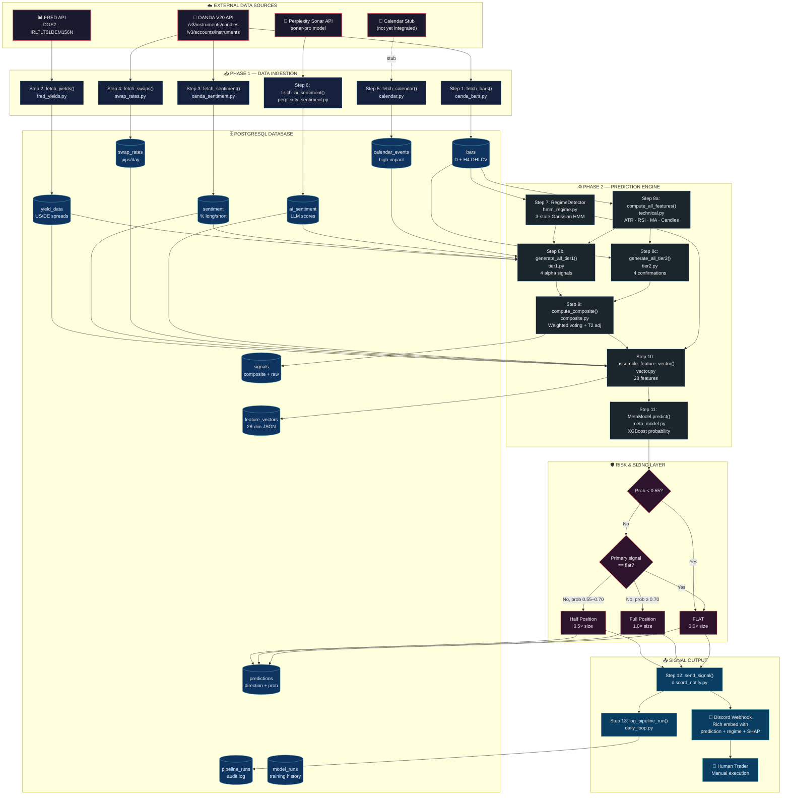
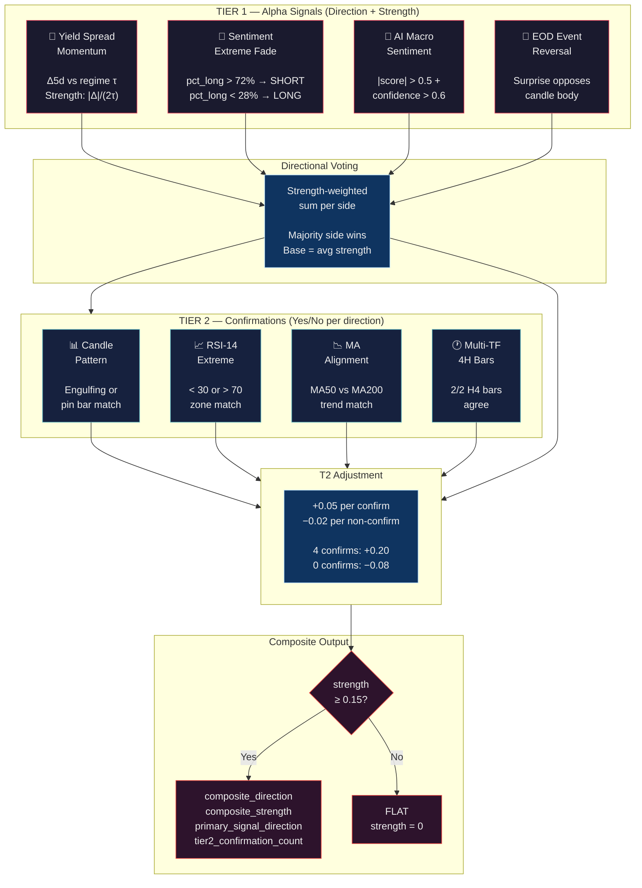
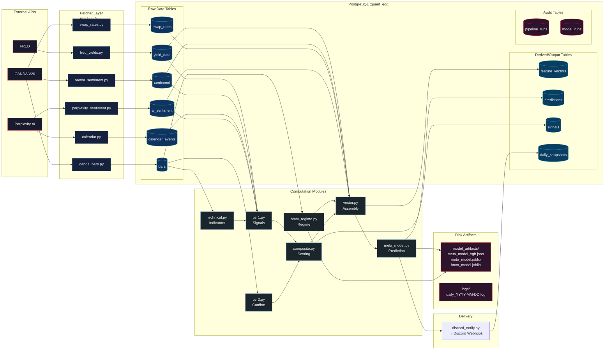
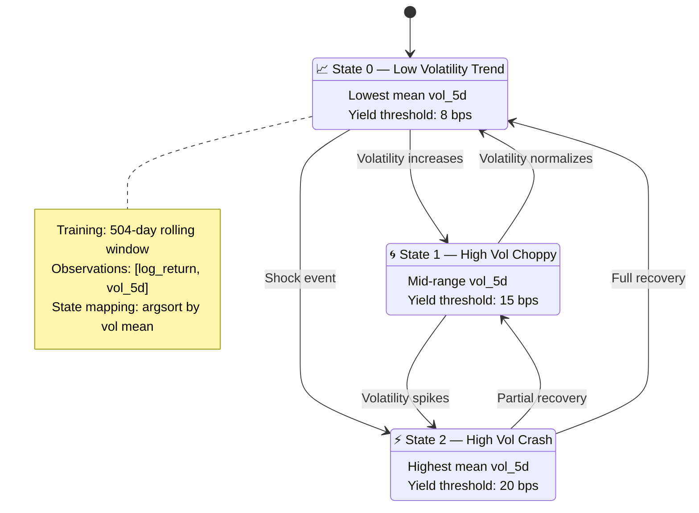
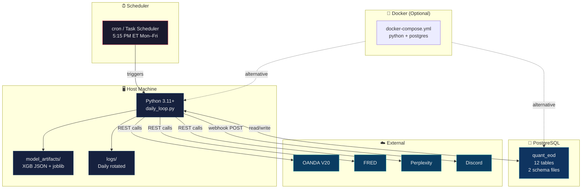

# Quant EOD Engine — System Architecture Diagram

> **Version:** v1.0.0 | **Date:** 2026-04-03
> All diagrams render via Mermaid.js and map directly to source files.

---

## 1. End-to-End Pipeline Flow

The complete data-to-signal pipeline executed daily at 5:15 PM ET.

---

## 2. Model Architecture Detail

Zoomed view of the XGBoost meta-labeling pipeline and its validation framework.

```mermaid
flowchart LR
    subgraph INPUT["Feature Vector (28-dim)"]
        direction TB
        F1["Regime: state, days_in_regime"]
        F2["Macro: yield_spread, Δ5d, Δ20d"]
        F3["Sentiment: pct_long, extreme"]
        F4["AI: score, confidence, stances"]
        F5["Technical: ATR, RSI, MAs, candles"]
        F6["Calendar: reversal, surprise_mag"]
        F7["Temporal: day_of_week, is_friday"]
        F8["Carry: long_swap, short_swap"]
        F9["Signal: direction, count, strength, T2"]
    end

    subgraph NORM["Normalization"]
        SC["StandardScaler\nz-score transform\nfit on training data"]
    end

    subgraph MODEL["XGBoost Classifier"]
        direction TB
        XG["XGBClassifier\n200 trees · depth=4\nη=0.05 · L1=0.1 · L2=1.0\nsubsample=0.8 · colsample=0.8\nmin_child_weight=5"]
    end

    subgraph GATE["3-Tier Probability Gate"]
        direction TB
        G1["P < 0.55 → FLAT (0.0×)"]
        G2["0.55 ≤ P < 0.70 → HALF (0.5×)"]
        G3["P ≥ 0.70 → FULL (1.0×)"]
    end

    subgraph VETO["Signal Veto"]
        V1{"primary_signal\n_direction == 0?"}
        V2["Override → FLAT"]
        V3["Pass through"]
    end

    subgraph EXPLAIN["Explainability"]
        SH["SHAP TreeExplainer\nTop 5 features per prediction"]
    end

    subgraph VALID["Validation (Training Only)"]
        direction TB
        CV["CPCV\nN=6, k=2 → 15 paths\npurge=5, embargo=2"]
        PSR["Probabilistic Sharpe Ratio\nBailey & López de Prado\nskew + kurtosis adjusted"]
    end

    INPUT --> SC
    SC --> XG
    XG --> GATE
    XG --> SH
    GATE --> V1
    V1 -->|Yes| V2
    V1 -->|No| V3

    XG -.->|training| CV
    CV -.-> PSR

    classDef input fill:#1b262c,stroke:#bbe1fa,color:#eee
    classDef proc fill:#16213e,stroke:#0f3460,color:#eee
    classDef gate fill:#2d132c,stroke:#ee4540,color:#eee
    classDef valid fill:#0a3d62,stroke:#38ada9,color:#eee

    class F1,F2,F3,F4,F5,F6,F7,F8,F9 input
    class SC,XG,SH proc
    class G1,G2,G3,V1,V2,V3 gate
    class CV,PSR valid
```

---

## 3. Signal Generation Cascade

How the 4 Tier 1 alpha signals and 4 Tier 2 confirmations combine into a composite score.

---

## 4. Data Flow & Storage Architecture

How data moves between external sources, the PostgreSQL persistence layer, and the computation modules.

---

## 5. Backtest Execution Model

Timing and PnL computation in `backtest_loop.py`.

```mermaid
sequenceDiagram
    participant D as Day T (Signal)
    participant T1 as Day T+1 (Execution)
    participant DB as PostgreSQL
    participant MM as MetaModel

    Note over D: 5:15 PM ET — Daily bar complete

    D->>DB: Load feature_vector for Day T
    DB-->>D: 28-feature dict
    D->>MM: predict(feature_vector)
    MM-->>D: {direction, prob, size}

    Note over D,T1: Overnight — position determined

    T1->>DB: Load bars for Day T+1
    DB-->>T1: {open, close}

    Note over T1: Entry at T+1 Open

    rect rgb(45, 19, 44)
        Note over T1: raw_ret = (close / open) - 1.0
        Note over T1: spread_cost = 1.5 pips / open
        Note over T1: pnl = direction × size × leverage × raw_ret − spread_cost
        Note over T1: equity *= (1 + pnl)
    end

    Note over T1: Exit at T+1 Close
```

---

## 6. HMM Regime Detection

State machine for the 3-state Hidden Markov Model.

---

## 7. Deployment Topology

Infrastructure layout for the production system.

---

## Diagram Index

| # | Diagram | Shows |
|:-:|---------|-------|
| 1 | **End-to-End Pipeline** | Complete 13-step flow from APIs to Discord, through DB and engine |
| 2 | **Model Architecture** | XGBoost internals: features → scaler → classifier → probability gate → signal veto |
| 3 | **Signal Cascade** | 4 Tier 1 + 4 Tier 2 → composite voting → strength floor |
| 4 | **Data Flow & Storage** | All read/write relationships between modules and 12 DB tables |
| 5 | **Backtest Execution** | Sequence diagram of T/T+1 timing, PnL formula, and equity update |
| 6 | **HMM Regime States** | State machine with transitions and per-state parameters |
| 7 | **Deployment Topology** | Infrastructure: cron → Python → PostgreSQL → APIs → Discord |
